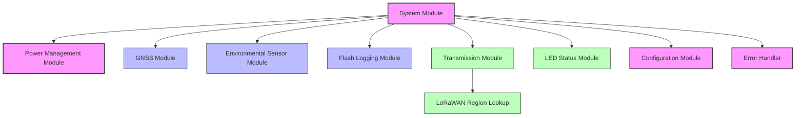

# Stratosonde Firmware Documentation

## Overview

This repository contains the firmware architecture documentation for the Stratosonde, an ultra-lightweight, solar-powered radiosonde designed for long-duration autonomous operation in the stratosphere. The firmware enables the device to collect atmospheric and positional data, transmit it over LoRaWAN, and operate efficiently on solar power.

## Documentation Structure

The documentation is organized into the following files in the `docs/` directory:

- **[docs/FirmwareArchitecture.md](docs/FirmwareArchitecture.md)**: Main architecture document providing an overview of the entire system, module interactions, and system state machine.

### Module-Specific Documentation

- **[docs/SystemModule.md](docs/SystemModule.md)**: Central orchestrator for all firmware operations, implementing the main state machine.
- **[docs/PowerManagement.md](docs/PowerManagement.md)**: Handles power control, monitoring, and optimization to maximize flight duration.
- **[docs/GNSSModule.md](docs/GNSSModule.md)**: Interfaces with the GPS receiver to obtain position and time information.
- **[docs/EnvironmentalSensors.md](docs/EnvironmentalSensors.md)**: Manages the pressure, temperature, and humidity sensors.
- **[docs/FlashLogging.md](docs/FlashLogging.md)**: Provides persistent storage for telemetry data in external flash memory.
- **[docs/TransmissionModule.md](docs/TransmissionModule.md)**: Handles LoRaWAN communication and adaptive transmission strategies.
- **[docs/RegionLookup.md](docs/RegionLookup.md)**: Determines the appropriate LoRaWAN region based on GPS coordinates.
- **[docs/LEDStatus.md](docs/LEDStatus.md)**: Provides visual feedback during initialization and early operation phases.
- **[docs/ConfigurationModule.md](docs/ConfigurationModule.md)**: Manages configurable parameters for all aspects of operation.
- **[docs/ErrorHandler.md](docs/ErrorHandler.md)**: Provides centralized error management and recovery strategies.

## System Architecture

## Hardware Components

- **MCU**: STM32WLE5 (ARM Cortex-M4 with integrated LoRa radio)
- **GPS**: ATGM336H-5NR31
- **Pressure Sensor**: MS5607
- **Temperature/Humidity Sensor**: SHT31
- **Flash Memory**: W25Q16JV
- **Power Source**: Solar panel with battery backup

## Key Features

- **Power Efficiency**: Intelligent power management with dynamic duty cycling
- **Adaptive Communication**: Region-aware LoRaWAN communication with fallback strategies
- **Robust Data Storage**: Circular buffer implementation in external flash
- **Graceful Degradation**: Error handling with recovery strategies
- **Configurable Operation**: Centralized configuration system for mission parameters

## Implementation Phases

1. **Core Infrastructure**: Configuration, Power Management, Error Handler, System Module
2. **Sensor Integration**: GNSS Module, Environmental Sensor Module
3. **Data Management**: Flash Logging Module
4. **Communication**: Transmission Module, Region Lookup
5. **Integration & Testing**: Full system integration and optimization

## Getting Started

To understand the firmware architecture:

1. Start with the [docs/FirmwareArchitecture.md](docs/FirmwareArchitecture.md) document for a high-level overview
2. Explore the module-specific documentation based on your area of interest
3. Refer to the state machine diagrams to understand system behavior
4. Review the data structures and interfaces between modules

## Development Environment

- **IDE**: STM32CubeIDE
- **HAL**: STM32 HAL Library
- **LoRaWAN Stack**: STM32WL LoRaWAN stack
- **Build System**: Make-based build system
