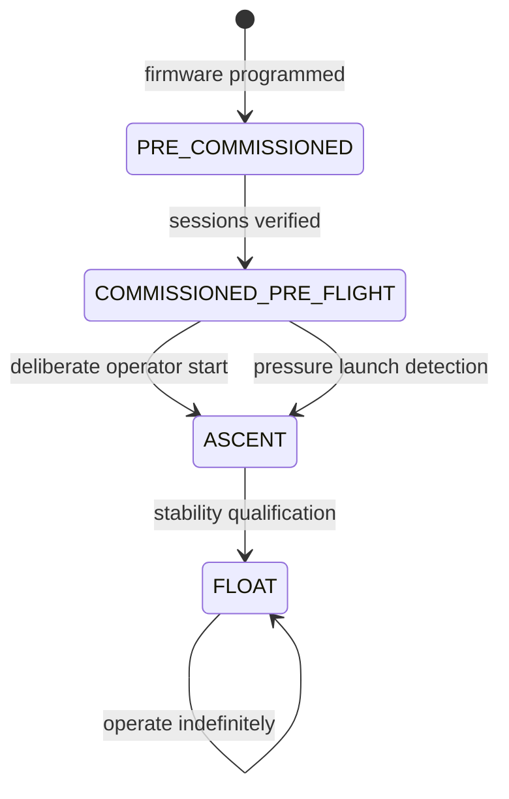

# Stratosonde Firmware Architecture Overview

**Date:** 2026-08-13
**Audience:** New firmware contributors, reviewers, and implementation agents
**Authority:** **Explanatory overview only.** Normative details live in
`decisions/` and `SYSTEM-INVARIANTS.md`. Where this document and a DDR disagree,
the DDR wins.

For module-level design see `FirmwareArchitecture.md` and the per-module docs.

---

## 1. Product shape

Stratosonde is a long-duration unattended superpressure-balloon scientific
instrument.

It cannot depend on post-launch human intervention, reflashing, LoRaWAN rejoin,
or physical repair.

Architecture therefore prioritizes:

1. keep the mission alive;
2. keep science honest;
3. keep RF geographically conservative;
4. keep behavior simple enough to prove.

## 2. Lifecycle



### PRE_COMMISSIONED

Firmware runs, but required private/session material is not yet installed and
verified. Not release-ready. (DDR-0002 `INV-LIFE-009/010`.)

### COMMISSIONED_PRE_FLIGHT

Provisioning is complete. Hardware/science checks and privacy-safe telemetry are
allowed, but precise X/Y is withheld. (DDR-0018.)

### ASCENT

Mission start is permanent. Entry is deliberate or automatic from pressure
behavior. (DDR-0002 `BR-LIFE-007/008`.)

### FLOAT

Once stability/float qualification is met, FLOAT is durably latched. Later
pressure change does not restore ASCENT. (DDR-0002 `INV-LIFE-011`.)

There is no landing state and no normal mission-complete state.

## 3. Ordinary wake

```text
scheduled epoch
    |
    v
battery / energy-history update
    |
    +-- admission fails --> sleep
    |
    +-- admission passes --> FULL CYCLE
                             |
                             +--> sensors
                             +--> GNSS attempt
                             +--> one science record
                             +--> append immutable record
                             +--> permitted radio work
                             +--> optional requested/backlog work
                             +--> sleep
```

Long-term battery trend may lengthen cadence.

Inside one scheduled wake, first-flight behavior is **FULL CYCLE or SLEEP**.
Energy policy does not intentionally create "everything except GNSS" science.
(DDR-0016 `INV-PWR-022`, DDR-0001 `INV-WAKE-012`.)

GNSS may still be stale because GNSS itself failed or timed out, and individual
sensors may still be stale because they failed. That is honest degradation, not
an energy mode.

## 4. Scheduler

Cadence is fixed **start-to-start**.

A ten-minute target conceptually means scheduled epochs at `12:00`, `12:10`,
`12:20`, etc., not "finish work, then sleep ten minutes."

Archive recovery yields to a live science epoch.

Pathological multi-epoch overrun handling remains a binding.

## 5. Science records

One record is one observation package:

```text
record_id
time
position + freshness
sensor A + freshness
sensor B + freshness
...
system/power context
integrity check
```

A failing sensor gets bounded recovery; then last-known-good may be used stale.
(DDR-0009 `BR-FAIL-016`.)

GNSS follows the same recovery shape, but after 24 hours without a valid
horizontal fix RF becomes silent until one valid fix returns.
(DDR-0015 `BR-STALE-017/018/019`.)

## 6. Archive

The archive is circular, append-oriented, and immutable by logical record.

- one unique ID per science record;
- retransmission reuses that ID;
- physical location is not identity;
- new data may overwrite undelivered old data;
- one corrupt record is skipped, never allowed to truncate later records.

Commissioning should initialize/erase the archive.

In flight, erase just in time at the smallest practical hardware erase unit.

Fast boot uses retained cursor state; a whole-archive scan is not normal startup
work. (DDR-0011, DDR-0012 `INV-BOOT-010`.)

## 7. Persistence

### Must survive

- LoRaWAN credentials/session state;
- frame-counter recovery state;
- lifecycle phase (including the float latch);
- last valid GNSS position and age/provenance;
- mission configuration/cadence;
- battery/energy trend;
- calibration coefficients;
- archive append cursor;
- next logical record identity.

### Reconstructable

- current RF region from position;
- derived runtime/cache/index state.

### May tolerate bounded rollback

- archive replay watermark, if the consequence is only a small number of
  duplicate transmissions.

### Safe to lose

- pure diagnostics;
- separate last-GNSS-time object when RTC continuity already supplies working
  time;
- exact transient next-wake timer, if at most one cycle is lost/shifted.

(DDR-0010.)

## 8. Radio

Required LoRaWAN sessions are joined on the ground only.

The compact confirmed probe establishes whether the current path is useful.

No ACK means:

```text
end RF work
sleep normally
try next science cycle
```

Hardware/stack errors may trigger bounded reset/reinitialization recovery, but
never an autonomous in-flight join. (DDR-0018, DDR-0019.)

## 9. Gap repair

Normal backlog recovery is newest-first.

An explicit backend request for record `N` preempts opportunistic backlog.

```text
receive REQUEST_RECORD N
  -> if permitted, search archive
  -> send N if retained
  -> otherwise send a useful substitute whose actual record_id exposes mismatch
  -> forget request
  -> resume normal newest-first backlog if budget remains
```

The request is not persisted across sleeps. Linear record lookup is acceptable
because targeted retrieval is rare. (DDR-0004, DDR-0005 `INV-TX-010`.)

## 10. Backend contract

Backend should assume:

- record contents never change;
- retransmission reuses record ID;
- gaps can exist;
- duplicates can exist;
- old records can be overwritten;
- returned ID is authoritative;
- old firmware packet versions may remain in flight for a long time.

The backend owns gap detection and targeted repair.

## 11. Protocol evolution

A deployed packet format must remain identifiable and decodable while
corresponding sondes may still be alive.

New backend releases retain old codecs rather than requiring in-flight firmware
upgrade. Firmware OTA over LoRaWAN is not part of this product.
(DDR-0027, DDR-0025.)

## 12. Fault philosophy

Nearly every recoverable subsystem follows:

```text
attempt
  -> bounded recovery
     -> success: normal immediately
     -> failure: degrade dependent capability
        -> finish/sleep
           -> retry next eligible wake
```

No failure-history probation, no reset-count escalation, and no permanent
software give-up state. (DDR-0009, DDR-0020.)

## 13. Deliberately unbound

Implementation may choose exact:

- pressure launch thresholds;
- button gesture;
- battery thresholds/model;
- retry counts;
- flash layout/erase size;
- record-ID width;
- downlink bytes;
- protocol-version encoding;
- replay checkpoint interval;
- lookup acceleration structure.

Those choices must still prove the DDRs and system invariants. Open items are
tracked in `decisions/open-intent-questions.md`.
