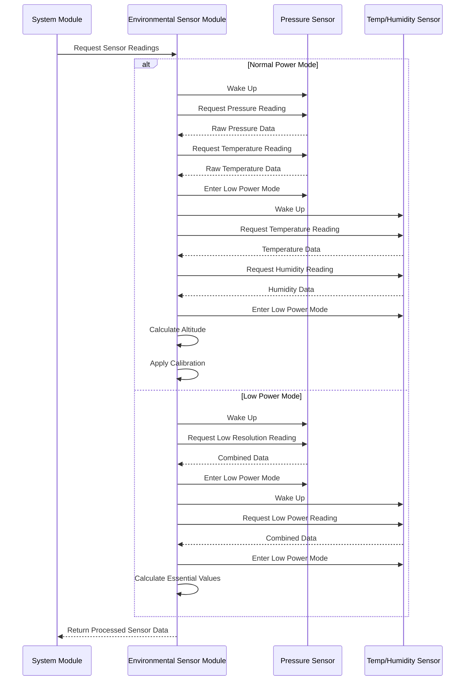

# Environmental Sensor Module

## Overview

The Environmental Sensor Module interfaces with the MS5607 pressure sensor and SHT31 temperature/humidity sensor to collect atmospheric data for the Stratosonde. It manages sensor communication, power control, and data acquisition while optimizing for power efficiency.

## Hardware Interface

- **Pressure Sensor**: MS5607
  - Interface: I2C
  - Measurement: Barometric pressure and temperature
  - Range: 10 to 1200 mbar, -40 to +85°C
  
- **Temperature/Humidity Sensor**: SHT31
  - Interface: I2C
  - Measurement: Temperature and relative humidity
  - Range: -40 to +125°C, 0 to 100% RH

- **I2C Bus**: Shared I2C bus for both sensors
  - SCL: I2C clock line
  - SDA: I2C data line
  - Power Control: GPIO pins for sensor power gating

## Operational Flow



## Key Functions

### Initialization

```c
SensorStatus_t Sensor_Init(void);
```
- Initializes I2C interface for sensor communication
- Configures GPIO pins for power control
- Performs sensor detection and initial configuration
- Reads calibration data from sensors

### Power Management

```c
SensorStatus_t Sensor_PowerOn(void);
SensorStatus_t Sensor_PowerOff(void);
SensorStatus_t Sensor_EnterLowPowerMode(void);
```
- Controls power to sensors
- Implements proper power-up and power-down sequences
- Configures sensors for low-power operation

### Data Acquisition

```c
SensorStatus_t Sensor_ReadAll(SensorData_t *data);
SensorStatus_t Sensor_ReadPressure(float *pressure);
SensorStatus_t Sensor_ReadTemperature(float *temperature);
SensorStatus_t Sensor_ReadHumidity(float *humidity);
```
- Acquires data from sensors
- Implements one-shot measurements for power efficiency
- Converts raw sensor values to physical units

### Altitude Calculation

```c
float Sensor_CalculateAltitude(float pressure, float temperature);
float Sensor_DetectAscent(float current_altitude, float previous_altitude);
```
- Calculates altitude from pressure and temperature
- Implements altitude trend detection
- Provides ascent/descent rate calculation

### Calibration

```c
SensorStatus_t Sensor_Calibrate(void);
SensorStatus_t Sensor_ApplyCalibration(SensorData_t *data);
```
- Performs sensor calibration if needed
- Applies calibration factors to raw readings
- Stores calibration data in non-volatile memory

### Validation

```c
bool Sensor_ValidateReading(const SensorData_t *data);
SensorStatus_t Sensor_FilterReading(SensorData_t *data);
```
- Validates sensor readings against acceptable ranges
- Implements simple filtering for noisy readings
- Detects sensor failures or anomalies

## Data Structures

### Sensor Data

```c
typedef struct {
    float pressure;               // Barometric pressure in hPa
    float temperature_pressure;   // Temperature from pressure sensor in °C
    float temperature_humidity;   // Temperature from humidity sensor in °C
    float humidity;               // Relative humidity in %
    float altitude;               // Calculated altitude in meters
    float ascent_rate;            // Calculated ascent/descent rate in m/s
    uint32_t timestamp;           // Timestamp of the reading
    bool valid;                   // Flag indicating if data is valid
} SensorData_t;
```

### Sensor Configuration

```c
typedef struct {
    uint8_t pressure_osr;         // Pressure oversampling ratio
    uint8_t temperature_osr;      // Temperature oversampling ratio
    uint8_t humidity_precision;   // Humidity measurement precision
    uint16_t measurement_interval; // Interval between measurements in ms
    bool enable_filtering;        // Enable measurement filtering
} SensorConfig_t;
```

## Sensor Modes

### MS5607 Pressure Sensor

| Mode | Description | Resolution | Conversion Time | Current |
|------|-------------|------------|-----------------|---------|
| OSR 256 | Lowest resolution | 0.11 mbar | 0.6 ms | 0.9 mA |
| OSR 512 | Low resolution | 0.062 mbar | 1.17 ms | 0.9 mA |
| OSR 1024 | Standard resolution | 0.039 mbar | 2.28 ms | 0.9 mA |
| OSR 2048 | High resolution | 0.028 mbar | 4.54 ms | 0.9 mA |
| OSR 4096 | Ultra high resolution | 0.021 mbar | 9.04 ms | 0.9 mA |
| Standby | Low power standby | - | - | 0.14 µA |

### SHT31 Temperature/Humidity Sensor

| Mode | Description | Resolution | Conversion Time | Current |
|------|-------------|------------|-----------------|---------|
| High | High precision | 0.015°C, 0.01% RH | 15 ms | 1.5 mA |
| Medium | Medium precision | 0.025°C, 0.02% RH | 6 ms | 1.5 mA |
| Low | Low precision | 0.04°C, 0.04% RH | 4 ms | 1.5 mA |
| Sleep | Low power sleep | - | - | 0.3 µA |

## Power Optimization

The Environmental Sensor Module implements several strategies to minimize power consumption:

1. **One-Shot Measurements**: Sensors are only activated for specific readings
2. **Power Gating**: Complete power-off when sensors are not needed
3. **Low Power Modes**: Sensors configured for appropriate precision vs. power
4. **Adaptive Sampling**: Measurement frequency adjusted based on system state
5. **I2C Optimization**: Efficient I2C transactions to minimize active time

## Measurement Strategy

| System State | Measurement Strategy | Sampling Rate | Resolution |
|--------------|----------------------|---------------|------------|
| Initialization | Full calibration | Once | Highest |
| Ascending Mode | Regular measurements | 1 minute | High |
| Float Mode | Regular measurements | 5 minutes | Standard |
| Low Power Mode | Essential measurements | 15 minutes | Low |

## Error Handling

1. **Communication Errors**:
   - I2C timeout detection
   - Bus recovery procedures
   - Retry mechanism for failed transactions

2. **Sensor Errors**:
   - Out-of-range detection
   - Sensor reset capability
   - Fallback to last valid reading

3. **Calibration Errors**:
   - Validation of calibration constants
   - Factory default fallback
   - Runtime recalibration if needed

## Implementation Notes

- I2C with polling (no DMA required for low data rates)
- Low-power one-shot measurements
- Sensor validation against acceptable ranges
- Error detection for sensor communication
- Integration with Power Management module for efficient operation
- Proper handling of sensor power-up and power-down sequences
- Altitude calculation using international barometric formula
