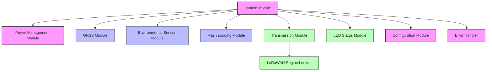
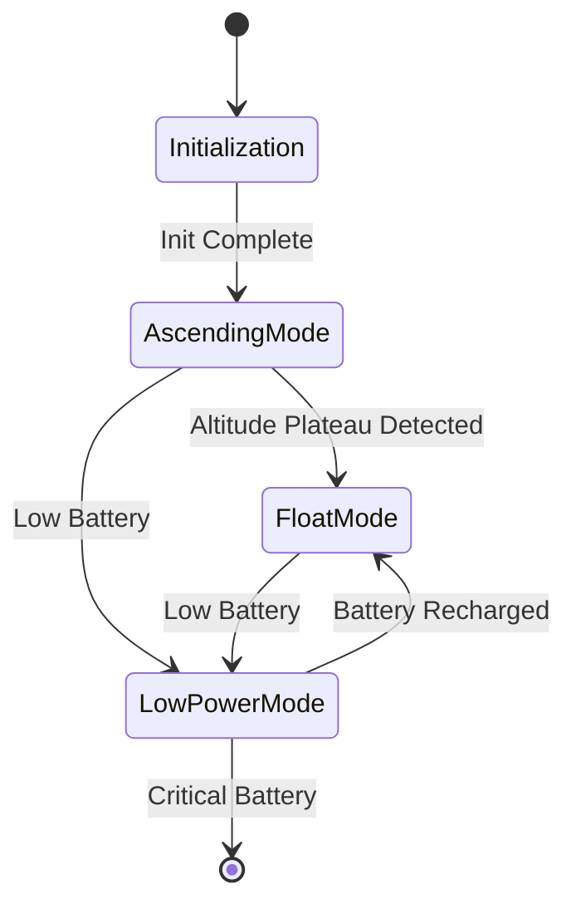
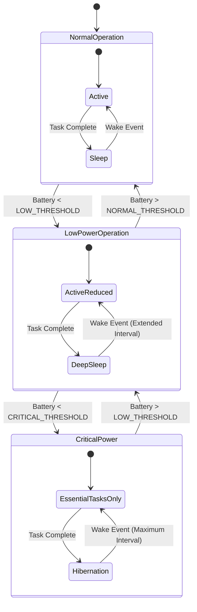
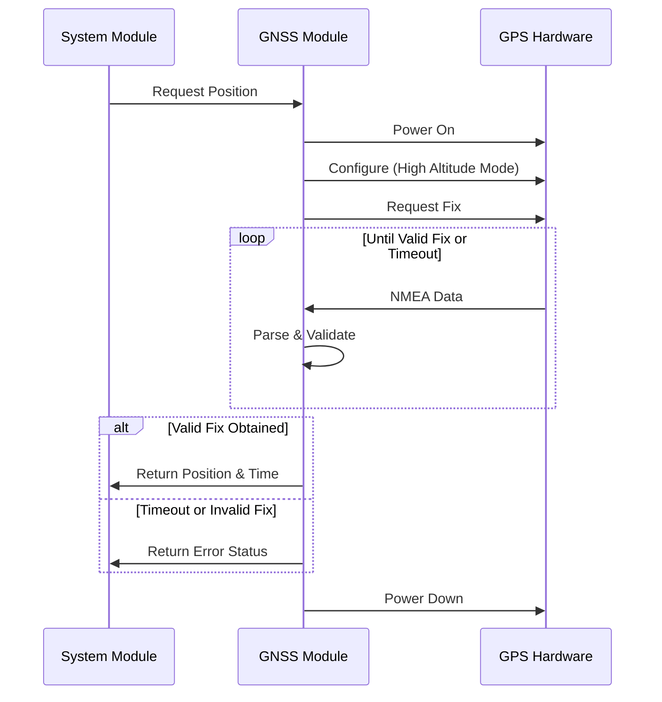
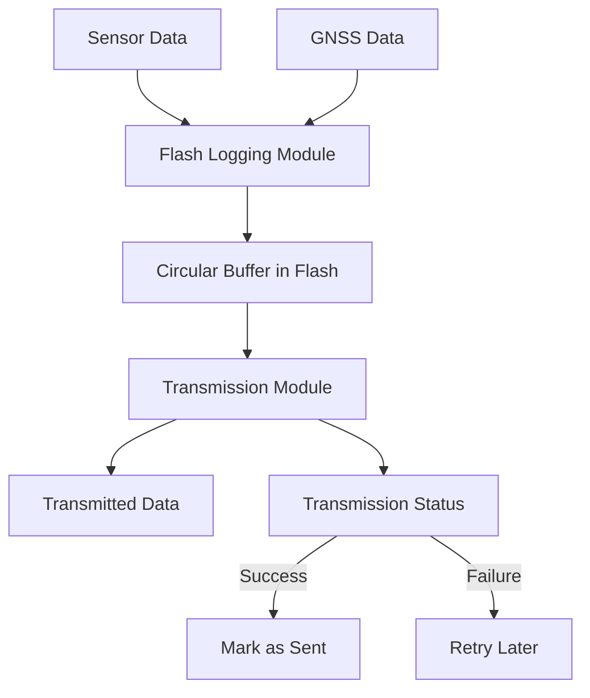
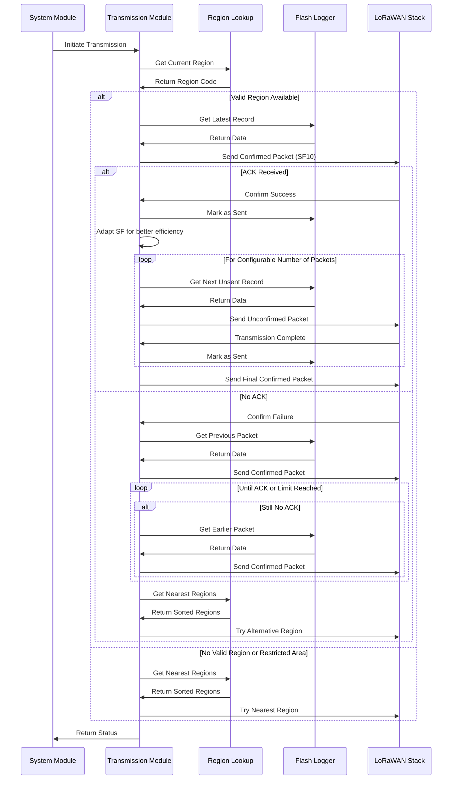
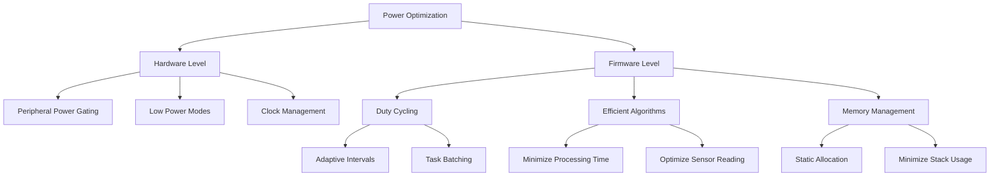

# Stratosonde Firmware Architecture

## 1. Overview

The Stratosonde is an ultra-lightweight, solar-powered radiosonde designed for long-duration autonomous operation in the stratosphere. This document outlines the firmware architecture that enables the device to collect atmospheric and positional data, transmit it over LoRaWAN, and operate efficiently on solar power.



## 2. Core Components

### 2.1 System Module

The System Module serves as the central orchestrator for all firmware operations, implementing a state machine that manages the device's lifecycle.

**Responsibilities:**
- System initialization and hardware setup
- Coordination of all other modules
- Management of the main operational state machine
- Watchdog initialization and refreshing
- RTC-driven sleep and wake scheduling

**State Machine:**



**Implementation Notes:**
- Uses STM32 HAL for hardware abstraction
- Implements independent watchdog for system recovery
- Manages RTC for precise timing and wake-up events

### 2.2 Power Management Module

The Power Management Module handles all aspects of power control, monitoring, and optimization to maximize flight duration.

**Responsibilities:**
- Battery voltage monitoring via ADC
- Power state determination and transitions
- Peripheral power gating
- Dynamic duty cycling based on available power

**Power States:**



**Implementation Notes:**
- Uses low-power modes (STOP, SLEEP) from STM32 HAL
- Implements peripheral power gating for unused components
- Configurable thresholds for state transitions

### 2.3 Configuration Module

The Configuration Module provides a centralized repository for all configurable parameters, making the firmware adaptable to different mission profiles.

**Responsibilities:**
- Store all configurable parameters in flash
- Provide a unified interface for parameter access
- Support default configurations for first boot

**Configuration Parameters:**
- Transmission intervals (normal and low-power modes)
- Battery thresholds for power mode transitions
- LoRaWAN parameters (region, data rate, etc.)
- Sensor sampling configurations
- Flash logging parameters

**Implementation Notes:**
- Parameters stored in dedicated flash sector
- CRC validation for configuration integrity
- Default values for factory reset

### 2.4 Error Handler

The Error Handler provides centralized error management and recovery strategies.

**Responsibilities:**
- Centralized error logging
- Recovery strategy implementation
- Watchdog management
- Diagnostic information collection

**Error Categories:**
- Hardware failures (sensor, communication)
- Software exceptions
- Resource exhaustion (memory, flash)
- Communication failures
- Power issues

**Implementation Notes:**
- Error codes with severity levels
- Flash-based error log
- Recovery procedures based on error type
- Optional inclusion of error data in telemetry

## 3. Data Acquisition

### 3.1 GNSS Module

The GNSS Module interfaces with the ATGM336H-5NR31 GPS receiver to obtain position and time information.

**Responsibilities:**
- UART communication with GPS module
- Power control for GPS module
- Position and time acquisition
- Quality metrics evaluation (satellites, HDOP)

**Operational Flow:**



**Implementation Notes:**
- UART with DMA for efficient data transfer
- Configurable timeout for fix acquisition
- Hot start optimization for quick fixes
- High-altitude mode configuration

### 3.2 Environmental Sensor Module

The Environmental Sensor Module interfaces with the MS5607 pressure sensor and SHT31 temperature/humidity sensor to collect atmospheric data.

**Responsibilities:**
- I2C communication with sensors
- Sensor power management
- Data acquisition and validation
- Unit conversion and formatting

**Implementation Notes:**
- I2C with polling (no DMA required for low data rates)
- Low-power one-shot measurements
- Sensor validation against acceptable ranges
- Error detection for sensor communication

## 4. Data Management

### 4.1 Flash Logging Module

The Flash Logging Module provides persistent storage for telemetry data when LoRaWAN connectivity is unavailable.

**Responsibilities:**
- Implement circular buffer in external flash
- Store high-resolution telemetry records with timestamps
- Convert to 11-byte LoRaWAN packets when transmitting
- Provide interface for reading historical data
- Manage flash memory efficiently
- Track transmitted packets with watermark system

**Data Flow:**



**Implementation Notes:**
- SPI communication with W25Q16JV flash chip
- SPI pins: PA10 (MOSI), PB14 (MISO), PB9 (CS), PB13 (SCK)
- Flash partitioning for configuration/calibration and telemetry data
- Fixed-size record format for efficient storage
- Metadata region for tracking write position
- Simple overwrite of oldest data when full (no wear leveling required)
- Low power shutdown mode command for the flash chip
- Graceful failure modes with limp operation when flash errors occur

## 5. Communication

### 5.1 Transmission Module

The Transmission Module handles all aspects of LoRaWAN communication, including adaptive transmission strategies.

**Responsibilities:**
- LoRaWAN stack management
- Adaptive transmission strategy
- Packet formatting and queuing
- Transmission status tracking
- Geo-fencing for restricted areas

**Transmission Strategy:**



**Implementation Notes:**
- Uses STM32WLE5's integrated LoRa radio
- LoRaWAN Class A implementation
- OTAA with session key caching (ABP as fallback)
- Initial SF10 for confirmed packets with adaptive SF after successful transmission
- 11-byte packet format with efficient encoding (100m resolution for coordinates, minute-based epoch time)
- Configurable transmission parameters
- Geo-fencing to prevent transmission in restricted areas (e.g., North Korea)
- Power management via the LoRaWAN stack with shutdown after receive window

### 5.2 LoRaWAN Region Lookup

The LoRaWAN Region Lookup module determines the appropriate frequency plan based on the device's current position.

**Responsibilities:**
- Determine current LoRaWAN region from coordinates
- Provide distance to other regions
- Support over-ocean operation (transmit to closest region or two)
- Implement geo-fencing for restricted areas

**Implementation Notes:**
- Integration with the H3-lite library (to be provided externally)
- Interface to get closest regions from latitude/longitude coordinates with distance in km
- Support for distance-based region selection
- Handling of over-ocean scenarios by selecting multiple nearby regions
- Geo-fencing for restricted areas like North Korea (no transmission)

### 5.3 LED Status Module

The LED Status Module provides visual feedback during initialization and early operation phases.

**Responsibilities:**
- Indicate system state via LED patterns
- Provide visual confirmation during pre-launch configuration
- Indicate error conditions with different patterns
- Minimize power usage during flight

**LED Patterns:**
- Boot/Commissioning: 1 Hz blink
- GNSS acquisition: 2 Hz blink
- Ascent transmission: Solid ON
- Telemetry cycle: Brief flash during transmission
- Sleep/Float mode: OFF
- Error conditions: Different patterns for different error types

**Implementation Notes:**
- Simple GPIO control for the red LED on PA0
- Direct LED toggling in functions (no timer-based approach)
- LED completely disabled during float mode
- Focus on pre-launch functionality for configuration verification
- Different flash patterns for different error types

## 6. Implementation Phases

### 6.1 Phase 1: Core Infrastructure
- Implement Configuration Module
- Implement Power Management Module
- Set up Error Handler with watchdog
- Enhance System Module with state machine

### 6.2 Phase 2: Sensor Integration
- Implement GNSS Module
- Implement Environmental Sensor Module
- Basic sensor data acquisition

### 6.3 Phase 3: Data Management
- Implement Flash Logging Module
- Circular buffer implementation
- Data structure definitions

### 6.4 Phase 4: Communication
- Enhance Transmission Module
- Implement Region Lookup
- Diagnostic packet formats

### 6.5 Phase 5: Integration & Testing
- Full system integration
- Power consumption optimization
- Temperature chamber testing

## 7. Testing Strategy

### 7.1 Unit Testing
- Individual module functionality
- Interface validation
- Error handling verification

### 7.2 Integration Testing
- Module interactions
- State transitions
- Resource management

### 7.3 Environmental Testing
- Temperature chamber testing
- Power cycling tests
- Long-duration operation

### 7.4 Field Testing
- Ground-based range testing
- Solar charging validation
- Pre-flight verification

## 8. Power Optimization



### 8.1 Hardware Level Optimization
- Use of STM32's low-power modes (STOP, SLEEP)
- Peripheral power gating for unused components
- Clock management (reducing frequency when possible)

### 8.2 Firmware Level Optimization
- Duty cycling of operations
- Efficient algorithms to minimize processing time
- Memory management to reduce power consumption

### 8.3 Adaptive Strategies
- Dynamic adjustment of sampling rates based on battery level
- Prioritization of critical functions during low power
- Intelligent transmission scheduling

## 9. Data Structures

### 9.1 Telemetry Record
```c
typedef struct {
    uint32_t timestamp;           // UTC timestamp
    int32_t latitude;             // Scaled latitude
    int32_t longitude;            // Scaled longitude
    uint16_t altitude;            // Altitude in meters
    int16_t temperature;          // Temperature in 0.1°C
    uint16_t humidity;            // Humidity in 0.1%
    uint16_t pressure;            // Pressure in 0.1 hPa
    uint16_t packet_index;        // Sequence number (0-65535)
    uint8_t satellites;           // Number of satellites
    uint8_t hdop;                 // Horizontal dilution of precision
    uint8_t battery;              // Battery level in %
    uint8_t flags;                // Status flags
} TelemetryRecord_t;
```

### 9.2 Configuration Structure
```c
typedef struct {
    uint32_t magic;               // Magic number for validation
    uint16_t normal_interval;     // Normal mode interval in seconds
    uint16_t lowpower_interval;   // Low power mode interval in seconds
    uint16_t battery_low;         // Low battery threshold in mV
    uint16_t battery_normal;      // Normal battery threshold in mV
    uint16_t battery_critical;    // Critical battery threshold in mV
    uint8_t gnss_timeout;         // GNSS timeout in seconds
    uint8_t gnss_min_satellites;  // Minimum satellites for valid fix
    uint8_t gnss_max_hdop;        // Maximum HDOP for valid fix
    uint8_t lora_datarate;        // LoRaWAN data rate
    uint8_t lora_tx_power;        // LoRaWAN TX power
    uint8_t lora_confirmed;       // Use confirmed messages
    uint8_t lora_port;            // LoRaWAN port
    uint8_t lora_retry_count;     // LoRaWAN retry count
    uint32_t crc;                 // CRC for configuration validation
} Configuration_t;
```

## 10. Conclusion

This firmware architecture provides a robust, power-efficient framework for the Stratosonde's operation. By implementing a modular design with clear separation of concerns, the system can reliably collect and transmit atmospheric data while operating on limited solar power in extreme conditions.

The architecture prioritizes:
- Power efficiency through intelligent management
- Data integrity through robust storage
- Communication reliability through adaptive strategies
- System robustness through error handling and watchdog

With this design, the Stratosonde can achieve its mission of long-duration atmospheric data collection using minimal hardware resources.
