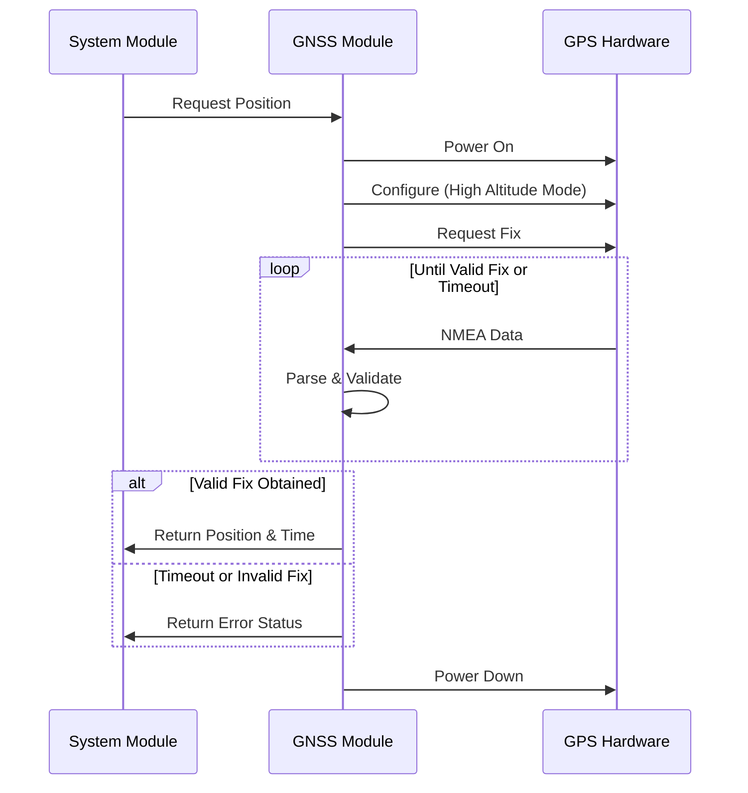

# GNSS Module

## Overview

The GNSS Module interfaces with the ATGM336H-5NR31 GPS receiver to obtain position and time information for the Stratosonde. It manages power control, communication, and data parsing to provide accurate location data while minimizing power consumption.

## Hardware Interface

- **GPS Module**: ATGM336H-5NR31
- **Communication**: UART interface
- **Power Control**: GPIO pin for direct power control
- **Configuration**: UART commands for module configuration

## Operational Flow



## Key Functions

### Initialization

```c
GNSSStatus_t GNSS_Init(void);
```
- Initializes UART interface for GPS communication
- Configures GPIO for power control
- Sets up DMA for efficient data transfer
- Prepares parsing buffers

### Power Management

```c
GNSSStatus_t GNSS_PowerOn(void);
GNSSStatus_t GNSS_PowerOff(void);
```
- Controls power to GPS module
- Implements proper power-up and power-down sequences
- Manages power state tracking

### Configuration

```c
GNSSStatus_t GNSS_Configure(void);
GNSSStatus_t GNSS_SetHighAltitudeMode(bool enable);
GNSSStatus_t GNSS_SetUpdateRate(uint8_t rate);
```
- Sends configuration commands to GPS module
- Sets high altitude mode for stratospheric operation
- Configures update rate and other parameters

### Position Acquisition

```c
GNSSStatus_t GNSS_GetPosition(GNSSData_t *data);
GNSSStatus_t GNSS_GetPositionWithTimeout(GNSSData_t *data, uint32_t timeout);
```
- Acquires position data from GPS module
- Implements timeout to prevent blocking
- Validates data quality before returning

### Data Parsing

```c
GNSSStatus_t GNSS_ParseNMEA(const char *nmea, GNSSData_t *data);
GNSSStatus_t GNSS_ProcessBuffer(void);
```
- Parses NMEA sentences from GPS module
- Extracts position, time, and quality metrics
- Handles different sentence types (GGA, RMC, etc.)

### Time Synchronization

```c
GNSSStatus_t GNSS_SyncRTC(void);
uint32_t GNSS_GetTimestamp(void);
```
- Synchronizes system RTC with GPS time
- Provides accurate timestamp for telemetry data
- Handles UTC to local time conversion if needed

### Quality Assessment

```c
bool GNSS_IsFixValid(const GNSSData_t *data);
uint8_t GNSS_GetFixQuality(const GNSSData_t *data);
```
- Evaluates the quality of GPS fix
- Checks satellite count and HDOP
- Determines if position data is reliable

## Data Structures

### GNSS Data

```c
typedef struct {
    float latitude;               // Latitude in degrees (positive = North)
    float longitude;              // Longitude in degrees (positive = East)
    float altitude;               // Altitude in meters above sea level
    float speed;                  // Ground speed in km/h
    float course;                 // Course in degrees from true north
    uint8_t satellites;           // Number of satellites used for fix
    float hdop;                   // Horizontal dilution of precision
    uint8_t fix_quality;          // Fix quality (0 = invalid, 1 = GPS, 2 = DGPS)
    uint32_t timestamp;           // UTC timestamp
    bool valid;                   // Flag indicating if data is valid
} GNSSData_t;
```

### GNSS Configuration

```c
typedef struct {
    uint8_t update_rate;          // Position update rate in Hz
    bool high_altitude_mode;      // High altitude mode enabled
    uint8_t min_satellites;       // Minimum satellites for valid fix
    float max_hdop;               // Maximum HDOP for valid fix
    uint32_t timeout;             // Acquisition timeout in milliseconds
} GNSSConfig_t;
```

## High Altitude Mode

The GNSS Module configures the GPS receiver for high altitude operation:

- **Maximum Altitude**: Extends altitude limit beyond 18,000 meters
- **Dynamic Model**: Sets appropriate dynamic model for balloon flight
- **Configuration Command**: Sends UBX protocol commands to enable these features

## Power Optimization

The GNSS Module implements several strategies to minimize power consumption:

1. **Power Gating**: Complete power-off when GPS is not needed
2. **Duty Cycling**: Periodic position updates based on system state
3. **Hot Start Optimization**: Maintains ephemeris data for quick fixes
4. **Adaptive Acquisition**: Longer acquisition times in low power states

## Acquisition Strategy

| System State | Acquisition Strategy | Update Rate | Timeout |
|--------------|----------------------|-------------|---------|
| Initialization | Full cold start | Once | 120 seconds |
| Ascending Mode | Regular updates | 1 minute | 60 seconds |
| Float Mode | Periodic updates | 5 minutes | 90 seconds |
| Low Power Mode | Minimal updates | 15 minutes | 120 seconds |

## Error Handling

1. **Communication Errors**:
   - UART timeout detection
   - Buffer overflow protection
   - Retry mechanism for failed commands

2. **Fix Quality Issues**:
   - Minimum satellite threshold (configurable)
   - Maximum HDOP threshold (configurable)
   - Altitude sanity checks

3. **Hardware Failures**:
   - Detection of unresponsive GPS module
   - Power cycling for recovery
   - Fallback to last known position

## Implementation Notes

- UART with DMA for efficient data transfer
- Configurable timeout for fix acquisition
- Hot start optimization for quick fixes
- High-altitude mode configuration
- Integration with Power Management module for efficient operation
- Proper handling of GPS module power-up and power-down sequences
- Validation of position data against acceptable ranges
