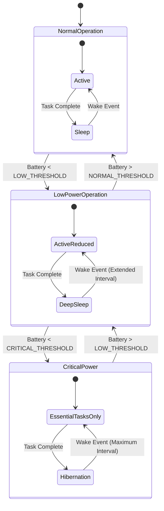

# Power Management Module

## Overview

The Power Management Module handles all aspects of power control, monitoring, and optimization to maximize the flight duration of the Stratosonde. It implements dynamic duty cycling, peripheral power gating, and adaptive power states based on battery voltage.

## Hardware Interface

- **Battery Monitoring**: ADC channel for battery voltage measurement
- **Peripheral Power Control**: GPIO pins for power gating critical components
- **Power States**: Managed through STM32's low-power modes

## Power States



### State Descriptions

| State | Description | Features |
|-------|-------------|----------|
| **Normal Operation** | Sufficient battery voltage for full functionality | Regular sampling intervals, full LoRaWAN functionality |
| **Low Power Operation** | Battery voltage below LOW_THRESHOLD | Extended sampling intervals, reduced transmissions |
| **Critical Power** | Battery voltage below CRITICAL_THRESHOLD | Minimal functionality, maximum sleep time |

## Battery Thresholds

- **NORMAL_THRESHOLD**: Voltage level for normal operation (configurable)
- **LOW_THRESHOLD**: Voltage level to enter low power mode (configurable)
- **CRITICAL_THRESHOLD**: Voltage level to enter critical power mode (configurable)

## Key Functions

### Initialization

```c
PowerStatus_t Power_Init(void);
```
- Initializes ADC for battery monitoring
- Configures GPIO pins for peripheral power control
- Sets up initial power state based on battery voltage

### Battery Monitoring

```c
uint16_t Power_GetBatteryVoltage(void);
PowerState_t Power_GetPowerState(void);
```
- Measures current battery voltage via ADC
- Determines appropriate power state based on thresholds

### Power State Management

```c
PowerStatus_t Power_EnterState(PowerState_t state);
PowerStatus_t Power_UpdateState(void);
```
- Transitions between power states
- Updates system configuration based on current state

### Peripheral Power Control

```c
PowerStatus_t Power_EnableGPS(void);
PowerStatus_t Power_DisableGPS(void);
PowerStatus_t Power_EnableSensors(void);
PowerStatus_t Power_DisableSensors(void);
```
- Controls power to individual peripherals
- Implements power gating for unused components

### Sleep Mode Management

```c
PowerStatus_t Power_EnterSleep(uint32_t duration);
PowerStatus_t Power_EnterDeepSleep(uint32_t duration);
PowerStatus_t Power_EnterHibernation(uint32_t duration);
```
- Configures and enters appropriate sleep mode
- Sets up wake-up timer for specified duration
- Ensures critical peripherals are in proper state before sleep

### Wake-up Management

```c
PowerStatus_t Power_HandleWakeup(WakeupSource_t source);
```
- Handles system wake-up from various sources
- Restores system state after sleep

## Sleep Modes

| Mode | Description | Current Consumption | Wake-up Sources |
|------|-------------|---------------------|-----------------|
| **Sleep** | CPU stopped, peripherals running | ~500 µA | RTC, External Interrupt |
| **Deep Sleep** | CPU and most peripherals stopped | ~5 µA | RTC, External Interrupt |
| **Hibernation** | Minimal system function | ~1 µA | RTC only |

## Duty Cycling

The Power Management Module implements adaptive duty cycling based on the current power state:

| State | Active Time | Sleep Time | Duty Cycle |
|-------|-------------|------------|------------|
| Normal Operation | As needed | Configurable (e.g., 5 min) | ~5% |
| Low Power Operation | Minimized | Extended (e.g., 15 min) | ~2% |
| Critical Power | Essential only | Maximum (e.g., 60 min) | <1% |

## Peripheral Power Gating

The module implements power gating for major peripherals:

| Peripheral | Power Control Method | Power State Dependencies |
|------------|----------------------|--------------------------|
| GPS | Direct GPIO control | Enabled only during position acquisition |
| Environmental Sensors | I2C commands + power control | One-shot measurements during wake cycles |
| Flash Memory | SPI commands | Low power mode when not in use |
| LoRa Radio | LoRaWAN stack control | Powered down after receive window |

## Implementation Notes

### Hardware Level Optimization

- Uses STM32's low-power modes (STOP, SLEEP)
- Peripheral power gating for unused components
- Clock management (reducing frequency when possible)

### Firmware Level Optimization

- Duty cycling of operations
- Efficient algorithms to minimize processing time
- Memory management to reduce power consumption

### Adaptive Strategies

- Dynamic adjustment of sampling rates based on battery level
- Prioritization of critical functions during low power
- Intelligent transmission scheduling

## Error Handling

1. **Battery Measurement Errors**:
   - Fallback to conservative power state if ADC readings are unreliable
   - Multiple measurements with averaging to improve accuracy

2. **Peripheral Control Failures**:
   - Detection of power control failures
   - Fallback strategies for unresponsive peripherals

3. **Sleep Mode Failures**:
   - Watchdog to recover from failed sleep transitions
   - Fallback to simpler sleep mode if advanced modes fail

## Power Consumption Analysis

| Component | Active Current | Sleep Current | Duty Cycle | Average Current |
|-----------|----------------|---------------|------------|-----------------|
| MCU (STM32WLE5) | 5.3 mA | 1.5 µA | 5% | 266 µA |
| GPS | 25 mA | 0 µA | 1% | 250 µA |
| Sensors | 1.5 mA | 1 µA | 2% | 31 µA |
| Flash Memory | 5 mA | 1 µA | 1% | 51 µA |
| LoRa Radio | 125 mA | 0 µA | 0.1% | 125 µA |
| **Total** | | | | **723 µA** |

With a small solar panel providing approximately 1-2 mA in daylight, the system can maintain positive energy balance during daylight hours and operate on battery during night.
