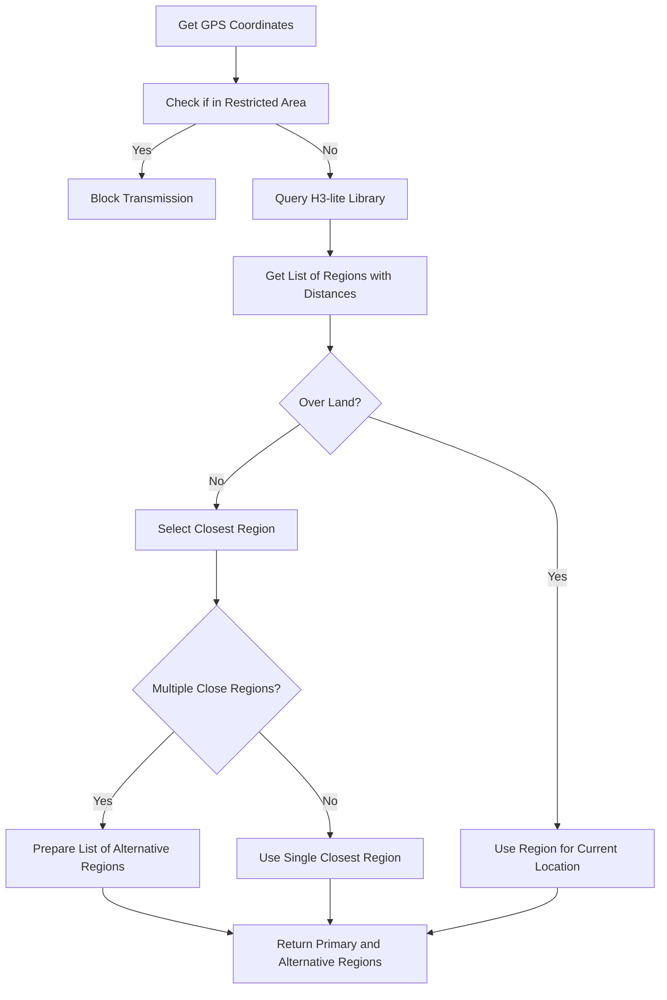

# LoRaWAN Region Lookup Module

## Overview

The LoRaWAN Region Lookup module determines the appropriate frequency plan based on the device's current position. It integrates with the H3-lite library to efficiently map GPS coordinates to LoRaWAN regions and handles special cases like over-ocean operation and restricted areas.

## Integration with H3-lite Library

- **External Library**: H3-lite (to be provided separately)
- **Interface**: Simple API to get closest regions from latitude/longitude
- **Distance Calculation**: Returns distance in kilometers to each region

## Region Determination Process



## Supported LoRaWAN Regions

| Region Code | Frequency Band | Countries/Areas |
|-------------|----------------|-----------------|
| EU868       | 863-870 MHz    | Europe          |
| US915       | 902-928 MHz    | United States   |
| AU915       | 915-928 MHz    | Australia       |
| AS923-1     | 920-923 MHz    | Asia Group 1    |
| AS923-2     | 923-925 MHz    | Asia Group 2    |
| AS923-3     | 915-921 MHz    | Asia Group 3    |
| KR920       | 920-923 MHz    | South Korea     |
| IN865       | 865-867 MHz    | India           |
| RU864       | 864-870 MHz    | Russia          |

## Restricted Areas

- **North Korea**: No transmission allowed
- Other restricted areas can be defined as needed

## Over-Ocean Strategy

- When over ocean, transmit to the closest region or two
- Prioritize regions by distance
- Consider signal propagation characteristics over water

## Key Functions

### Initialization

```c
RegionStatus_t Region_Init(void);
```
- Initializes the region lookup module
- Prepares interface with H3-lite library

### Region Lookup

```c
RegionStatus_t Region_GetForCoordinates(float latitude, float longitude, LoRaWAN_Region_t *region);
```
- Determines the appropriate LoRaWAN region for given coordinates
- Returns region code for use by Transmission Module

### Distance Calculation

```c
RegionStatus_t Region_GetDistances(float latitude, float longitude, RegionDistance_t *distances, uint8_t maxRegions);
```
- Returns distances to all regions from given coordinates
- Sorted by proximity (closest first)

### Restricted Area Check

```c
bool Region_IsRestricted(float latitude, float longitude);
```
- Checks if coordinates are in a restricted transmission area
- Returns true if transmission should be blocked

### Alternative Regions

```c
RegionStatus_t Region_GetAlternatives(float latitude, float longitude, LoRaWAN_Region_t *regions, uint8_t maxRegions);
```
- Gets alternative regions for over-ocean operation
- Returns multiple options sorted by proximity

## Data Structures

### Region Distance

```c
typedef struct {
    LoRaWAN_Region_t region;      // Region code
    float distance;               // Distance in kilometers
} RegionDistance_t;
```

### Region Definition

```c
typedef struct {
    LoRaWAN_Region_t code;        // Region code
    char name[16];                // Region name
    uint32_t frequency;           // Base frequency in Hz
    uint8_t datarates;            // Supported data rates bitmap
    uint8_t max_tx_power;         // Maximum TX power
} RegionDefinition_t;
```

## Error Handling

1. **Library Integration Errors**:
   - Graceful fallback if H3-lite library fails
   - Default to most common region if lookup fails

2. **No Valid Region**:
   - Handle cases where no suitable region is found
   - Implement fallback strategy based on last known good region

3. **Restricted Areas**:
   - Clear indication when in restricted area
   - Provide status to Transmission Module to block transmission

## Implementation Notes

- Integration with the H3-lite library (to be provided externally)
- Efficient lookup mechanism to minimize processing time
- Compact storage of region boundaries
- Support for distance-based region selection
- Handling of over-ocean scenarios by selecting multiple nearby regions
- Geo-fencing implementation for restricted areas
