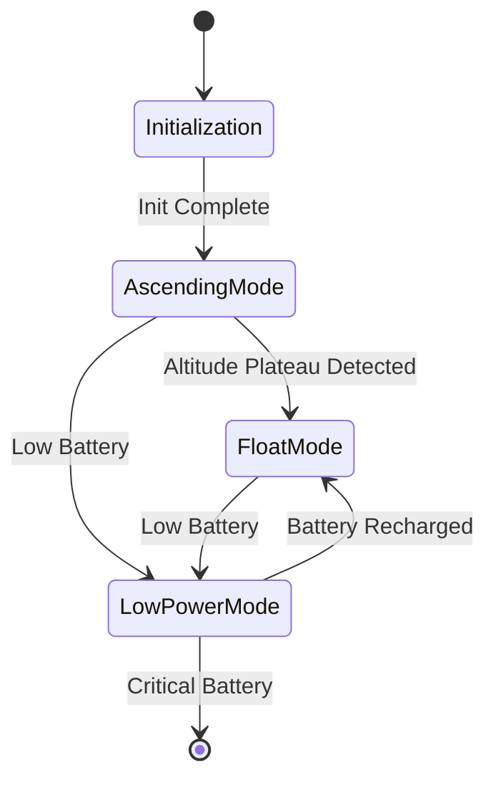
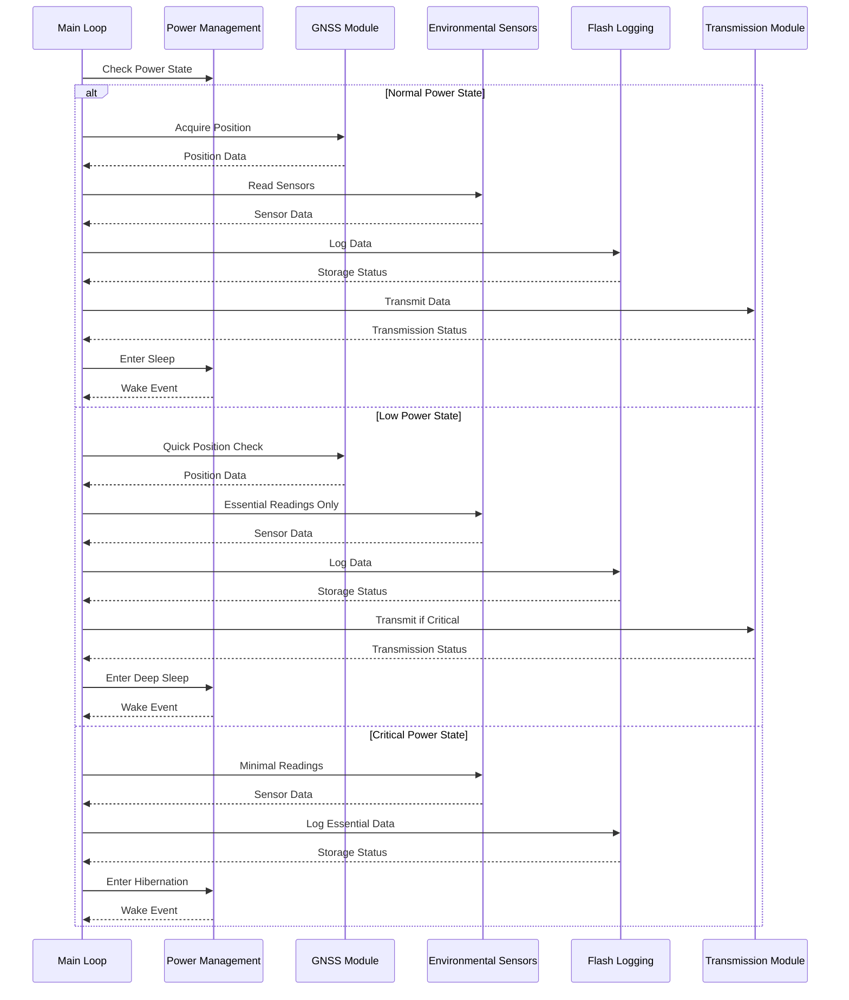

# System Module

## Overview

The System Module serves as the central orchestrator for all firmware operations in the Stratosonde. It implements a state machine that manages the device's lifecycle, coordinates all other modules, and ensures reliable operation through watchdog management and error handling.

## Responsibilities

- System initialization and hardware setup
- Coordination of all other modules
- Management of the main operational state machine
- Watchdog initialization and refreshing
- RTC-driven sleep and wake scheduling
- Error detection and handling

## State Machine



### State Descriptions

| State | Description | Activities |
|-------|-------------|------------|
| **Initialization** | System boot and setup | Hardware initialization, module setup, configuration loading |
| **AscendingMode** | Balloon is ascending | Regular sensor readings, frequent transmissions, GPS active |
| **FloatMode** | Balloon has reached float altitude | Regular sensor readings, scheduled transmissions, GPS duty-cycled |
| **LowPowerMode** | Battery voltage is low | Reduced sensor readings, minimal transmissions, GPS minimized |

## Operational Flow



## Key Functions

### Initialization

```c
SystemStatus_t System_Init(void);
```
- Initializes all hardware peripherals
- Sets up all modules in the correct sequence
- Loads configuration from flash
- Performs self-test of critical components

### State Management

```c
SystemStatus_t System_SetState(SystemState_t state);
SystemState_t System_GetState(void);
SystemStatus_t System_UpdateState(void);
```
- Transitions between system states
- Retrieves current system state
- Updates state based on sensor data and conditions

### Module Coordination

```c
SystemStatus_t System_AcquirePosition(void);
SystemStatus_t System_ReadSensors(void);
SystemStatus_t System_LogData(void);
SystemStatus_t System_TransmitData(void);
```
- Coordinates operations between modules
- Manages data flow through the system
- Handles error conditions from module operations

### Watchdog Management

```c
void System_InitWatchdog(void);
void System_RefreshWatchdog(void);
```
- Initializes independent watchdog timer
- Refreshes watchdog to prevent system reset
- Implements safe refresh strategy

### Sleep and Wake Management

```c
SystemStatus_t System_EnterSleep(uint32_t duration);
SystemStatus_t System_HandleWakeup(WakeupSource_t source);
```
- Coordinates system sleep through Power Management module
- Handles different wake-up sources
- Restores system state after wake-up

### Error Handling

```c
SystemStatus_t System_HandleError(ErrorType_t error, uint32_t data);
bool System_IsErrorActive(ErrorType_t error);
```
- Centralized error handling
- Implements recovery strategies
- Logs errors for later analysis

## Watchdog Implementation

The System Module implements an independent watchdog timer (IWDG) to ensure system recovery in case of software failures:

- **Timeout**: Configured for 10 seconds
- **Refresh Strategy**: Refreshed only after successful completion of main loop
- **Recovery**: Automatic system reset if watchdog times out

## RTC Implementation

The System Module uses the RTC for precise timing and wake-up events:

- **Time Synchronization**: Synchronized with GPS time when available
- **Wake-up Alarms**: Configured based on power state and required activities
- **Timestamp Generation**: Provides accurate timestamps for telemetry data

## Configuration Management

The System Module manages system-wide configuration parameters:

- **Storage**: Parameters stored in dedicated flash sector
- **Default Values**: Fallback to default values if configuration is invalid
- **Runtime Updates**: Support for updating configuration during operation

## Error Recovery Strategies

| Error Type | Recovery Strategy |
|------------|-------------------|
| Hardware Failure | Attempt reset of affected peripheral, disable if persistent |
| Communication Error | Retry with backoff, switch to alternative interface if available |
| Sensor Error | Use last valid reading, mark data as potentially invalid |
| Flash Error | Enter limp mode, prioritize transmission of current data |
| Critical Error | Perform system reset via watchdog |

## Implementation Notes

- Uses STM32 HAL for hardware abstraction
- Implements independent watchdog for system recovery
- Manages RTC for precise timing and wake-up events
- Coordinates power states with Power Management module
- Implements graceful degradation for component failures
- Prioritizes mission-critical functions during resource constraints
