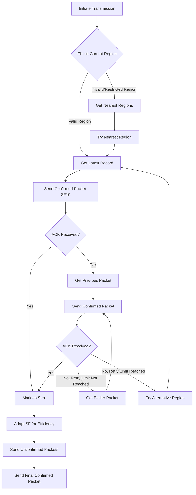

# Transmission Module

## Overview

The Transmission Module handles all aspects of LoRaWAN communication for the Stratosonde, implementing an adaptive transmission strategy that maximizes the chances of successful data delivery while minimizing power consumption.

## Hardware Interface

- **Radio**: STM32WLE5's integrated LoRa radio
- **Antenna**: Matched impedance antenna for optimal range
- **Power Control**: Managed through the LoRaWAN stack

## LoRaWAN Configuration

- **Class**: Class A (most power-efficient)
- **Activation Method**: 
  - Primary: OTAA (Over-The-Air Activation) with session key caching
  - Fallback: ABP (Activation By Personalization)
- **Security**: 
  - DevEUI, AppEUI, and AppKey stored in STM32 secure enclave
  - Session keys cached to avoid rejoin procedures

## Transmission Strategy



### Key Aspects

1. **Initial Transmission**:
   - Latest packet sent confirmed via SF10 (high power, maximum range)
   - If confirmation received, proceed with unconfirmed packets
   - If no confirmation, try previous packet confirmed

2. **Batch Transmission**:
   - After successful confirmation, send configurable number of packets unconfirmed
   - Work backwards through stored packets
   - Send one more confirmed packet at the end of batch

3. **Adaptive Spreading Factor**:
   - Start with SF10 for confirmed packets
   - After successful confirmation, adapt SF for better efficiency
   - Part of configuration settings to allow larger packets in future

4. **Retry Mechanism**:
   - If confirmed packet not acknowledged, try previous packet
   - Continue until configurable confirmed packet limit reached
   - If still no success, try alternative regions

5. **Region Handling**:
   - Use H3-lite library to determine appropriate region
   - If over ocean, transmit to closest region or two
   - No transmission in restricted areas (e.g., North Korea)

## Data Format

### Low-Resolution Packet (11 bytes)

```c
typedef struct {
    uint8_t timestamp[2];         // Compressed timestamp (minutes since epoch)
    uint8_t latitude[2];          // 100m resolution latitude
    uint8_t longitude[2];         // 100m resolution longitude
    uint8_t altitude;             // Compressed altitude
    uint8_t temperature;          // Compressed temperature
    uint8_t pressure;             // Compressed pressure
    uint8_t status;               // Battery, satellites, flags
    uint8_t packet_index;         // LSB of sequence number (0-255)
} LowResTelemetryPacket_t;
```

### Data Compression Techniques

- **Position**: 100m resolution for latitude/longitude
- **Time**: Minute-based epoch time
- **Measurements**: Scaled and offset to maximize resolution in expected ranges
- **Status**: Bit-packed information for battery, satellites, and flags

## Key Functions

### Initialization

```c
TransmissionStatus_t Transmission_Init(void);
```
- Initializes LoRaWAN stack
- Configures radio parameters
- Performs OTAA join or ABP setup
- Caches session keys for future use

### Transmission Control

```c
TransmissionStatus_t Transmission_SendLatestData(void);
TransmissionStatus_t Transmission_SendBatch(uint8_t batchSize);
TransmissionStatus_t Transmission_SendConfirmed(LowResTelemetryPacket_t *packet);
TransmissionStatus_t Transmission_SendUnconfirmed(LowResTelemetryPacket_t *packet);
```
- Implements various transmission strategies
- Handles packet formatting and queuing
- Manages confirmations and retries

### Region Management

```c
TransmissionStatus_t Transmission_SetRegion(LoRaWAN_Region_t region);
LoRaWAN_Region_t Transmission_GetCurrentRegion(void);
bool Transmission_IsRegionRestricted(float latitude, float longitude);
```
- Interfaces with Region Lookup module
- Manages region-specific configurations
- Implements geo-fencing for restricted areas

### Adaptive Parameters

```c
TransmissionStatus_t Transmission_SetDataRate(uint8_t dataRate);
TransmissionStatus_t Transmission_SetTxPower(uint8_t txPower);
TransmissionStatus_t Transmission_OptimizeParameters(void);
```
- Adjusts transmission parameters based on success/failure
- Implements adaptive spreading factor
- Optimizes for power efficiency

### Power Management

```c
TransmissionStatus_t Transmission_EnterLowPowerMode(void);
TransmissionStatus_t Transmission_ExitLowPowerMode(void);
```
- Controls radio power states
- Shuts down radio after receive window
- Minimizes power consumption during sleep periods

## Error Handling

1. **Join Failures**:
   - Retry with exponential backoff
   - Fall back to ABP if OTAA repeatedly fails
   - Cache last known good session keys

2. **Transmission Failures**:
   - Implement retry mechanism with previous packets
   - Try alternative regions when appropriate
   - Report persistent failures to Error Handler

3. **Region Issues**:
   - Handle cases where no valid region is available
   - Implement fallback strategy for over-ocean operation
   - Skip transmission in restricted areas

## Power Considerations

- Radio controlled via LoRaWAN stack
- Powered down after receive window as per LoRaWAN standard
- Adaptive parameters to minimize transmission time
- Batch transmissions to optimize duty cycle

## Implementation Notes

- Uses STM32WLE5's integrated LoRa radio
- LoRaWAN Class A implementation for power efficiency
- OTAA with session key caching to avoid rejoin procedures
- Configurable transmission parameters
- Geo-fencing implementation for restricted areas
- Integration with Flash Logging Module for data retrieval
