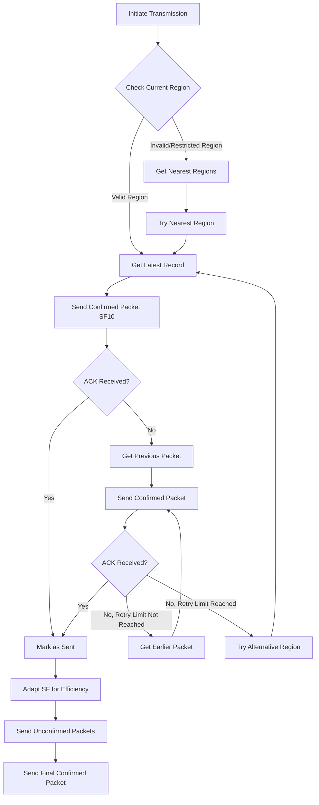

# Transmission Module

## Overview

The Transmission Module handles all aspects of LoRaWAN communication for the Stratosonde, implementing an adaptive transmission strategy that maximizes the chances of successful data delivery while minimizing power consumption.

## Hardware Interface

- **Radio**: STM32WLE5's integrated LoRa radio
- **Antenna**: Matched impedance antenna for optimal range
- **Power Control**: Managed through the LoRaWAN stack

## LoRaWAN Configuration

- **Class**: Class A (most power-efficient)
- **Activation Method**: 
  - Primary: OTAA (Over-The-Air Activation) with session key caching
  - Fallback: ABP (Activation By Personalization)
- **Security**: 
  - DevEUI, AppEUI, and AppKey stored in STM32 secure enclave
  - Session keys cached to avoid rejoin procedures

## Transmission Strategy


```mermaid
flowchart TD
    A[Initiate Transmission] --> B{Check Current Region}
    B -->|Valid Region| C[Get Latest Record]
    B -->|Invalid/Restricted Region| D[Get Nearest Regions]
    D --> E[Try Nearest Region]
    E --> C
    
    C --> F[Send Confirmed Packet SF10]
    F --> G{ACK Received?}
    
    G -->|Yes| H[Mark as Sent]
    G -->|No| I[Get Previous Packet]
    
    H --> J[Adapt SF for Efficiency]
    J --> K[Send Unconfirmed Packets]
    K --> L[Send Final Confirmed Packet]
    
    I --> M[Send Confirmed Packet]
    M --> N{ACK Received?}
    N -->|Yes| H
    N -->|No, Retry Limit Not Reached| O[Get Earlier Packet]
    O --> M
    N -->|No, Retry Limit Reached| P[Try Alternative Region]
    P --> C
```

### Key Aspects

1. **Initial Transmission**:
   - Latest packet sent confirmed via SF10 (high power, maximum range)
   - If confirmation received, proceed with unconfirmed packets
   - If no confirmation, try previous packet confirmed

2. **Batch Transmission**:
   - After successful confirmation, send configurable number of packets unconfirmed
   - Work backwards through stored packets
   - Send one more confirmed packet at the end of batch

3. **Adaptive Spreading Factor**:
   - Start with SF10 for confirmed packets
   - After successful confirmation, adapt SF for better efficiency
   - Part of configuration settings to allow larger packets in future

4. **Retry Mechanism**:
   - If confirmed packet not acknowledged, try previous packet
   - Continue until configurable confirmed packet limit reached
   - If still no success, try alternative regions

5. **Region Handling**:
   - Use H3-lite library to determine appropriate region
   - If over ocean, transmit to closest region or two
   - No transmission in restricted areas (e.g., North Korea)

## Data Formats

### Production Packets

The Stratosonde uses two main packet formats for production:

#### Port 10: Compact Binary Packet — Heartbeat v2 (11 bytes)

Ultra-compact telemetry optimized for SF10 (maximum range). **All multibyte fields are little-endian** (D9). See [PayloadFormats.md](PayloadFormats.md) for the authoritative field-level spec and decoder.

| Offset | Field | Type | Size | Resolution |
|--------|-------|------|------|------------|
| 0 | Timestamp (minutes since epoch) | uint16 LE | 2 bytes | 1 minute (45.5-day wrap, see status b5) |
| 2 | Latitude | int16 LE | 2 bytes | ~300m (deg = value × 90 / 32767) |
| 4 | Longitude | int16 LE | 2 bytes | ~550m (deg = value × 180 / 32767) |
| 6 | Temperature | int8 | 1 byte | 2°C ((value − 64) × 2) |
| 7 | Pressure + Humidity (packed) | uint16 LE | 2 bytes | bits 0-10: 1 hPa; bits 11-15: 5% |
| 9 | Battery | uint8 | 1 byte | 50 mV |
| 10 | Status v2 (stale bits + time markers + mission state) | uint8 | 1 byte | — |

**Note**: Altitude calculated on backend from pressure + temperature. The 11th byte is the heartbeat v2 status byte (GPS/temp/hum/press stale bits, GNSS-disciplined-time marker, timestamp-wrap, mission state); LinkCheckReq rides in FOpts, not the payload.

#### Port 11: Core Science Archive Packet (v4, variable length)

High-resolution archive transfer at SF7. Wire format **v4** (`packet_type 0x04`), variable length `6 + 32n + 4` bytes:

- Header: 6 bytes — `packet_type` (1 B = 0x04), `record_count` (1 B = n), `base_seq` (4 B uint32 LE, flash sequence of the first record; record i identity = `base_seq + i`, DDR-0005)
- Records: n × 32-byte high-resolution records (n ≤ 6), packed to the runtime payload budget (`LoRaMacQueryTxPossible`)
- Trailer: 4 bytes CRC32 over all preceding bytes

Each 32-byte record includes: full-precision GPS, environmental sensors (0.1° resolution), battery/solar voltages, voltage slope, satellites, HDOP, power mode, data-honesty flags, and CRC16. Records are ACK-gated (watermark commits only on `McpsConfirm.AckReceived`; backend dedups on (DevEUI, sequence)). Legacy fixed layouts v1 (`0x01`, 222 B) and v2 (`0x02`, 198 B) are documented in [PayloadFormats.md](PayloadFormats.md) for historical decode only.

### Debug Packets (Development Only)

- **Port 2**: CayenneLPP format (~30 bytes)
- **Port 3**: GNSS Detail with satellite tracking (~40-60 bytes)

### Data Compression Strategy

- **GPS coordinates**: full-range int16 scaling for compact (~300m lat / ~550m lon), full 1e-7° precision for archive
- **Time**: Minute epochs (compact), second epochs (archive)
- **Sensors**: Scaled/offset to maximize resolution in expected ranges
- **Multi-tier**: Compact for real-time, bulk for historical backfill

## Key Functions

### Initialization

```c
TransmissionStatus_t Transmission_Init(void);
```
- Initializes LoRaWAN stack
- Configures radio parameters
- Performs OTAA join or ABP setup
- Caches session keys for future use

### Transmission Control

```c
TransmissionStatus_t Transmission_SendLatestData(void);
TransmissionStatus_t Transmission_SendBatch(uint8_t batchSize);
TransmissionStatus_t Transmission_SendConfirmed(LowResTelemetryPacket_t *packet);
TransmissionStatus_t Transmission_SendUnconfirmed(LowResTelemetryPacket_t *packet);
```
- Implements various transmission strategies
- Handles packet formatting and queuing
- Manages confirmations and retries

### Region Management

```c
TransmissionStatus_t Transmission_SetRegion(LoRaWAN_Region_t region);
LoRaWAN_Region_t Transmission_GetCurrentRegion(void);
bool Transmission_IsRegionRestricted(float latitude, float longitude);
```
- Interfaces with Region Lookup module
- Manages region-specific configurations
- Implements geo-fencing for restricted areas

### Adaptive Parameters

```c
TransmissionStatus_t Transmission_SetDataRate(uint8_t dataRate);
TransmissionStatus_t Transmission_SetTxPower(uint8_t txPower);
TransmissionStatus_t Transmission_OptimizeParameters(void);
```
- Adjusts transmission parameters based on success/failure
- Implements adaptive spreading factor
- Optimizes for power efficiency

### Power Management

```c
TransmissionStatus_t Transmission_EnterLowPowerMode(void);
TransmissionStatus_t Transmission_ExitLowPowerMode(void);
```
- Controls radio power states
- Shuts down radio after receive window
- Minimizes power consumption during sleep periods

## Error Handling

1. **Join Failures**:
   - Retry with exponential backoff
   - Fall back to ABP if OTAA repeatedly fails
   - Cache last known good session keys

2. **Transmission Failures**:
   - Implement retry mechanism with previous packets
   - Try alternative regions when appropriate
   - Report persistent failures to Error Handler

3. **Region Issues**:
   - Handle cases where no valid region is available
   - Implement fallback strategy for over-ocean operation
   - Skip transmission in restricted areas

## Power Considerations

- Radio controlled via LoRaWAN stack
- Powered down after receive window as per LoRaWAN standard
- Adaptive parameters to minimize transmission time
- Batch transmissions to optimize duty cycle

## Implementation Notes

- Uses STM32WLE5's integrated LoRa radio
- LoRaWAN Class A implementation for power efficiency
- OTAA with session key caching to avoid rejoin procedures
- Configurable transmission parameters
- Geo-fencing implementation for restricted areas
- Integration with Flash Logging Module for data retrieval
