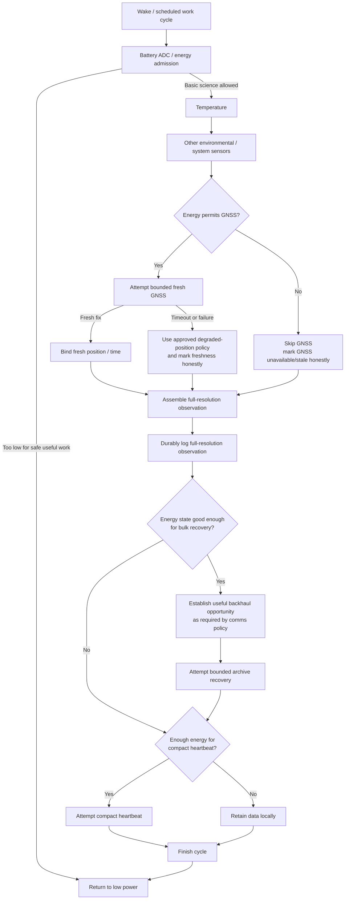

# DDR-0001: Energy-Gated Resilient Wake Cycle

**Status:** Draft — wake-cycle intent substantially elicited; static implementation comparison complete; executable proof pending  
**Intent Interview Date:** 2026-08-09  
**Method:** Intent Interview V2 / Intent-Anchored Development  
**Scope:** One periodic flight work cycle: wake → energy admission → observation → GNSS attempt as permitted → durable archive → opportunistic radio work → return to low power  
**Authority:** Product intent is normative. Existing implementation and historical design records may be consulted during migration, but this DDR must remain complete and understandable without depending on them.

**Legacy migration rule:** Historical DDRs are source material only. Any still-valid rationale, invariant, requirement, or trade-off must be absorbed into the new V2 record. Once no unique design knowledge remains in a legacy DDR, that legacy record may be retired or removed.

---

## 1. Intent

Stratosonde is a long-duration balloon payload in which mass is a first-order mission constraint. Battery capacity adds mass, and additional mass increases balloon and helium requirements and can reduce achievable altitude or mission practicality.

The sonde therefore spends most of its mission asleep. A wake cycle exists to extract useful scientific value while expending as little energy as practical, then return the system to its low-power state.

The purpose of a wake is:

> **Safely obtain and durably preserve the best observation the available energy permits, attempt to deliver useful data when possible, and return to low power without allowing one unavailable subsystem to sacrifice the mission.**

A complete science observation ideally binds together:

- time;
- position;
- environmental sensor measurements;
- power/system context needed to interpret the observation.

Fresh position is highly valuable, but GNSS is a comparatively expensive load and must not be allowed to jeopardize continued operation. Missing GNSS therefore degrades the observation; it does not invalidate all other science.

---

## 2. Mission-Level Invariants

### INV-WAKE-001 — Energy must not be spent recklessly

A wake cycle SHALL NOT intentionally start a power-intensive operation when the system's energy state indicates that doing so creates unacceptable brownout, peripheral undervoltage, data-validity, or mission-loss risk.

The product is designed with substantial voltage margin. The MCU can continue operating below the minimum operating voltage of several peripherals, so **continued MCU execution is not sufficient evidence that sensors, GNSS, or radio data remain trustworthy**.

Normal operation SHALL stay clear of the peripheral-undervoltage region. Brownout/reset is an abnormal fault condition to recover from, not an intended power-control mechanism.

### INV-WAKE-002 — Preserve useful science despite partial failure

Failure or deliberate omission of one subsystem SHALL NOT discard otherwise useful measurements when those measurements can be safely acquired and archived.

In particular, unavailable GNSS SHALL NOT by itself prevent environmental science from being collected and preserved.

### INV-WAKE-003 — Work is a resilient checklist, not an all-or-nothing chain

The wake cycle SHALL attempt as much useful work as current resources and dependencies permit.

A failed task SHALL terminate only the work that actually depends upon it, unless continuing would violate safety, regulatory, data-integrity, or energy constraints.

### INV-WAKE-004 — Expensive operations are bounded

No peripheral acquisition, radio operation, retry loop, or other optional work SHALL be allowed to run indefinitely.

The cycle must retain a path back to low power.

### INV-WAKE-005 — Archive is independent of backhaul

A lack of gateway coverage, LoRaWAN session availability, or other backhaul failure SHALL NOT prevent a valid observation from being durably archived.

### INV-WAKE-006 — Freshness must remain honest

When fresh information cannot be obtained, downstream records SHALL distinguish degraded/stale/unavailable information from fresh measurements.

No fallback value may silently masquerade as a fresh measurement.

### INV-WAKE-007 — Cold boot, fault reset, and ordinary wake converge on the same mission cycle

After the minimum hardware-specific startup required to establish a known state, firmware SHALL enter the same ordinary mission-cycle orchestration regardless of whether execution began from:

- cold power-on;
- watchdog reset;
- fault reset;
- ordinary low-power wake.

The design SHALL avoid separate behavioral implementations for "boot" and "wake" unless the hardware requires a genuine difference. (Startup mechanics are owned by DDR-0012; this invariant fixes the product-level convergence requirement.)

### INV-WAKE-008 — Start from the lowest-power known state

Startup SHALL first establish a known safe/low-power hardware state before enabling expensive subsystems.

### INV-WAKE-009 — Energy truth precedes expensive work

Before admitting GNSS, radio, or optional application work, the orchestrator SHALL establish enough current energy/power state to decide which work is physically admissible for that cycle. This strengthens BR-WAKE-001: the admission decision must be based on the *current* cycle's measured state, not on stale or assumed conditions.

### INV-WAKE-010 — The orchestrator owns the wake deadline

The Stratosonde core SHALL own the wake-cycle timing budget.

Peripheral or application work SHALL NOT extend the wake indefinitely. Application payload time/resource requests remain subordinate to this deadline (see DDR-0017).

### INV-WAKE-011 — Wake duration should be minimized

The implementation SHOULD overlap independent activity when doing so is safe and materially reduces awake time.

Example:

> Environmental sensors may be sampled while GNSS acquisition is in progress rather than serially waiting for GNSS first.

---

## 3. Behavioral Requirements

Confidence legend:

- **CONFIRMED** — stated and affirmed during the Intent Interview.
- **INFERRED** — strongly implied by the discussion but not yet explicitly approved as normative wording.
- **OPEN** — product behavior is not yet fully decided.

| ID | Requirement | Confidence |
|---|---|---|
| BR-WAKE-001 | At the beginning of each work cycle, the sonde SHALL determine whether available energy is sufficient to perform useful work safely before intentionally enabling high-energy loads. | **CONFIRMED** |
| BR-WAKE-002 | If energy is insufficient for even the minimum safe useful work, the sonde SHALL return to low power rather than intentionally brown out. | **CONFIRMED** |
| BR-WAKE-003 | If energy permits basic science acquisition but not GNSS acquisition, the sonde SHALL still attempt environmental sensing and durable logging. | **CONFIRMED** |
| BR-WAKE-004 | GNSS SHALL be attempted on each ordinary wake for which the current resource policy permits GNSS. Persistent past GNSS failure alone SHALL NOT create a long-lived GNSS backoff state. | **CONFIRMED** |
| BR-WAKE-005 | A GNSS acquisition attempt SHALL be bounded by an energy/time budget. Failure to obtain a fix within that bound SHALL end the attempt and allow the rest of the cycle to continue. | **CONFIRMED** |
| BR-WAKE-006 | When GNSS acquisition fails after a previous valid position exists, the observation SHALL preserve the distinction between fresh and stale position. | **CONFIRMED** |
| BR-WAKE-007 | Environmental sensor failures SHALL degrade independently wherever practical; one failed sensor SHALL NOT automatically cancel unrelated sensor acquisition, archive work, or permissible transmission. | **CONFIRMED** |
| BR-WAKE-008 | The sonde SHALL construct and durably archive a full-resolution observation before treating radio transmission as the means by which that observation is preserved. | **CONFIRMED** |
| BR-WAKE-009 | Backhaul is opportunistic. If transmission cannot occur, the sonde SHALL retain the observation locally and complete the wake cycle rather than waiting indefinitely for coverage. | **CONFIRMED** |
| BR-WAKE-010 | The cycle SHALL ultimately return to the low-power state after bounded work completes or available work is exhausted. | **CONFIRMED** |
| BR-WAKE-011 | When the energy condition later improves sufficiently, GNSS eligibility SHALL recover automatically without requiring a special mission-recovery state or operator action. | **CONFIRMED** |
| BR-WAKE-012 | The power policy MAY use modest hysteresis to prevent threshold chatter, but SHALL remain understandable as resource-driven degradation rather than as a failure-history state machine. | **INFERRED — needs wording review** |
| BR-WAKE-013 | When GNSS is intentionally skipped for energy reasons, the archived record SHALL explicitly identify that fresh GNSS was not obtained. Whether it should carry last-known position or no position is not yet settled by this interview. | **OPEN** |
| BR-WAKE-014 | Energy shedding SHALL follow the product priority hierarchy: battery ADC → temperature → other sensors → full-resolution logging → archive recovery → compact heartbeat → GNSS, ordered from least expensive/highest preservation priority to most expensive/first shed. | **CONFIRMED** |
| BR-WAKE-015 | Current science delivery outranks archive recovery. If energy or time permits current compact science transmission but not both current transmission and historical archive recovery, firmware SHALL attempt the current science product and defer archive recovery. | **CONFIRMED — 2026-08-12 interview** |
| BR-WAKE-016 | Every peripheral operation used in the mission path SHALL have either a timeout, a bounded retry count, a bounded execution budget, or another deterministic completion bound. "No response forever" is not a valid runtime state. | **CONFIRMED — 2026-08-12 interview** |

---

## 4. Chosen Product Decision

Stratosonde uses an **energy-gated, degradation-oriented periodic work cycle**.

The wake cycle is not an all-or-nothing transaction and is not primarily a collection of named operating modes. It is a set of useful tasks with dependencies and resource gates.

The product policy is:

1. establish whether useful work is energetically safe;
2. acquire the science that can safely be acquired;
3. attempt GNSS when the current resource policy allows it;
4. bound GNSS so loss of sky visibility, spoofing, receiver malfunction, or other abnormal behavior cannot consume the mission indefinitely;
5. preserve the resulting observation in the local full-resolution archive;
6. attempt radio delivery when legal, technically possible, and energetically permitted;
7. stop optional work when its bound is reached; and
8. return to low power.

Power degradation should arise primarily from the **current resource condition**, not merely because a subsystem failed on previous cycles.

When the energy budget contracts, work SHALL be shed according to this product priority, from first preserved to first omitted:

**battery ADC → temperature → other sensors → full-resolution logging → archive recovery → compact heartbeat → GNSS**

The ordering represents expected energy cost and intended preservation priority. It is **not necessarily the execution order**.

Execution order may differ where one inexpensive or prerequisite action determines whether a later action is useful. In particular, bulk archive recovery may depend on first establishing that a useful backhaul opportunity exists, even though archive recovery and heartbeat occupy different positions in the energy-cost hierarchy.

A marginal-energy cycle may therefore skip GNSS and bulk archive recovery while still attempting the compact heartbeat.

**Priority clarification (2026-08-12 interview):** the energy-cost/preservation hierarchy above orders *shedding under scarcity*; it SHALL NOT be read as making historical archive recovery more mission-important than delivery of current science.

> **Current science acquisition, durable preservation, and the compact current-science transmission product SHALL be protected ahead of historical archive recovery. Archive recovery and other secondary communication are surplus/opportunistic work. GNSS and other expensive loads remain individually admitted by DDR-0016.**

The exact total ordering between GNSS and all communication subclasses does not need to be frozen in this DDR (see DDR-0022 for the mission-value hierarchy and DDR-0005 for transmission policy).

---

## 5. Rationale and Trade-offs

### 5.1 Why sleep dominates the architecture

A smaller energy store reduces payload mass. Lower mass benefits the balloon system beyond the battery itself: balloon size, helium requirement, altitude capability, and cost are all affected.

The wake/sleep architecture therefore treats active time as expensive.

### 5.2 Why GNSS is degradable

Position and time are critical parts of the ideal science bundle, but GNSS is one of the larger loads in the wake cycle.

A missing fix reduces scientific value. Killing the energy store while trying to obtain that fix can destroy all future scientific value.

Therefore GNSS is attempted aggressively when resources permit but is bounded and skippable when they do not.

### 5.3 Why partial science is still worth keeping

Environmental measurements without a fresh position are imperfect, but they can remain scientifically useful—especially when paired with an honest stale/unknown-position indication and the possibility of later contextual reconstruction.

The product therefore prefers an honest incomplete observation over no observation.

### 5.4 Why failure history should not dominate future attempts

GNSS conditions can change abruptly as the payload moves. Persistent failure may be caused by temporary interference, spoofing, geometry, receiver behavior, or environmental conditions.

The sonde should therefore continue to try GNSS on later cycles whenever the **energy policy** says that another attempt is affordable.

If repeated failed attempts materially deplete the battery, the energy policy naturally causes GNSS to become ineligible until energy recovers.

### 5.5 Why brownout is not a strategy

A reset caused by intentionally overcommitting the battery is uncontrolled behavior. It can interrupt writes, corrupt state, consume additional energy, or create reset loops.

The correct behavior is to predict or conservatively gate high-load work before starting it.

---

### 5.6 Voltage margin protects data validity

The hardware contains subsystems with different minimum operating voltages. The MCU may continue executing at voltages where some sensors, GNSS, or radio functions are already outside their intended operating range.

Therefore the power policy is not merely about preventing an MCU reset. It must also protect **measurement and peripheral validity**.

The design intent is to maintain enough battery and load-transient margin that normal operation stays well above those peripheral limits. A full supply collapse may reset the MCU and should be recoverable, but such a reset is exceptional and must not be used as a normal energy-management technique.

### 5.7 Energy margin exists to sustain the mission, not the hardware

Added from the 2026-08-12 intent interview:

> Energy is not conserved to protect an economically valuable piece of recoverable hardware. Once launched, the sonde is effectively expendable. Energy margin exists to preserve predictable recurring science, maintain valid peripheral operation, avoid uncontrolled brownout, and permit subsequent mission cycles. The desired outcome is sustained information production, not maximum battery reserve.

This is the wake-cycle expression of DDR-0022 INV-MISSION-003/004 (hardware preservation is instrumental; a recurring mission outranks a heroic single cycle).

## 6. Product Behavior Model

### Dependency interpretation

This diagram is intentionally **not** a strict success chain.

Examples:

- GNSS failure blocks fresh position, not environmental sensing or archive storage.
- RF silence blocks transmission, not observation or archive storage.
- An individual environmental sensor failure should not unnecessarily block unrelated sensors.
- Extremely low energy may block nearly everything because energy safety is upstream of optional work.

---

## 7. Open Decisions Requiring Further Interview

### OD-WAKE-001 — What exactly is the minimum safe useful cycle?

We have established that some energy states should cause an immediate return to sleep and other low-energy states should still permit environmental science.

We have **not** yet established the exact minimum work set or its energy-admission criterion.

Questions for the next interview:

- Is durable logging always permitted whenever the MCU is capable of running safely?
- Can sensor acquisition itself ever be skipped?
- Is there a minimum reserve required specifically to guarantee a safe flash write and return to sleep?

### OD-WAKE-002 — Position semantics when GNSS is skipped by policy

On a GNSS timeout after a valid historical fix, the mental model is clear: last-known position may flow as stale.

When GNSS is **not attempted at all** because energy policy forbids it, the interview was less specific.

Candidate policies:

1. archive last-known position marked stale;
2. archive position unavailable/zero plus an explicit reason;
3. distinguish `STALE_TIMEOUT` from `SKIPPED_ENERGY`.

This must be decided explicitly.

### OD-WAKE-003 — Power-policy memory and hysteresis

The stated intent was approximately:

> above an acceptable energy condition, attempt the full cycle; below it, degrade; when energy recovers, automatically return to the full cycle.

A small amount of hysteresis may be desirable, but the interview did not establish that multi-hour predictive history is itself a product requirement.

We need to decide whether the product intent permits:

- simple voltage thresholds;
- threshold hysteresis;
- trend/slope prediction;
- time-to-critical prediction;
- named power modes.

The implementation mechanism may vary, but its complexity must serve a consciously owned product policy.

### OD-WAKE-004 — Thresholds between energy tiers

The qualitative shedding policy is now clearer:

- marginal energy may still permit the compact heartbeat;
- marginal energy should not permit bulk archive recovery;
- GNSS is the most expensive listed task and is shed early;
- basic science and local logging should survive deeper degradation where safely possible.

What remains open is the **quantitative admission policy** that decides when each tier is allowed.

---

## 8. Current Firmware Binding

Inspected against the repository `master` branch on 2026-08-09.

Primary implementation locations:

- `LoRaWAN/App/lora_app.c`
  - `SendTxData()`
  - `AcquireGnssFix()`
  - `SelectRegionAndSession()`
  - `ArchiveSample()`
  - `RunTxStateMachine()`
- `Core/Src/transmit_plan.c`
  - `DecideTransmitPlan()`
  - `ApplyOperatingMode()`
- `Core/Src/power_model.c`
  - voltage normalization;
  - voltage slope;
  - time-to-target prediction;
  - operating-mode selection.
- `Core/Src/sys_sensors.c`
  - environmental sensor acquisition;
  - last-known-good sensor handling;
  - GNSS merge/freshness propagation.

This binding is implementation-specific and may change without changing the normative intent above.

---

## 9. Static Intent ↔ Firmware Comparison

**Important:** This is a static comparison, not executable proof. Under Intent Interview V2, a code-reading finding is not yet accepted as a proven bug or proven conformance until an appropriate test demonstrates it.

| Requirement / Intent | Static result | Current implementation observation |
|---|---|---|
| BR-WAKE-001: energy admission precedes high-energy work | **PARTIAL / QUESTION** | `SendTxData()` calls `EnvSensors_Read()` before reading raw battery and calling `DecideTransmitPlan()`. Environmental sensing therefore precedes the main power decision. This may be necessary because temperature feeds the power model, but it differs from the stated mental model that battery admission is the first mandatory task. |
| BR-WAKE-002/003: low energy may skip GNSS while preserving basic science | **MATCH (static)** | `MODE_REDUCED`, `MODE_RECOVERY`, and `MODE_SURVIVAL` disable GNSS; execution later still calls `ArchiveSample()` and the TX state machine. |
| BR-WAKE-004: retry GNSS on later ordinary cycles when resources allow | **MATCH (static)** | GNSS enablement is selected from current power/temperature policy. No persistent GNSS-failure backoff was identified. |
| BR-WAKE-005: GNSS work is bounded | **MATCH (static)** | `AcquireGnssFix()` loops only while elapsed time is less than `gps_timeout_ms`, then exits acquisition and powers GNSS back down. |
| BR-WAKE-006: timeout after a prior fix produces honest stale position | **MATCH (static)** | On acquisition timeout with a previous fix, `AcquireGnssFix()` restores last-known position and calls `EnvSensors_MarkGnssStale(true)`. |
| INV-WAKE-006: *any* GNSS failure must not masquerade as fresh | **POTENTIAL MISMATCH — PROOF REQUIRED** | If `GNSS_WakeFromStandby()` itself fails, `AcquireGnssFix()` returns before the normal invalidation/stale-marking path. A test is required to determine whether previous GNSS state can leak into the archived sample as apparently fresh data. |
| BR-WAKE-008: durable archive precedes radio delivery | **MATCH (static)** | `SendTxData()` calls `ArchiveSample()` before `RunTxStateMachine()`. |
| BR-WAKE-009: RF inability does not prevent archive | **MATCH (static)** | In FLIGHT with no valid LoRaWAN session, the firmware sets RF silence and continues through GNSS/observation/archive. Restricted-region RF silence similarly preserves local archive work. |
| BR-WAKE-010: bounded work returns toward sleep | **PARTIAL — broader proof needed** | GNSS acquisition and radio state transitions are bounded, and the periodic task returns. End-to-end STOP/low-power entry has not been proven as part of this DDR review. |
| BR-WAKE-011/012: resource-driven recovery with little/no behavioral memory | **NEEDS INTENT RESOLUTION** | Current firmware keeps voltage-slope history and predicts time to critical/full to select five named operating modes. This may satisfy the underlying energy intent, but it is materially more stateful/predictive than the mental model expressed in the interview. |

---

## 10. Related Findings Discovered During the Interview

These are **not normative parts of DDR-0001**. They are recorded here because the wake-cycle interview exposed them and they should seed separate V2 DDR work.

### RF-001 — Archive recovery order conflicts with current firmware

**Interview intent:** When only part of the cached archive can be recovered, transmit the **newest records first**, then work backward, because recent science has the highest expected value and limited remaining energy should recover the most recent observations first.

**Current firmware:** `RunTxStateMachine()` explicitly reads unsent records in FIFO order, **oldest unsent first**.

**Classification:** **MENTAL MODEL ↔ CODE MISMATCH**

**Action:** Create a dedicated V2 DDR for archive recovery priority before changing code.

---

### RF-002 — Archive delivery semantics conflict with the interview

**Interview intent:** After the compact heartbeat proves coverage and the initial high-rate/link-quality check is satisfactory, cached high-resolution records may be sent without per-record acknowledgement and then marked sent; a future downlink protocol may later request specific missing sequence numbers.

**Current firmware:** Archive packets are confirmed uplinks and records remain pending until network acknowledgement proves delivery.

**Classification:** **MENTAL MODEL ↔ CODE DIFFERENCE**

**Action:** Re-interview archive-delivery semantics as a dedicated bounded topic. Do not change firmware until that intent is consciously resolved.

---

### RF-003 — Unknown/open-ocean region policy is currently owned by code, not settled intent

**Interview state:** When a fresh/current location maps to no region over ocean/uncovered geography, the desired behavior was explicitly undecided: hold the last/current region and transmit, or refrain from RF and sleep/log only.

**Current firmware:** `REGION_UNKNOWN` keeps the current region and transmits normally.

**Classification:** **OPEN PRODUCT DECISION / IMPLEMENTATION HAS ALREADY CHOSEN**

**Action:** Elicit and formalize the no-region policy in a separate V2 DDR. Until then, this code behavior should not be mistaken for approved product intent.

---

## 11. Proof Plan

The following tests should be created before this DDR is marked implementation-conformant.

### P-WAKE-001 — Minimum-energy admission

**Type:** host test of decision logic + bench/HIL power test

Demonstrate that when the energy input is below the product's safe-work floor:

- GNSS is not enabled;
- other prohibited high-load operations are not enabled;
- the system does not intentionally brown out;
- the cycle returns to low power.

Exact thresholds are implementation/configuration binding, not this requirement.

### P-WAKE-002 — Degraded science without GNSS

**Type:** host/integration test

Given energy sufficient for basic science but insufficient for GNSS:

- GNSS is not started;
- environmental sensors are still attempted;
- a full-resolution archive record is written;
- the record indicates GNSS was not fresh;
- the cycle completes.

### P-WAKE-003 — GNSS timeout degradation

**Type:** host integration test with fake GNSS

Given a previous valid fix and then no fix until timeout:

- acquisition terminates within the configured bound;
- last-known position is used only according to the approved stale-position policy;
- stale state is asserted;
- archive work still occurs;
- the cycle does not wedge.

### P-WAKE-004 — GNSS wake failure honesty

**Type:** host/integration fault-injection test

Force `GNSS_WakeFromStandby()` to fail while a previous cycle left valid GNSS data in memory.

The resulting observation SHALL NOT represent that old position as fresh.

This test should be written **before** deciding whether the static concern in §10 is a bug.

### P-WAKE-005 — Archive before transmission

**Type:** host integration test with call spies / fake flash and fake LoRaWAN

For a normal cycle, prove that the durable archive operation succeeds or is explicitly dealt with before the radio path is allowed to treat the live observation as delivered.

### P-WAKE-006 — RF silence still archives

**Type:** host/integration test

Given FLIGHT state with no usable LoRaWAN session, prove that:

- observation acquisition proceeds as permitted;
- archive write occurs;
- no RF transmit is attempted;
- the cycle completes.

### P-WAKE-007 — Automatic recovery after energy return

**Type:** host test of power policy

Drive the energy model from a degraded state into an acceptable state and prove that GNSS becomes eligible again without operator action or a persistent GNSS-failure lockout.

The exact expected behavior must be updated after OD-WAKE-003 is resolved.

### P-WAKE-008 — End-to-end wake completion

**Type:** HIL / bench test

Inject representative failures across GNSS, environmental sensors, flash, and radio paths and verify that every recoverable case ultimately returns to the expected low-power state within a bounded interval.

---

### P-WAKE-009 — Marginal-energy heartbeat without bulk recovery

**Type:** host/integration test

Given an energy state that permits the compact heartbeat but does not permit bulk archive recovery or GNSS:

- environmental science and local logging proceed as allowed;
- bulk archive recovery is not attempted;
- GNSS is not attempted;
- the compact heartbeat is attempted;
- the cycle remains bounded and returns to low power.

### P-WAKE-010 — Peripheral-undervoltage avoidance

**Type:** HIL / bench power test

Sweep supply voltage and load transients through the intended low-energy operating range and prove that the product policy stops or sheds peripheral work with sufficient margin before sensors/GNSS/radio are intentionally operated outside their approved voltage range.

Also verify that an actual supply-collapse reset is recoverable but is not required for ordinary energy-state transitions.

## 12. Conformance State

At this stage:

- **Intent extraction:** substantial but not complete;
- **Core wake-cycle invariants:** captured;
- **Behavioral requirements:** captured with explicit confidence;
- **Static firmware comparison:** completed for the primary wake-cycle path;
- **Executable proof:** not yet complete;
- **DDR acceptance:** not yet appropriate.

### Conditions to move this DDR from Draft to Accepted

1. Resolve the remaining quantitative and dependency questions in §§14–16.
2. Resolve whether the predictive slope/history implementation is an acceptable realization of the intended energy policy.
3. Write and run P-WAKE-001 through P-WAKE-010, or document why a different proof type is required.
4. Resolve any test-proven intent/code mismatch.
5. Re-read the final normative sections without reference to the existing code and confirm that they describe the product we would want to rebuild from scratch.

---

## 13. Regeneration Test

A clean-room implementer receiving this DDR plus its referenced product-level DDRs should understand that:

- the sonde sleeps because energy mass is mission-critical;
- each wake is a bounded attempt to harvest scientific value;
- energy safety gates expensive work;
- GNSS is important but degradable;
- partial honest science is better than losing the cycle;
- one failed subsystem should not unnecessarily cancel unrelated work;
- science must survive loss of backhaul;
- radio is opportunistic relative to durable local science;
- work must finish and return to low power;
- degraded behavior should automatically relax when resources recover.

The implementer **should not** need to copy the current function structure, named power modes, numerical thresholds, source files, or algorithms to satisfy this product intent.

That is the standard by which this DDR should be judged.

---

## 14. Energy-Cost and Preservation Hierarchy

The wake-cycle hierarchy is ordered from **least expensive / highest preservation priority** to **most expensive / first to be shed**:

1. **Battery ADC**
2. **Temperature**
3. **Other environmental sensors**
4. **Full-resolution local logging**
5. **Archive recovery**
6. **Compact heartbeat**
7. **GNSS**

This is an **energy-cost and preservation hierarchy**, not a mandatory execution sequence.

### Execution-order rule

Execution may be reordered when a dependency makes that more efficient.

For example, bulk archive recovery is worthwhile only when:

- the energy state is good enough for high-energy recovery;
- communications policy allows transmission; and
- the system has adequate evidence that a useful backhaul opportunity exists.

Therefore a low-cost link-establishment or heartbeat action may logically occur before archive recovery even though the hierarchy above is not ordered that way.

Conversely, in a marginal-energy state:

- **bulk archive recovery is skipped**;
- **GNSS may be skipped**;
- the **compact heartbeat may still be attempted** if affordable.

The heartbeat remains useful even without fresh GNSS because successful reception confirms mission presence and the receiving network/gateway can provide useful context about where the sonde was heard.

---

## 15. Brownout and Peripheral Voltage Policy

Normal product behavior SHALL be designed to remain comfortably above the voltage at which attached peripherals cease to be trustworthy.

The interview established the following hardware context:

- the MCU has substantially lower minimum operating voltage than several peripherals;
- several sensors and the GNSS receiver cease valid operation at a higher voltage than the MCU;
- the radio may operate at reduced capability at lower voltage;
- two series LTO cells provide substantial operating and transient margin.

These numerical characteristics are **hardware/implementation binding**, not universal product constants. The enduring product requirement is:

> **Do not use the MCU's ability to keep executing as justification for operating sensors or other peripherals outside their valid electrical range.**

A complete supply collapse may reset the MCU. The firmware must be robust enough to recover from such an event, but a brownout/reset is an **exceptional fault**, not an everyday transition or intentional method of managing low energy.

---

## 16. Remaining Wake-Cycle Questions

The wake-cycle intent is now substantially captured. Before marking this DDR Accepted, the remaining questions are narrower:

1. **Energy thresholds:** What measured condition admits or rejects each energy tier?
2. **Reserve policy:** Must every admitted operation preserve a minimum reserve for safe logging and return to low power?
3. **Archive recovery bound:** What limits a bulk archive-recovery burst—record count, time, voltage, predicted energy, duty-cycle/regulatory limits, or a combination?
4. **Link establishment:** Exactly what evidence is required before bulk archive recovery begins?
5. **Temperature failure:** If temperature cannot be measured, what conservative assumption should the energy model use?
6. **GNSS skipped vs failed:** Should the record distinguish `skipped for energy`, `attempted but timed out`, and `hardware/wake failure` as separate states?

Those questions are now narrow enough to interview independently without reopening the core wake-cycle philosophy.

**Update (2026-08-09):** questions 1 (energy thresholds), 2 (reserve policy), 5 (temperature failure), and 6 (GNSS skipped vs failed) were resolved by the power-management interview — see **DDR-0016** (tiered energy model + droop admission; reserve-by-refusal in CRITICAL; last-known-good temperature; skip-cause provenance as a SHOULD). Questions 3 and 4 (archive-recovery burst bound, link-establishment evidence) were resolved by **DDR-0019** (confirmed-probe escalation, supervised burst with configured bounds).
