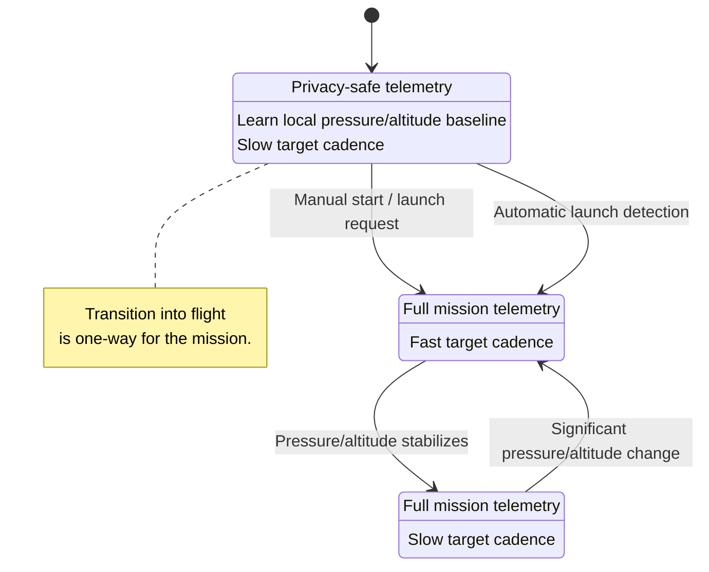
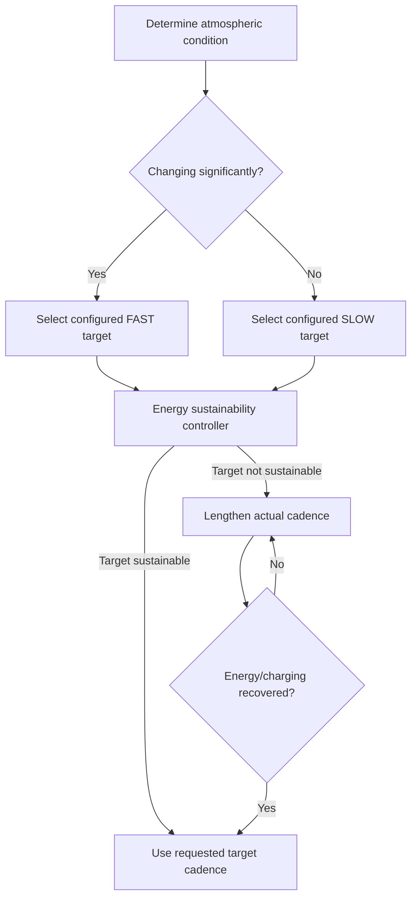

# DDR-0002: Mission Lifecycle, Privacy, and Energy-Sustainable Cadence

**Status:** Draft — product intent substantially elicited; implementation validation pending  
**Intent Interview Date:** 2026-08-09  
**Method:** Intent Interview V2 / Intent-Anchored Development  
**Scope:** Commissioning, launch detection, flight-phase behavior, privacy policy, adaptive update cadence, and mission continuation  
**Authority:** Product intent is normative. This record is intended to stand alone as part of the regenerable Stratosonde product design.

---

## 1. Intent

Stratosonde is intended for long-duration balloon missions in which scientific value depends strongly on **time + position + environmental measurements** being meaningfully associated.

The product must also tolerate a practical reality: launch is an exciting, busy event, and operators may forget a procedural step. The sonde must therefore not depend on flawless launch procedure in order to recognize that a flight has begun and start useful mission behavior.

Commissioning should also avoid exposing a customer's or operator's precise ground location when that location has no scientific value.

Once in flight, rapid altitude or pressure change is more information-rich than long periods of stable float. Cadence should therefore follow atmospheric dynamics, but only insofar as the available energy can sustain it.

The core design intent is:

> **Commission safely and privately, detect flight autonomously if necessary, increase cadence when the atmosphere is changing, reduce cadence when conditions are stable, and always allow the energy manager to slow the requested cadence when mission survival requires it.**

---

## 2. Mission Lifecycle Model

The product has a meaningful distinction between:

1. **Commissioning**
2. **Flight**

The transition from commissioning to flight is **one-way during a mission**.

Within flight, firmware may continuously vary its target cadence based on atmospheric stability and energy availability.

Terms such as `ASCENT`, `FLOAT`, and `DESCENT` may be useful descriptions, but the core product behavior is simpler:

- **stable pressure / altitude** → slow cadence;
- **significant pressure / altitude change** → fast cadence.

A permanent software state named `DESCENT` is not required for this behavior.

---

## 3. Product-Level Invariants

### INV-LIFE-001 — Flight must not depend on flawless human procedure

The sonde SHALL NOT depend solely on an operator remembering to press a launch or arm control.

If the payload is clearly in flight, firmware SHALL be capable of transitioning from commissioning behavior into flight behavior automatically.

### INV-LIFE-002 — Commissioning shall protect location privacy

While commissioning, precise horizontal position SHALL NOT be transmitted as ordinary mission telemetry.

The device MAY acquire GNSS position internally for validation, altitude, time, or other commissioning purposes, but customer/operator X/Y location SHALL not be exposed merely because the device is being prepared.

### INV-LIFE-003 — Commissioning failure must not destroy flight science

Commissioning exists to inform and prepare the operator, but once actual flight is occurring, incomplete commissioning SHALL NOT cause firmware to abandon science acquisition.

If capabilities are missing—for example, network keys were not installed—the sonde should still collect and locally preserve whatever useful science remains possible.

### INV-LIFE-004 — Commissioning-to-flight transition is one-way

Once genuine flight has been detected or deliberately initiated, the sonde SHALL NOT automatically return to commissioning behavior during that mission.

### INV-LIFE-005 — Cadence follows atmospheric change

The sonde SHALL increase observation/transmission cadence when atmospheric pressure or pressure-derived altitude is changing significantly and reduce cadence when it is stable.

### INV-LIFE-006 — Configured cadence is a target, not a survival obligation

Mission configuration may request a preferred update rate, but firmware SHALL override that target when necessary to maintain a sustainable energy state.

Mission survival takes precedence over maintaining the requested cadence.

### INV-LIFE-007 — Recovery toward requested cadence is automatic

When charging and energy conditions improve sufficiently, firmware SHALL move back toward the mission-requested cadence automatically.

### INV-LIFE-008 — No ordinary software mission-end state

For the long-duration Stratosonde mission model, firmware SHALL continue operating indefinitely while energy and hardware permit.

Ground recovery does not require a normal software `MISSION_COMPLETE` state.

---

## 4. Behavioral Requirements

Confidence legend:

- **CONFIRMED** — explicitly stated or affirmed in the interview.
- **INFERRED** — strongly implied but wording still deserves review.
- **OPEN** — product behavior has not yet been fully decided.

| ID | Requirement | Confidence |
|---|---|---|
| BR-LIFE-001 | On first power-up, the sonde SHALL enter commissioning behavior rather than immediately publishing full flight telemetry. | **CONFIRMED** |
| BR-LIFE-002 | Commissioning MAY run the same fundamental wake/sense/log cycle used in flight; commissioning is primarily a policy difference, not a wholly separate science engine. | **CONFIRMED** |
| BR-LIFE-003 | During commissioning, the sonde SHALL suppress transmission of precise horizontal position X/Y. | **CONFIRMED** |
| BR-LIFE-004 | During commissioning, the sonde MAY transmit privacy-safe data such as pressure, derived altitude, sensor data, health, and other non-X/Y information. | **CONFIRMED** |
| BR-LIFE-005 | The sonde SHALL maintain enough history of pressure and/or pressure-derived altitude during commissioning to establish a local baseline suitable for autonomous launch detection. | **CONFIRMED** |
| BR-LIFE-006 | Autonomous launch detection SHALL be based primarily on the low-power pressure sensor / pressure-derived altitude rather than requiring GNSS. | **CONFIRMED** |
| BR-LIFE-007 | Automatic flight entry SHALL occur when pressure/derived-altitude behavior departs sufficiently from the commissioning baseline to make launch evident. | **CONFIRMED** |
| BR-LIFE-008 | A manual operator action MAY request/start flight behavior, but the product SHALL remain capable of entering flight automatically if the operator forgets. | **CONFIRMED** |
| BR-LIFE-009 | An operator readiness indication such as a green LED MAY be provided after a commissioning validation/confirmed-uplink cycle, but readiness indication SHALL NOT be treated as an absolute runtime gate on later science collection. | **CONFIRMED** |
| BR-LIFE-010 | If a manual start/validation action does not receive the expected network acknowledgement, the device MAY warn the operator but SHALL still remain capable of entering flight automatically after release. | **CONFIRMED** |
| BR-LIFE-011 | Once flight entry is established, the transition SHALL be one-way for the duration of that mission. | **CONFIRMED** |
| BR-LIFE-012 | Flight-phase cadence control SHALL use pressure or pressure-derived altitude change as its primary signal; GNSS SHALL NOT be required for cadence detection. | **CONFIRMED** |
| BR-LIFE-013 | Flight cadence SHALL be fast while the current pressure/altitude sample differs significantly from a recent running average and SHALL return to the slower cadence after measurements stabilize. | **CONFIRMED** |
| BR-LIFE-014 | One general stability/change algorithm SHOULD serve ascent, stable float, and unexpected descent/rapid-altitude-change behavior instead of requiring separate bespoke algorithms for each. | **CONFIRMED** |
| BR-LIFE-015 | The running reference SHALL continue adapting over the mission using recent samples rather than remaining permanently anchored to launch-site conditions. | **CONFIRMED** |
| BR-LIFE-016 | Fast and slow target update rates SHALL be mission-configurable. | **CONFIRMED** |
| BR-LIFE-017 | Mission-specific configuration MAY vary with battery size, solar-panel size, attached sensor payload, and mission objectives without changing generic Stratosonde behavior. | **CONFIRMED** |
| BR-LIFE-018 | Firmware SHALL attempt to honor the configured target cadence while energy is healthy. | **CONFIRMED** |
| BR-LIFE-019 | If operation at the requested cadence causes the battery/energy trend to become unsustainable, firmware SHALL automatically lengthen the actual cadence. | **CONFIRMED** |
| BR-LIFE-020 | If charging later becomes strong and the battery returns to a healthy state, firmware SHALL automatically return toward the user-requested faster cadence. | **CONFIRMED** |
| BR-LIFE-021 | Firmware does not need to explicitly transmit the selected cadence merely for observability; received packet timestamps are sufficient to infer actual transmission interval at the backend. | **CONFIRMED** |
| BR-LIFE-022 | No normal flight-complete state is required. The device should continue operating until energy is exhausted, hardware fails, or power is physically removed after recovery. | **CONFIRMED** |

---

## 5. Chosen Product Decision

Stratosonde uses a **one-way commissioning-to-flight lifecycle with continuously adaptive flight cadence**.

Commissioning and flight share the same fundamental mission engine:

1. wake;
2. assess energy;
3. acquire permissible science;
4. log data;
5. communicate as allowed;
6. return to low power.

The main differences are policy.

### Commissioning policy

- preserve privacy;
- establish pressure/altitude baseline;
- perform readiness checks;
- optionally confirm network reachability;
- run at a relatively slow configurable cadence;
- do not transmit precise X/Y position.

### Flight policy

- transmit ordinary mission position/science subject to regulatory and energy rules;
- continuously estimate atmospheric stability from pressure or pressure-derived altitude;
- use a faster target cadence during significant change;
- use a slower target cadence during stable periods;
- allow the energy manager to slow either target when the requested rate is not sustainable.

The lifecycle is intentionally asymmetric:

- **commissioning → flight:** allowed and ultimately one-way;
- **flight → commissioning:** not an autonomous mission transition;
- **fast ↔ slow flight cadence:** continuously reversible according to atmospheric stability and energy.

---

## 6. Why Pressure Is the Primary Launch / Dynamics Signal

GNSS is scientifically valuable, but it is not the correct mandatory dependency for launch detection because:

- GNSS can be blocked;
- GNSS can be spoofed or otherwise behave abnormally;
- GNSS acquisition is comparatively expensive;
- pressure measurement is inexpensive;
- pressure changes strongly and predictably with altitude during balloon ascent.

The product therefore prefers the pressure sensor or pressure-derived altitude as the always-available flight-dynamics signal.

Absolute launch-site altitude is not the key quantity. The important signal is **departure from the recently learned local baseline**.

---

## 7. Privacy During Commissioning

Commissioning may occur at a customer's home, office, laboratory, private staging location, or launch field.

Publishing full GNSS X/Y during this phase can expose a location that has no scientific relevance to the atmospheric mission.

Therefore:

> **Precise horizontal location is mission data only after the mission has begun.**

Commissioning may still use and/or transmit:

- pressure;
- pressure-derived altitude;
- environmental sensors;
- battery/health data;
- GNSS-derived altitude if desired;
- GNSS time if desired;
- other privacy-safe validation information.

Whether precise commissioning X/Y is also stored locally is a separate open privacy decision.

---

## 8. Launch Detection and Cadence Controller

The product intent is deliberately simple.

A recent running average provides the local reference. The current sample is compared against it.

When the current value departs meaningfully from the reference, the atmosphere is considered dynamic and the fast target cadence is selected.

When current samples and the moving reference converge again, the atmosphere is considered stable and the slow target cadence is selected.



The names `FlightFast` and `FlightSlow` are descriptive. An implementation may name them differently or express them without explicit states.

---

## 9. Atmospheric Stability Model

The desired conceptual algorithm is:

```text
reference = running_average(recent_pressure_or_altitude_samples)
delta     = abs(current_sample - reference)

if delta is meaningfully large:
    desired_cadence = configured_fast_target
else:
    desired_cadence = configured_slow_target

actual_cadence = energy_manager.limit(desired_cadence)
```

This is a product description, not a mandate for one specific filter.

The implementation may use pressure directly or a pressure-derived altitude representation.

The design deliberately favors a small, understandable adaptive filter over a complex flight-phase classifier unless tests demonstrate that greater complexity is required.

---

## 10. Energy-Sustainable Cadence

Configured target cadence expresses **mission preference**.

It does not override firmware's obligation to remain alive.

Example product behavior:

- mission requests a slow/stable update every 5 minutes;
- attached sensors, solar conditions, temperature, latitude, season, or battery capacity make 5 minutes unsustainable;
- firmware observes an unhealthy energy trend;
- actual cadence expands to 10 minutes, 20 minutes, or another sustainable value;
- the mission continues regularly rather than exhausting the battery;
- later, strong sun returns and battery charging becomes healthy;
- firmware returns toward the requested 5-minute target.

Likewise, a configured fast target during atmospheric change remains subject to energy limits.



The energy manager therefore has final authority over actual cadence.

---

## 11. Configuration Model

Mission-specific configuration should be able to express at least:

- fast target update interval;
- slow target update interval;
- atmospheric-change threshold;
- stability threshold or hysteresis if needed;
- running-average/window parameters;
- launch-detection threshold;
- minimum persistence / sample count required for automatic launch detection;
- energy-policy parameters that bound achievable cadence.

Configuration may vary substantially between missions because of:

- battery capacity;
- solar-panel capacity;
- seasonal illumination;
- latitude;
- sensor payload;
- expansion/Qwiic devices;
- communication requirements;
- scientific objectives.

The generic behavior does not change:

> **Prefer the configured cadence when sustainable; automatically degrade when it is not; automatically recover toward the configured cadence when conditions improve.**

---

## 12. No Normal Mission-End State

The current Stratosonde product is designed for long-duration superpressure balloon missions.

There is no ordinary software-defined mission completion condition.

Firmware should continue the mission indefinitely.

If a sonde is physically recovered, the finder/operator can remove or disconnect power. No special software landing/recovery state is required for the current product.

Avoiding a software end state reduces the risk of falsely terminating a viable long-duration mission.

A future latex/radiosonde product variant may introduce landing detection or a recovery mode, but that is not part of this product decision.

---

## 13. Open Decisions

### OD-LIFE-001 — Commissioning archive policy

The interview established that commissioning X/Y should not be transmitted.

It did **not** fully settle whether precise commissioning X/Y may be stored locally in the full-resolution flash archive.

Candidate policies:

1. do not record commissioning X/Y at all;
2. record internally but never transmit;
3. record only after explicit privacy-safe conditions are satisfied.

### OD-LIFE-002 — Manual start control

A manual button/start action remains potentially useful as an operator experience and readiness checkpoint, but the interview moved away from making it essential.

We still need to decide whether production hardware should include:

- no launch button;
- a button as an optional early mission-start request;
- a button solely for diagnostics/readiness indication;
- another operator control.

Automatic launch detection remains mandatory regardless.

### OD-LIFE-003 — Exact automatic-launch threshold

The product behavior is clear, but the numerical criterion remains configuration/implementation work.

It may involve:

- altitude delta from commissioning baseline;
- pressure delta;
- rate of change;
- persistence across multiple samples;
- a combination.

The criterion must strongly reject ordinary weather/building/HVAC pressure variation while reliably recognizing real ascent.

### OD-LIFE-004 — Filter details

A running average is desired for simplicity.

Window length, weighting, hysteresis, and exact transition criteria remain tunable implementation decisions subject to proof.

### OD-LIFE-005 — GNSS time vs mission time

The GNSS portion of the interview surfaced a separate unresolved topic:

- GNSS supplies absolute time;
- STM32 RTC / mission ticks may provide continuity;
- GNSS time may theoretically jump or become suspect.

Whether records should carry both absolute GNSS time and monotonic mission time, and how inconsistent sources are resolved, requires a dedicated DDR/interview.

---

## 14. Proof Plan

This DDR is not implementation-conformant until behavior is demonstrated with executable tests or HIL evidence.

### P-LIFE-001 — Commissioning privacy

Given commissioning state and a valid GNSS fix:

- internal GNSS acquisition may succeed;
- transmitted commissioning telemetry contains no precise X/Y;
- privacy-safe commissioning fields remain available.

### P-LIFE-002 — Automatic launch without operator action

Begin in commissioning with a stable pressure/altitude baseline.

Without any button press, feed a sequence representing genuine balloon ascent.

Prove that:

- launch is detected within the configured bound;
- the system transitions into flight behavior;
- full mission telemetry becomes eligible;
- the transition does not depend on GNSS.

### P-LIFE-003 — Reject ordinary commissioning variation

Feed pressure variations representative of weather drift, HVAC changes, handling, and sensor noise.

Prove commissioning does not falsely transition into flight.

### P-LIFE-004 — One-way mission transition

After entering flight, feed data resembling the original launch-site pressure/altitude.

Prove firmware does not return to commissioning automatically.

### P-LIFE-005 — Fast cadence on significant change

Given established flight operation and significant pressure/altitude deviation from the running reference:

- the dynamic/fast target is selected;
- actual cadence approaches the configured fast target when energy permits.

### P-LIFE-006 — Slow cadence on stability

After a dynamic interval, provide stable measurements.

Prove that:

- the running reference converges;
- the slow target becomes selected;
- firmware does not chatter rapidly between targets.

### P-LIFE-007 — Descent/rapid change uses the same controller

From stable slow flight, provide a large change in the opposite altitude direction.

Prove the same dynamics detector selects the fast target without requiring a separate descent mission state.

### P-LIFE-008 — Energy override

Configure a target cadence that is demonstrably unsustainable for the simulated battery/solar/load environment.

Prove that:

- firmware attempts the requested cadence when energy is healthy;
- an unfavorable energy trend causes actual cadence to lengthen;
- operation remains sustainable rather than blindly exhausting the battery.

### P-LIFE-009 — Automatic cadence recovery

After P-LIFE-008 has forced a slower cadence, provide strong charging / recovered battery conditions.

Prove firmware automatically returns toward the configured target cadence without operator intervention.

### P-LIFE-010 — Incomplete commissioning still preserves science

Simulate launch with missing radio credentials or another major commissioning deficiency.

Prove that after automatic launch detection the sonde still:

- acquires permissible sensors;
- obtains GNSS when allowed;
- logs full-resolution science locally;
- continues the mission even when transmission cannot succeed.

### P-LIFE-011 — Indefinite mission continuation

Exercise long-duration stable operation and verify there is no ordinary software transition to a terminal mission-complete state.

---

## 15. Regeneration Test

A clean-room implementer receiving this DDR should understand that the intended product:

- starts in a privacy-preserving commissioning condition;
- does not expose precise X/Y during commissioning;
- learns a local pressure/altitude baseline;
- can accept manual mission-start intent but does not rely upon it;
- automatically recognizes real launch from pressure/altitude behavior;
- never automatically returns from flight to commissioning;
- uses atmospheric stability, not a rigid ascent/float/descent sequence, to choose fast versus slow target cadence;
- uses one simple recent-history comparison algorithm if practical;
- treats update rates as configurable mission targets;
- allows firmware to slow those targets when energy cannot sustain them;
- automatically moves back toward requested cadence when charging improves;
- continues operating indefinitely rather than entering a normal mission-end state.

The implementer should **not** need to know today's state names, source-code layout, threshold values, averaging algorithm, scheduler implementation, or radio stack to recreate the intended behavior.

---

## 16. Next Intent Interview

The most natural next bounded topic is **GNSS and mission time**.

Questions to resolve include:

- Which time source is authoritative under normal operation?
- Should every full-resolution record contain both absolute time and monotonic mission time?
- What constitutes an implausible GNSS time jump?
- Is position ever rejected for implausible movement, or is GNSS position always recorded as reported with provenance/freshness?
- How should stale position interact with regulatory-region selection?
- What precisely distinguishes GNSS `fresh`, `stale`, `skipped for energy`, `timeout`, and `hardware failure`?

That topic should remain separate from the lifecycle/cadence policy captured here.

---

## 17. Amendment 2026-08-11 (issue #142, maintainer decision)

Flight-entry and cadence semantics changed after the 2026-08-10/11 flight-readiness reviews:

- **Flight entry is explicit, not join-triggered.** MultiRegion_PreJoinAllRegions() no longer calls MissionState_EnterFlight(). A commissioned unit holds COMMISSIONING (quiet watch: no GPS, no telemetry TX; pressure still read every cycle) until (a) deliberate arming via MissionState_EnterFlight() (button hook; needs a free GPIO - PB3 went analog in F24) or (b) autonomous launch detection per BR-LIFE-007: a cumulative pressure drop of MISSION_LAUNCH_DP_HPA (6 hPa) below the running session maximum. The DR3-persisted state now wins outright over the session bank; DDR-0018's ambiguity rule narrows to: bank commissioned + DR3 wiped -> ASCENT (never commissioning privileges mid-flight).
- **BR-LIFE-013/014 (fast cadence on significant change / descent) are accepted descopes for first flight.** FLOAT is a terminal one-way latch; the unit never returns to fast cadence. Rationale: simplicity and power determinism beat burst-capture for first flight; recorded as an accepted gap here rather than rediscovered later (also #126).
- **FLOAT detection is windowed-range (5% over 300 s) with NO altitude guard** - float altitude is payload/balloon-dependent (5-25 km), so no fixed ceiling pressure can be correct. Pad-side protection is structural: detection only runs in ASCENT, and ASCENT requires arming or launch.
- **ASCENT cadence (10 s) keeps GNSS continuously powered/tracking**; cycles run nearly back-to-back with little STOP2 sleep by design (ascent is ~2 h; float is weeks).
