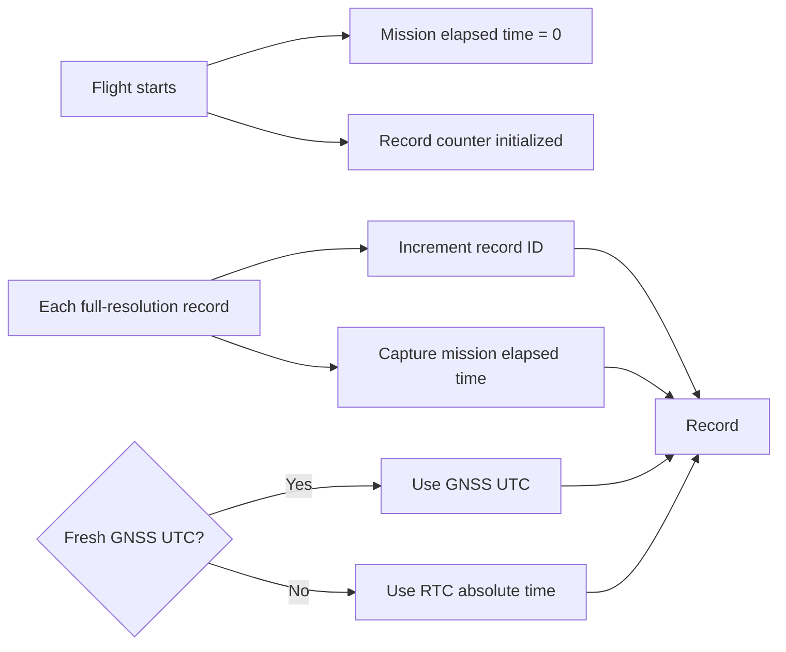
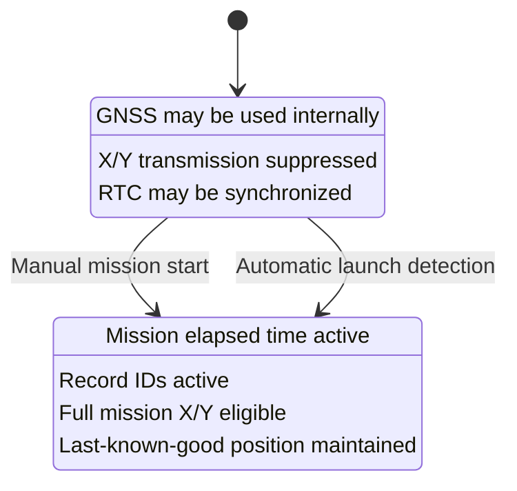

# DDR-0003: GNSS Position, Time, Provenance, and Stale-Data Semantics

**Status:** Draft — product intent substantially elicited; implementation validation pending  
**Intent Interview Date:** 2026-08-09  
**Method:** Intent Interview V2 / Intent-Anchored Development  
**Scope:** GNSS fix acceptance, position provenance, absolute and monotonic time, stale-data handling, privacy at mission start, record identity, and altitude authority  
**Authority:** Product intent is normative. This record is intended to stand alone as part of the regenerable Stratosonde product design.

---

## 1. Intent

Stratosonde is a scientific instrument whose measurements are valuable primarily because they are associated with:

- **where** the measurement was taken;
- **when** it was taken; and
- **what** the environmental conditions were.

The firmware should preserve those relationships as faithfully as possible without becoming overconfident about data quality.

GNSS is the primary source of absolute position and UTC time, but firmware should not attempt to infer physical plausibility from one accepted GNSS solution to the next. A fix that meets the configured receiver-quality threshold is preserved as reported.

When GNSS is unavailable, the sonde should continue collecting science, retain the last known good position indefinitely with explicit stale provenance, use its internal RTC for absolute time continuity, and maintain a monotonic mission timeline regardless of GNSS behavior.

The product should prefer:

> **Preserve data and provenance; do not silently “correct” GNSS in firmware. Let the backend perform higher-order plausibility analysis.**

---

## 2. Product-Level Invariants

### INV-GNSS-001 — Scientific records require explicit spatial and temporal provenance

Every full-resolution science record SHALL make clear:

- its absolute timestamp source;
- its mission-relative time;
- its position source/status;
- whether GNSS position/time is fresh, stale, unavailable, or otherwise degraded.

### INV-GNSS-002 — GNSS quality is judged locally, not by trajectory plausibility

The firmware MAY reject a GNSS solution that does not meet configured receiver-quality criteria.

Once a fix meets those criteria, firmware SHALL NOT reject it merely because:

- the position moved farther than expected;
- implied speed is implausible;
- the solution disagrees with the previous fix;
- GNSS altitude disagrees with pressure-derived altitude.

Those are backend-analysis concerns.

### INV-GNSS-003 — Raw evidence is more valuable than firmware speculation

Firmware SHALL preserve accepted GNSS solutions as reported rather than attempting to “repair” suspicious coordinates or time based on predicted trajectory.

### INV-GNSS-004 — GNSS loss shall not stop science collection

If fresh GNSS is not available, the sonde SHALL continue collecting and logging otherwise valid science.

### INV-GNSS-005 — Last known good position remains useful indefinitely when marked stale

A previously valid mission position MAY continue to be attached to later records indefinitely if no newer valid fix is available, provided the record clearly marks that position as stale.

Age alone SHALL NOT cause firmware to discard the last known good position.

### INV-GNSS-006 — Absolute and monotonic time are separate first-class concepts

The product SHALL preserve both:

- an absolute civil/UTC time domain; and
- a monotonic mission-relative time domain.

Neither shall silently substitute for the other.

### INV-GNSS-007 — Position privacy changes at mission start

During commissioning, precise X/Y position SHALL not be transmitted as ordinary mission telemetry.

Mission position logging/transmission begins only after the commissioning-to-flight transition.

### INV-GNSS-008 — Pressure is authoritative for flight-state altitude decisions

Both GNSS altitude and barometric altitude MAY be recorded.

For launch detection, dynamic/stable cadence behavior, and other flight-state decisions, **pressure / pressure-derived altitude is authoritative**.

---

## 3. GNSS Fix Acceptance

A GNSS solution is considered usable when it meets a configured quality threshold.

The product-level requirement is intentionally generic.

Quality criteria MAY include:

- minimum satellite count;
- HDOP or equivalent dilution-of-precision threshold;
- receiver-reported fix validity;
- rejection of extremely weak satellites if the receiver or implementation exposes useful signal-quality data.

Exact values are mission/configuration parameters, not fixed architectural constants.

The core rule is:

> **Accept a fix based on GNSS solution quality, not on whether it agrees with where firmware thinks the balloon ought to be.**

---

## 4. Behavioral Requirements

Confidence legend:

- **CONFIRMED** — explicitly stated or affirmed in the interview.
- **INFERRED** — strongly implied but wording still deserves review.
- **OPEN** — product behavior has not yet been fully decided.

| ID | Requirement | Confidence |
|---|---|---|
| BR-GNSS-001 | GNSS SHALL provide the primary absolute X/Y/Z position source for scientific records when a valid fix is available. | **CONFIRMED** |
| BR-GNSS-002 | GNSS fix acceptance SHALL use configurable receiver-quality criteria such as satellite count and HDOP. | **CONFIRMED** |
| BR-GNSS-003 | Firmware SHALL NOT perform previous-position, previous-speed, or trajectory-plausibility rejection of an otherwise accepted GNSS fix. | **CONFIRMED** |
| BR-GNSS-004 | Accepted GNSS fixes SHALL be logged as reported even if they later appear suspicious or spoofed. | **CONFIRMED** |
| BR-GNSS-005 | GNSS UTC and mission-relative monotonic time SHALL both be treated as first-class record fields/concepts. | **CONFIRMED** |
| BR-GNSS-006 | Mission-relative time SHALL never move backward as a result of GNSS time behavior. | **CONFIRMED** |
| BR-GNSS-007 | Mission-relative time SHALL begin when the mission transitions from commissioning into flight, either by operator action or automatic launch detection. | **CONFIRMED** |
| BR-GNSS-008 | Each logged science record SHALL have a simple monotonically increasing record identifier independent of its timestamp. | **CONFIRMED** |
| BR-GNSS-009 | Record ID and mission elapsed time SHALL remain separate concepts: one identifies the record, the other describes when it occurred relative to mission start. | **CONFIRMED** |
| BR-GNSS-010 | When GNSS is unavailable after a previous valid mission fix, the sonde SHALL continue using the last known good position and SHALL mark it stale. | **CONFIRMED** |
| BR-GNSS-011 | Last known good position SHALL remain reusable indefinitely while marked stale; firmware SHALL not age it out merely because it is old. | **CONFIRMED** |
| BR-GNSS-012 | When fresh GNSS time is unavailable, the sonde SHALL use the STM32 RTC for absolute-time continuity while still preserving mission monotonic time. | **CONFIRMED** |
| BR-GNSS-013 | If no mission-era GNSS fix has ever been obtained after commissioning-to-flight transition, the record SHALL represent position as unavailable/invalid rather than as trustworthy location data. | **CONFIRMED** |
| BR-GNSS-014 | A placeholder such as `0,0` MAY be used internally/on-wire only if an explicit invalid/unavailable flag is authoritative and prevents the placeholder from being interpreted as a real position. | **CONFIRMED** |
| BR-GNSS-015 | Commissioning SHALL not transmit precise X/Y position. | **CONFIRMED** |
| BR-GNSS-016 | Mission position logging/transmission begins after the transition into flight behavior. | **CONFIRMED** |
| BR-GNSS-017 | GNSS altitude and barometric altitude SHALL both be preservable in the scientific record. | **CONFIRMED** |
| BR-GNSS-018 | Pressure-derived altitude SHALL be authoritative for firmware flight-state decisions such as launch detection and fast/slow cadence transitions. | **CONFIRMED** |
| BR-GNSS-019 | GNSS time and position provenance SHOULD be distinguishable so the backend can identify cases where one appears trustworthy and the other does not. | **INFERRED — needs field-level design** |
| BR-GNSS-020 | GNSS failure reasons SHOULD distinguish at least `fresh`, `stale`, `skipped for energy`, `timeout/no fix`, `wake/hardware failure`, and `never had mission fix`, provided this can be represented without unnecessary protocol complexity. | **INFERRED — needs encoding decision** |

---

## 5. Time Model

The product uses three related but distinct concepts.

### 5.1 Absolute UTC time

GNSS UTC is the preferred absolute time source when available and valid.

During commissioning, a valid GNSS time may be used to initialize or synchronize the STM32 RTC.

The RTC then provides continued absolute-time continuity during later GNSS outages.

### 5.2 Mission elapsed time

Mission elapsed time is monotonic and starts at the commissioning-to-flight transition.

Examples of valid mission-start events:

- operator initiates mission start; or
- automatic pressure/altitude launch detection transitions the sonde into flight.

Mission elapsed time:

- never moves backward;
- does not depend on subsequent GNSS availability;
- helps expose GNSS UTC anomalies;
- allows science to remain chronologically ordered even if absolute time becomes suspect.

### 5.3 Record identifier

Every full-resolution logged record receives a simple monotonically increasing record ID.

The record ID is **not** overloaded with elapsed time.

This keeps backend archive recovery simple:

> “Request record 6472”

is preferable to requiring the backend to guess which mission timestamp corresponds to the missing record.

---

## 6. Position Provenance Model

### Fresh GNSS position

When a fix passes the configured GNSS quality threshold:

- use the new X/Y/Z;
- mark the position fresh;
- preserve it as the new last-known-good mission position.

### Stale position

When no new valid fix is available and a previous valid mission position exists:

- reuse last-known-good position;
- mark it stale;
- continue collecting science;
- do not expire the coordinate merely because it becomes old.

### No mission position available

If the sonde enters flight before ever obtaining a valid mission-era X/Y fix:

- represent position as unavailable/invalid;
- continue collecting/logging science;
- do not treat placeholder coordinates as real.

The backend may later reconstruct context using:

- gateway reception location;
- later GNSS fixes;
- monotonic mission time;
- pressure-derived altitude;
- surrounding valid records.

---

## 7. GNSS Suspicion and Spoofing Philosophy

The firmware SHALL NOT attempt to become a navigation-anomaly detector.

If GNSS provides a solution meeting the configured receiver-quality threshold, the firmware records it.

This includes cases where:

- the coordinate appears to jump;
- the implied velocity is unrealistic;
- UTC jumps unexpectedly;
- GNSS altitude disagrees with pressure altitude.

Why:

1. firmware may not have enough evidence to prove the receiver is wrong;
2. discarding unusual data destroys evidence;
3. backend systems have more historical context and computational flexibility;
4. mission monotonic time, pressure data, gateway context, and later fixes can help identify anomalies after the fact.

The product therefore follows:

> **Preserve first; analyze later.**

---

## 8. Commissioning Privacy Boundary

Commissioning may use GNSS internally.

However, precise horizontal position is not ordinary commissioning telemetry.

At transition into flight:

- mission elapsed time begins;
- record ID begins/initializes for mission science;
- full mission position becomes eligible for logging/transmission;
- X/Y privacy suppression ends.

---

## 9. Altitude Authority

Stratosonde should preserve both:

- **GNSS altitude**; and
- **barometric / pressure-derived altitude**.

They serve different purposes.

### Barometric altitude is authoritative for firmware flight-state decisions

Use pressure/derived altitude for:

- automatic launch detection;
- dynamic-versus-stable flight determination;
- target cadence selection;
- pressure-change trend detection.

### GNSS altitude is scientific context

GNSS altitude is still worth recording and comparing later.

The firmware does not need to force the two altitude sources to agree.

A disagreement is data.

---

## 10. Stale-State Semantics

The word `stale` must never mean “probably fresh enough.”

It means:

> **This field is being carried forward from a previously valid observation because no new valid observation was obtained for this record.**

For GNSS-related data, field-level provenance should ideally allow the backend to distinguish:

- fresh GNSS position;
- stale carried-forward position;
- no mission position ever obtained;
- GNSS skipped because energy policy prohibited acquisition;
- GNSS attempted but timed out / no valid fix;
- GNSS hardware/wake failure.

Likewise for time:

- GNSS UTC fresh;
- RTC absolute time used;
- mission monotonic time always available while the MCU timebase is healthy.

The exact bit packing is an implementation/protocol decision.

---

## 11. Product Behavior Examples

### Example A — Normal wake

- GNSS passes configured quality threshold.
- New X/Y/Z accepted.
- GNSS UTC used.
- mission elapsed time recorded.
- record ID assigned.
- pressure altitude also recorded.
- position marked fresh.

### Example B — GNSS timeout

Previous mission fix exists.

- environmental sensors still collected;
- RTC provides absolute time;
- mission elapsed time continues;
- last-known-good X/Y reused;
- position marked stale;
- record ID increments normally.

### Example C — GNSS reports an implausible jump

Fix quality passes configured threshold.

- firmware accepts and logs it;
- no trajectory rejection;
- monotonic mission time remains continuous;
- pressure altitude remains independent;
- backend later decides whether the jump was real, spoofed, or erroneous.

### Example D — Flight begins without a mission GNSS fix

- commissioning privacy prevented X/Y mission use;
- launch is detected;
- GNSS still fails;
- science is logged;
- position is explicitly unavailable/invalid;
- no placeholder is considered trustworthy;
- later valid GNSS fix establishes last-known-good mission position.

### Example E — GNSS UTC becomes suspicious

- accepted position may still be preserved;
- RTC absolute time remains available;
- mission monotonic time remains continuous;
- backend can compare timelines and identify the anomaly.

---

## 12. Open Decisions

### OD-GNSS-001 — Exact GNSS quality threshold

Need mission-configurable values for:

- minimum satellite count;
- HDOP / quality limit;
- any receiver validity flags;
- whether individual satellite signal strength affects acceptance.

### OD-GNSS-002 — RTC synchronization policy

Need to decide whether GNSS UTC:

- initializes RTC only during commissioning;
- periodically disciplines RTC during flight;
- updates RTC only if within a sanity window;
- never steps RTC backward.

The product requirement is that mission monotonic time remain unaffected by RTC/GNSS correction.

### OD-GNSS-003 — Time-source provenance encoding

Need to define how each record identifies whether absolute time came from:

- fresh GNSS;
- RTC;
- another future source.

### OD-GNSS-004 — Position status encoding

Need to choose a compact representation for:

- fresh;
- stale;
- skipped-energy;
- timeout;
- hardware failure;
- unavailable/no mission fix.

### OD-GNSS-005 — Mission record counter lifetime

Current intent is that record ID begins at mission start.

Need to decide whether:

- it always begins at 0 or 1;
- it survives resets;
- reset recovery must reconstruct the next ID from flash.

### OD-GNSS-006 — Mission elapsed time persistence across MCU reset

Mission elapsed time is intended to describe time since flight start.

Need a design for restoring it after reset using RTC, persisted epoch, or another robust mechanism.

---

## 13. Proof Plan

### P-GNSS-001 — Accept quality-valid implausible movement

Feed two GNSS fixes that both meet the configured quality bar but imply physically implausible balloon motion.

Prove firmware:

- accepts both;
- logs both;
- does not reject the second based on trajectory;
- preserves monotonic mission time.

### P-GNSS-002 — Reject receiver-quality-invalid fix

Provide a fix below the configured satellite/HDOP/validity threshold.

Prove it is not promoted to fresh last-known-good position.

### P-GNSS-003 — Stale position continues indefinitely

Establish one valid mission fix, then simulate a long series of GNSS failures.

Prove every later record:

- retains last-known-good X/Y;
- marks it stale;
- does not age the position out.

### P-GNSS-004 — No mission fix at flight transition

Enter flight with no valid mission-era GNSS fix.

Prove:

- science still logs;
- position is explicitly unavailable/invalid;
- placeholder coordinates cannot be interpreted as valid;
- first later quality-valid fix becomes fresh last-known-good position.

### P-GNSS-005 — RTC fallback

Establish RTC synchronization, then remove GNSS time.

Prove:

- absolute timestamp continues from RTC;
- mission elapsed time continues monotonically;
- record ID continues increasing.

### P-GNSS-006 — GNSS UTC discontinuity

Inject a GNSS UTC jump backward or forward while the monotonic mission clock remains valid.

Prove:

- mission monotonic time does not jump backward;
- the record retains enough provenance to identify the absolute-time source;
- accepted GNSS evidence is not silently rewritten based on predicted trajectory.

### P-GNSS-007 — Commissioning privacy

Provide valid commissioning GNSS X/Y.

Prove precise horizontal position is not transmitted as commissioning telemetry.

### P-GNSS-008 — Flight privacy boundary

Trigger commissioning-to-flight transition.

Prove:

- mission elapsed time begins;
- mission record identity begins;
- full mission X/Y becomes eligible.

### P-GNSS-009 — Barometric altitude authority

Provide pressure altitude indicating dynamic ascent while GNSS altitude is stable or contradictory.

Prove cadence/flight-dynamics decisions follow pressure, not GNSS altitude.

### P-GNSS-010 — Record ID survives recoverable reset

After several logged flight records, inject an MCU reset.

Prove the next record receives a non-colliding monotonic record identifier according to the final OD-GNSS-005 decision.

---

## 14. Regeneration Test

A clean-room implementer receiving this DDR should understand that:

- GNSS is the primary absolute position source;
- fix acceptance is based on configurable receiver-quality criteria;
- accepted GNSS coordinates are not trajectory-filtered in firmware;
- suspicious data is preserved for backend interpretation;
- science continues without fresh GNSS;
- last-known-good mission position is reused indefinitely but explicitly marked stale;
- no prior mission fix means position is explicitly unavailable;
- commissioning suppresses X/Y for privacy;
- mission time begins at flight transition;
- every record has a simple monotonic record identifier;
- mission elapsed time and record ID are separate;
- GNSS UTC and RTC/monotonic time are complementary;
- pressure altitude is authoritative for firmware flight-state decisions;
- GNSS altitude remains valuable recorded evidence.

The implementer should not need today's source-code structure, packet layout, numeric GNSS thresholds, or state names to reproduce the intended product behavior.

---

## 15. Next Intent Interview

The next bounded topic should be **scientific archive identity, ordering, and recovery**.

That interview should resolve:

- newest-first versus oldest-first archive recovery;
- when a record is considered delivered;
- confirmed versus unconfirmed archive transmission;
- duplicate tolerance;
- record-ID-based selective retransmission;
- how much archive recovery can happen in one wake;
- what evidence of link quality is required before a recovery burst;
- whether archive recovery ever outranks current compact telemetry.

This is already known to contain meaningful differences between the mental model and current implementation, so it is a high-value next DDR.

---

## 16. Amendment 2026-08-12 (intent interview reconciliation)

The 2026-08-12 interview reaffirmed with no substantive policy change:

- last-known position remains scientifically useful when explicitly stale;
- scientific uncertainty should normally degrade rather than stop the mission.

Relationship notes:

- The broader raw/calibrated/derived-data and provenance policy that this DDR's freshness semantics participate in is now owned by **DDR-0023** (Scientific Data Truth, Derived Products, and Onboard Interpretation).
- RF legality derived from stale position remains governed by **DDR-0015**, not by this DDR.
