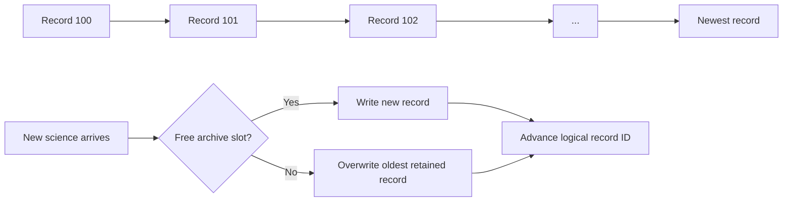
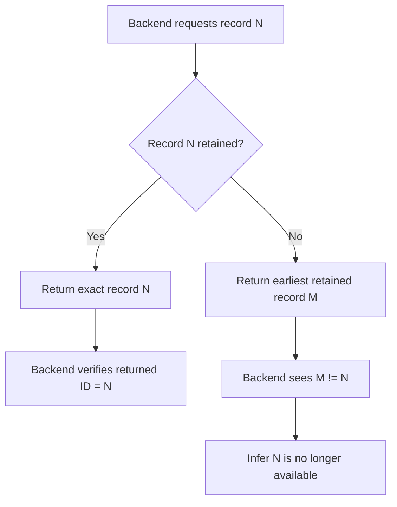
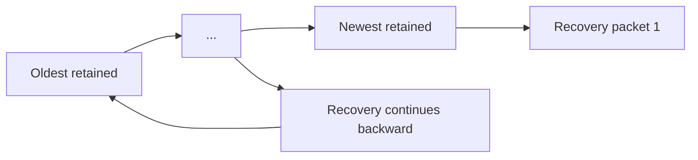

# DDR-0004: Immutable Circular Science Archive and Record Identity

**Status:** Draft — product intent substantially elicited; implementation validation pending  
**Intent Interview Date:** 2026-08-09  
**Method:** Intent Interview V2 / Intent-Anchored Development  
**Scope:** Full-resolution science-record identity, immutability, circular flash retention, overwrite policy, backend lookup, and record availability semantics  
**Authority:** Product intent is normative. This record is intended to stand alone as part of the regenerable Stratosonde product design.

---

## 1. Intent

Stratosonde is a long-duration scientific instrument that may spend extended periods without usable backhaul.

The local flash archive is therefore not merely a transmit queue. It is the authoritative rolling record of recent full-resolution science produced by the sonde.

The archive should be:

- simple;
- append-oriented;
- robust against partial subsystem failure;
- independent of whether a record has been transmitted;
- independent of whether a transmission was acknowledged;
- deterministic to query from the backend;
- continuously reusable for arbitrarily long missions.

The core product intent is:

> **Every full-resolution science record is written once, given a stable monotonic identity, retained unchanged in a circular archive, and eventually overwritten only by newer science when physical storage capacity is exhausted.**

---

## 2. Product-Level Invariants

### INV-ARCH-001 — Every science record has a stable identity

Each full-resolution archived science record SHALL receive a monotonic record ID.

That ID is the canonical lookup identity for archive retrieval.

### INV-ARCH-002 — Record identity and time are separate concepts

The record ID SHALL NOT be overloaded to mean mission elapsed time.

Mission elapsed time remains scientific metadata associated with the record.

This keeps:

- archive lookup deterministic;
- time semantics independent of storage indexing;
- future backend recovery protocols simple.

### INV-ARCH-003 — Archived science is immutable

Once a full-resolution science record has been committed to the archive, its scientific contents SHALL NOT be modified in place.

Delivery state, acknowledgement state, or backend recovery state SHALL NOT require rewriting the archived science payload itself.

### INV-ARCH-004 — Retention does not depend on acknowledgement

A record SHALL remain in the circular archive regardless of whether it has:

- never been transmitted;
- been transmitted but not acknowledged;
- been acknowledged;
- been retransmitted;
- been requested by the backend.

Acknowledgement is communication state, not archive-retention state.

### INV-ARCH-005 — New science always advances the archive

When storage is full, the oldest retained record SHALL be overwritten by the newest science record.

The archive SHALL NOT stop accepting new science merely because older records were never delivered.

### INV-ARCH-006 — The archive is circular by design

The archive SHALL operate indefinitely as a ring/circular buffer.

There is no normal "archive full" terminal state.

### INV-ARCH-007 — Backend requests must not require physical flash knowledge

The backend SHALL address archived science using logical record IDs, not flash addresses, sectors, pages, or implementation-specific storage locations.

---

## 3. Behavioral Requirements

Confidence legend:

- **CONFIRMED** — explicitly stated or affirmed during the interview.
- **INFERRED** — strongly implied by the discussion but wording may still deserve review.
- **OPEN** — product behavior is not yet fully decided.

| ID | Requirement | Confidence |
|---|---|---|
| BR-ARCH-001 | Each committed full-resolution science record SHALL receive a monotonically increasing logical record ID. | **CONFIRMED** |
| BR-ARCH-002 | Record ID SHALL remain separate from mission elapsed time. | **CONFIRMED** |
| BR-ARCH-003 | Mission elapsed time SHALL remain stored as metadata associated with the record. | **CONFIRMED** |
| BR-ARCH-004 | Archived science records SHALL be immutable after commit. | **CONFIRMED** |
| BR-ARCH-005 | The flash archive SHALL behave as a circular buffer. | **CONFIRMED** |
| BR-ARCH-006 | New science SHALL overwrite the oldest retained science when storage capacity is exhausted. | **CONFIRMED** |
| BR-ARCH-007 | Old records MAY be overwritten even if they were never transmitted or acknowledged. | **CONFIRMED** |
| BR-ARCH-008 | Acknowledgement or delivery SHALL NOT delete, erase, or otherwise preferentially remove an archived record. | **CONFIRMED** |
| BR-ARCH-009 | The backend SHALL request archived records by logical record ID. | **CONFIRMED** |
| BR-ARCH-010 | If the requested record is still retained, firmware SHALL return that exact record. | **CONFIRMED** |
| BR-ARCH-011 | If the requested record has already been overwritten, firmware MAY return the earliest record still available rather than returning an error-only response. | **CONFIRMED** |
| BR-ARCH-012 | The returned record SHALL carry its own record ID so the backend can determine whether the exact requested record was available. | **CONFIRMED** |
| BR-ARCH-013 | The archive SHALL continue operating indefinitely through logical record-ID wrap, provided wrap handling preserves unambiguous ordering within the retained window. | **CONFIRMED — wrap mechanism open** |
| BR-ARCH-014 | Physical flash addresses SHALL remain an implementation detail and SHALL NOT form part of the external archive protocol. | **CONFIRMED** |
| BR-ARCH-015 | The backend MAY infer permanent loss of a requested record when firmware returns a later earliest-available record. | **CONFIRMED** |
| BR-ARCH-016 | A long communications outage SHALL NOT change storage behavior: regardless of outage duration, the archive SHALL continue accepting new science and overwriting the oldest retained record when necessary. | **CONFIRMED — 2026-08-12 interview** |

---

## 4. Record Model

A conceptual archived record contains at least:

```text
record_id
mission_elapsed_time
absolute_time
time_source / freshness
position
position_source / freshness
GNSS altitude
pressure / barometric altitude
environmental sensor values
battery / system context
other mission payload fields
```

The exact binary layout is an implementation/protocol concern.

The important architectural rule is:

> **Record identity is stable even though physical storage location changes as the ring wraps.**

---

## 5. Record ID

The record ID is a simple monotonic logical sequence.

Conceptually:

```text
0, 1, 2, 3, 4, ...
```

or:

```text
1, 2, 3, 4, 5, ...
```

The choice of starting value is not important to the product behavior.

The record ID exists because a backend archive-recovery request must be deterministic.

For example:

> `Request record 6472`

is preferable to:

> `Request the record closest to 6472 seconds after mission start`

The latter requires fuzzy matching and introduces unnecessary ambiguity.

Mission elapsed time remains available for scientific chronology, but does not replace the record identifier.

---

## 6. Archive Storage Model

The science archive is an append-only logical stream implemented over finite physical flash.

When the end of physical storage is reached, writing resumes at the beginning of the archive region and replaces the oldest retained records.



There is no normal state in which the archive refuses new science because old science is still pending delivery.

---

## 7. Immutability

Once a record is safely committed, its science payload is never rewritten merely because communication state changed.

Examples of events that SHALL NOT mutate the archived science record:

- compact heartbeat acknowledged;
- archive record transmitted;
- archive record acknowledged;
- backend requests the record;
- backend reports receipt;
- retransmission occurs;
- link-quality state changes.

If delivery state needs to be tracked, it should be represented separately from the immutable science payload.

Possible implementation approaches include:

- a separate delivery bitmap;
- a separate journal;
- volatile recovery state;
- backend-owned state only;
- another compact metadata structure.

This DDR does not mandate which mechanism is used.

---

## 8. Backend Lookup Semantics

### Exact requested record still exists

Backend requests:

```text
record_id = 6472
```

Archive contains record 6472.

Firmware returns:

```text
record_id = 6472
payload = ...
```

### Requested record has been overwritten

Backend requests:

```text
record_id = 6472
```

Earliest retained record is 7081.

Firmware may return:

```text
record_id = 7081
payload = ...
```

The backend compares returned ID with requested ID and concludes that the requested history has already fallen out of the rolling archive.

This deliberately places interpretation on the backend rather than requiring complex error-state logic in firmware.



---

## 9. Overwrite Policy

The archive prioritizes **new scientific observations over indefinite preservation of old undelivered observations**.

Therefore:

- a new science record is not blocked by an old undelivered record;
- acknowledgement does not protect a record from overwrite;
- non-acknowledgement does not protect a record from overwrite;
- the archive continuously advances.

This is important because the sonde may experience:

- long periods without gateway coverage;
- failed joins;
- regional RF silence;
- low-energy periods;
- communication hardware failure;
- long-duration missions exceeding total flash history capacity.

The system must remain a scientific instrument first.

---

## 10. Delivery State Is Orthogonal to Storage State

These are separate questions:

### Storage question

> Is the record still physically available in the rolling archive?

### Delivery question

> Has the backend received this record?

One does not define the other.

A record can be:

- retained + not delivered;
- retained + delivered;
- overwritten + delivered;
- overwritten + never delivered.

The backend may ultimately be the authoritative owner of delivery completeness.

---

## 11. Archive Recovery Ordering

Prior intent interviews established a separate product preference:

> **When only part of the retained archive can be recovered, prefer the newest available science first and then work backward.**

The rationale is that:

- recent science is likely to be more operationally valuable;
- remaining mission energy may be limited;
- the system may only have a short connectivity window;
- recovering newest-first ensures that the most recent mission state escapes first.

This ordering is distinct from physical ring order.

A circular archive may be physically written oldest-to-newest while recovery traverses newest-to-oldest.



**Status:** This newest-first recovery preference is confirmed product intent, but its detailed delivery/acknowledgement protocol is handled separately below.

---

## 12. Relationship to Acknowledgement

The archive itself does not care whether a record was acknowledged.

However, archive **recovery policy** may care.

The interview has established two separate principles:

1. **Storage:** acknowledgement never controls retention.
2. **Recovery:** the backend may need a way to identify which logical record IDs it has or has not received.

The exact mechanism remains open.

Possible future approaches include:

- confirmed per-record delivery;
- unconfirmed bulk transmission followed by backend selective requests;
- bitmap/range requests;
- "send from record X backward";
- "send records X through Y";
- individual record-ID requests.

The archive design deliberately supports these without requiring archive-record mutation.

---

## 13. Record-ID Wrap

A long-duration mission may eventually exhaust the numeric width of the record ID.

Wrap is acceptable if the chosen width/protocol ensures that records remain unambiguous over the maximum archive-retention window.

The implementation SHALL NOT assume that:

```text
larger raw integer == newer record
```

across a wrap boundary without wrap-aware comparison.

Possible approaches include:

- sufficiently wide counters that wrap is practically unreachable;
- modular sequence arithmetic;
- mission identifier + record ID;
- epoch extension persisted separately.

The simplest implementation that satisfies mission duration and storage-window requirements is preferred.

---

## 14. Failure Philosophy

The archive follows the broader Stratosonde principle:

> **Forward progress is more important than preserving an old state indefinitely.**

Therefore:

- flash-full is not fatal;
- old undelivered data cannot wedge new science collection;
- backend-request misses do not halt the mission;
- logical record-ID wrap must not halt logging;
- communication state must not force science-record rewrites.

The archive should fail by losing the oldest history, not by stopping the creation of new history.

---

## 15. Open Decisions

### OD-ARCH-001 — Record ID width

Need to choose a width that makes wrap rare enough or simple enough to manage.

Consider:

- expected maximum mission duration;
- fastest possible logging cadence;
- flash capacity;
- backend protocol size.

### OD-ARCH-002 — Exact behavior for unavailable requested record

Current intent is:

> return the earliest retained record.

Need to decide whether the response should also contain an explicit status such as:

```text
REQUESTED_RECORD_OVERWRITTEN
```

or whether the returned record ID alone is sufficient.

### OD-ARCH-003 — Delivery-state ownership

Need to decide whether delivered/not-delivered state is tracked:

- entirely by the backend;
- partially in firmware;
- in a flash-side metadata bitmap;
- in volatile state only.

### OD-ARCH-004 — Archive recovery acknowledgement policy

Need to settle whether bulk archive records are:

- confirmed individually;
- transmitted unconfirmed after link validation;
- selectively recovered later by record ID;
- handled with another protocol.

### OD-ARCH-005 — Recovery traversal

Newest-first intent is confirmed.

Need to define:

- starting record;
- burst length;
- energy/time bound;
- regulatory/duty-cycle bound;
- how recovery resumes across later wake cycles.

### OD-ARCH-006 — Reset recovery of record ID

Need to guarantee that MCU resets do not cause duplicate logical record IDs.

Likely approaches:

- derive next ID from newest valid flash record;
- persist counter state safely;
- combine both.

---

## 16. Proof Plan

### P-ARCH-001 — Immutable committed record

Write a science record, transmit it, acknowledge it, request it, and modify communication state.

Prove the archived science payload bytes remain unchanged.

### P-ARCH-002 — Circular overwrite

Fill the archive completely, then write additional records.

Prove:

- new records continue to be accepted;
- oldest records are overwritten first;
- no "archive full" terminal state occurs.

### P-ARCH-003 — Undelivered records do not block new science

Fill the archive with records that are all marked or considered undelivered.

Continue logging.

Prove the oldest records are overwritten and new science continues.

### P-ARCH-004 — Delivered records are not preferentially erased

Mix delivered and undelivered records in the archive.

Wrap the ring.

Prove overwrite follows chronological age, not delivery state.

### P-ARCH-005 — Exact lookup

Request a retained record by ID.

Prove firmware returns exactly that record and the returned ID matches.

### P-ARCH-006 — Overwritten lookup fallback

Request a record older than the earliest retained record.

Prove firmware returns the earliest available record according to the chosen lookup policy.

### P-ARCH-007 — Backend-detectable gap

Using P-ARCH-006, prove the returned logical record ID is sufficient for the backend to determine that the requested record is no longer available.

### P-ARCH-008 — Reset-safe identity

Write several records, reset the MCU, then write another.

Prove the new record ID does not collide with any still-valid mission record.

### P-ARCH-009 — Record-ID wrap

Force the counter through its wrap boundary.

Prove logical ordering, lookup, and overwrite behavior remain correct across wrap.

### P-ARCH-010 — Newest-first recovery

Populate multiple retained unsent/unrecovered records.

Start a bounded archive-recovery opportunity.

Prove recovery begins at the newest eligible retained record and proceeds backward according to the final recovery protocol.

---

## 17. Regeneration Test

A clean-room implementer receiving this DDR should understand that:

- every full-resolution science record gets a monotonic logical ID;
- record ID and elapsed mission time are separate;
- committed science records are immutable;
- flash is a circular rolling archive;
- acknowledgements do not control archive retention;
- new science overwrites the oldest retained science when necessary;
- undelivered old science never blocks new science;
- backend lookup uses record IDs, not flash addresses;
- exact retained requests return exactly the requested record;
- overwritten requests may return the earliest still-available record;
- returned IDs let the backend detect gaps;
- record-ID wrap must be handled safely;
- archive recovery preference is newest-first;
- delivery protocol remains orthogonal to storage.

The implementer should not need the current flash driver, page geometry, sector size, ring-buffer structure, packet format, or source-code layout to recreate this behavior.

---

## 18. Next Intent Interview

The next bounded topic should be **archive delivery and recovery protocol**.

Questions to resolve one at a time:

1. What proves that the link is good enough to begin a bulk recovery burst?
2. Should recovered archive records be sent confirmed or unconfirmed?
3. When does firmware consider a record "delivered" for recovery scheduling?
4. Should the backend request individual IDs, ranges, or missing gaps?
5. How many archive records may be attempted per wake?
6. What ends a recovery burst: energy, time, link quality, duty-cycle limits, acknowledgement failure, or all of them?
7. How should newest-first recovery resume on the next opportunity?

Those decisions should remain separate from the immutable circular-storage contract captured here.
