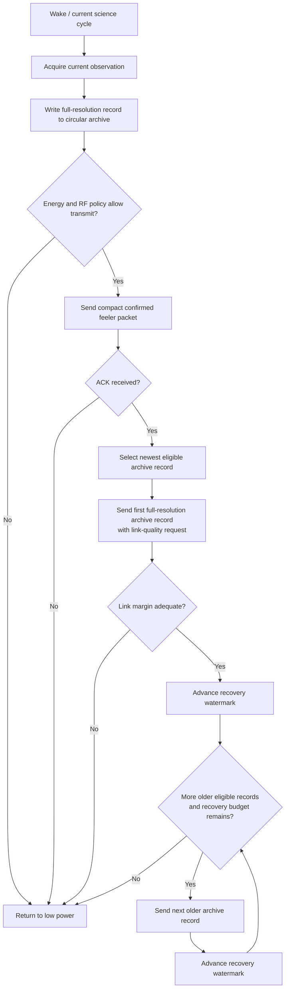
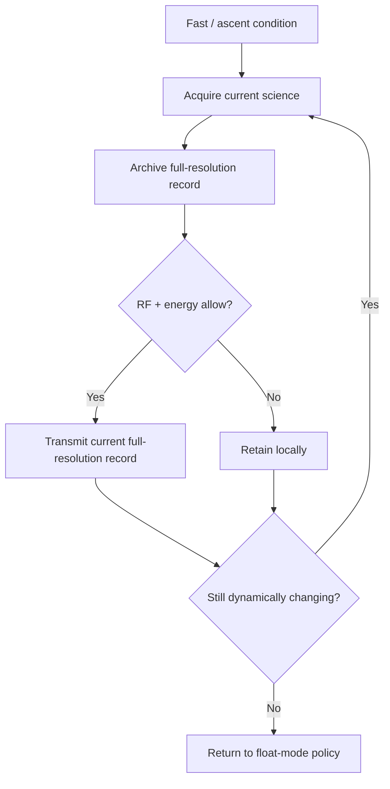

# DDR-0005: Live Telemetry and Archive Delivery Protocol

**Status:** Draft — product intent substantially elicited; implementation validation pending  
**Intent Interview Date:** 2026-08-09  
**Method:** Intent Interview V2 / Intent-Anchored Development  
**Scope:** Live telemetry priority, float-mode link probing, archive transmission, sent-watermark behavior, backend-requested gap recovery, and ascent-mode transmission policy  
**Authority:** Product intent is normative. This record is intended to stand alone as part of the regenerable Stratosonde product design.

---

## 1. Intent

Stratosonde must balance three competing goals:

1. **Never miss new science because old science is being transmitted.**
2. **Recover as much cached full-resolution science as practical whenever connectivity and energy allow.**
3. **Keep firmware-side delivery logic simple and push selective recovery intelligence to the backend.**

The product should therefore treat current science and archive recovery differently.

Current science is always generated, logged, and given priority.

Archive recovery is opportunistic background work that uses the time and energy left after the current science cycle has been protected.

The core design intent is:

> **Current science always wins. Archive delivery advances opportunistically, never retransmits on its own, and relies on the backend to request specific missing records when needed.**

---

## 2. Product-Level Invariants

### INV-TX-001 — Archive recovery must never delay new science acquisition

Transmission of cached records SHALL NOT cause the next scheduled science observation to be skipped, delayed beyond its intended cadence, or discarded.

If the next science cycle becomes due while archive recovery is still active, archive recovery SHALL yield to the new science cycle.

### INV-TX-002 — Every current full-resolution observation is archived before archive recovery matters

The current wake cycle SHALL produce and durably log the current full-resolution record before cached-history recovery is treated as useful work.

### INV-TX-003 — Float-mode archive recovery is opportunistic

Bulk archive recovery SHALL occur only when:

- the current energy state permits it;
- the communication path appears usable;
- current science work is complete;
- regulatory and duty-cycle constraints permit transmission.

### INV-TX-004 — Firmware does not autonomously retransmit archive records

Once an archive record has been transmitted by the normal recovery walker, firmware SHALL advance past it.

The same archive record SHALL NOT be retransmitted autonomously merely because no per-record confirmation was observed.

### INV-TX-005 — Backend owns gap repair

If the backend later determines that a record was missed, it SHALL be able to request that specific record by logical record ID, provided the record is still retained in the circular archive.

### INV-TX-006 — Ascent prioritizes new full-resolution science over protocol overhead

During fast ascent operation, current high-resolution science is more valuable than link-probing overhead or archive recovery.

The product MAY remain awake and transmit current full-resolution records directly at the fast cadence.

---

## 3. Float-Mode Transmission Sequence

In stable / float operation, the intended transmission flow is:

1. wake;
2. perform the normal science acquisition cycle;
3. create the compact low-bandwidth telemetry packet;
4. durably archive the current full-resolution science record;
5. transmit the compact packet as a **confirmed** uplink;
6. if acknowledgement is received, treat that as evidence that usable backhaul exists;
7. transmit the current/newest full-resolution archive record with link-quality request/measurement enabled;
8. if returned link margin is adequate, continue transmitting older archive records;
9. stop archive recovery when a limiting condition is reached;
10. return to the normal low-power cycle.

The compact packet is therefore a **feeler / connectivity-probe packet** as well as useful telemetry in its own right.

Exact naming of the packet is not architecturally important.

---

## 4. Behavioral Requirements

Confidence legend:

- **CONFIRMED** — explicitly stated or affirmed during the interview.
- **INFERRED** — strongly implied but wording may still deserve review.
- **OPEN** — product behavior is not yet fully decided.

| ID | Requirement | Confidence |
|---|---|---|
| BR-TX-001 | Current science acquisition and logging SHALL always take priority over archive recovery. | **CONFIRMED** |
| BR-TX-002 | Archive recovery MAY occupy the remainder of a wake interval, but SHALL yield when the next science cycle becomes due. | **CONFIRMED** |
| BR-TX-003 | Float-mode communication SHALL begin with a compact confirmed packet when the energy policy permits ordinary transmission. | **CONFIRMED** |
| BR-TX-004 | Receipt of the compact-packet acknowledgement SHALL be treated as evidence that useful backhaul currently exists. | **CONFIRMED** |
| BR-TX-005 | After confirmed compact telemetry succeeds, firmware SHALL attempt transmission of the newest eligible full-resolution archive record. | **CONFIRMED** |
| BR-TX-006 | The first full-resolution archive transmission in a recovery opportunity SHALL request/use link-quality feedback such as LinkCheckReq/LinkCheckAns or an equivalent mechanism. | **CONFIRMED** |
| BR-TX-007 | If measured link margin is adequate, firmware MAY continue transmitting additional archive records in the same opportunity. | **CONFIRMED** |
| BR-TX-008 | Normal archive recovery SHALL progress from newest retained eligible science toward older science. | **CONFIRMED** |
| BR-TX-009 | Firmware SHALL maintain a logical recovery watermark representing how far the normal one-pass archive walker has progressed. | **CONFIRMED** |
| BR-TX-010 | Once a record has been sent by the normal archive walker, that walker SHALL advance and SHALL NOT send the record again autonomously. | **CONFIRMED** |
| BR-TX-011 | Failure to receive a per-record acknowledgement SHALL NOT automatically cause firmware to retry the same archive record. | **CONFIRMED** |
| BR-TX-012 | The backend SHALL be able to request a specific missing logical record ID. | **CONFIRMED** |
| BR-TX-013 | Initial selective recovery protocol SHALL support single-record requests; range requests MAY be added later if operationally justified. | **CONFIRMED** |
| BR-TX-014 | If a specifically requested record is no longer retained, archive lookup behavior SHALL follow the circular-archive policy defined for unavailable records. | **CONFIRMED** |
| BR-TX-015 | Archive transmission SHALL NOT prevent the next live science cycle from executing even if archive traffic otherwise could keep the MCU awake continuously. | **CONFIRMED** |
| BR-TX-016 | During ascent / fast dynamic flight, firmware MAY skip the compact feeler packet and skip archive recovery. | **CONFIRMED** |
| BR-TX-017 | During ascent / fast dynamic flight, firmware SHOULD prioritize transmission of the newly generated full-resolution science record at each fast update interval. | **CONFIRMED** |
| BR-TX-018 | During ascent / fast dynamic flight, the device MAY remain awake between closely spaced samples when doing so is more efficient than repeated sleep/wake transitions. | **CONFIRMED** |
| BR-TX-019 | Transition back from fast/ascent behavior to float behavior SHALL occur automatically when pressure/altitude stability returns according to the mission-lifecycle cadence controller. | **CONFIRMED** |
| BR-TX-020 | Archive recovery SHALL resume later from the stored recovery watermark when a new suitable float-mode opportunity occurs. | **CONFIRMED** |

---

## 5. Live Science Versus Archive Science

The product distinguishes two transmission classes.

### 5.1 Live / current science

This is the observation just created by the current science cycle.

It has the highest priority.

During float:

- a compact packet may represent the current observation at low bandwidth;
- the corresponding full-resolution record is already in the local archive.

During ascent:

- the current full-resolution record may itself become the preferred transmitted product.

### 5.2 Archived science

Archived science is historical full-resolution data already preserved in flash.

Its delivery is opportunistic.

If archive recovery must stop because:

- the next observation is due;
- energy falls;
- link quality becomes inadequate;
- duty-cycle/regulatory constraints intervene;
- the radio path becomes unavailable;

the mission simply resumes archive recovery later.

---

## 6. Float-Mode Recovery State Machine



The precise protocol used for link-quality feedback may change.

The durable product rule is that the firmware should establish sufficient evidence of a useful link before expending substantial energy on bulk historical transfer.

---

## 7. Recovery Watermarks

The recovery model needs logical markers, conceptually:

- **newest retained record**
- **oldest retained record**
- **normal recovery watermark / last-sent point**

The normal walker begins at the newest eligible record and moves backward.

Example:

```text
retained archive:
1000 1001 1002 1003 1004 1005

newest record:
1005

normal recovery starts:
1005 -> 1004 -> 1003 -> ...
```

If recovery stops after sending through record 1003, the watermark records enough information to continue with 1002 during a later opportunity.

The watermark is about **normal transmission progress**, not proof of backend receipt.

This distinction is deliberate.

---

## 8. One-Pass Delivery Philosophy

The normal archive walker is intentionally not a reliable-transport protocol.

A record is visited once by the normal recovery pass.

Conceptually:

```text
record selected
-> record transmitted
-> recovery watermark advances
-> normal walker does not retry it
```

Why:

- LoRaWAN delivery may already be highly reliable in favorable conditions;
- repeated confirmed retries consume energy and airtime;
- the backend is better positioned to detect gaps;
- record IDs already provide deterministic gap identification;
- targeted recovery can repair only the records actually missing.

This reduces radio chatter and firmware complexity.

---

## 9. Backend-Driven Gap Recovery

If the backend observes:

```text
1001
1002
1004
1005
```

it can infer:

```text
1003 missing
```

The initial recovery protocol should support:

```text
REQUEST_RECORD 1003
```

Firmware then:

1. searches the retained circular archive for record 1003;
2. if present, returns/transmits that record;
3. if no longer present, follows the archive's unavailable-record behavior.

The initial protocol does not need range requests.

A future extension may support:

```text
REQUEST_RANGE 1003..1010
```

if operational evidence shows that single-record requests are too cumbersome.

---

## 10. Ascent / Fast Dynamic Flight Policy

Ascent is fundamentally different from float.

During ascent:

- the sonde is close to the launch region;
- gateway availability is expected to be relatively favorable;
- scientific state changes rapidly;
- update cadence may be on the order of seconds;
- protocol overhead can consume a significant fraction of available airtime and energy;
- repeated sleep/wake transitions may provide little benefit.

Therefore ascent behavior prioritizes **current full-resolution science**.

The intended behavior is:

1. remain in fast cadence while pressure/altitude is changing significantly;
2. acquire current science;
3. durably archive the full-resolution record;
4. transmit the current full-resolution record directly when communication is permitted;
5. skip archive recovery;
6. skip the compact feeler packet when appropriate;
7. skip link-check overhead when appropriate;
8. repeat at the fast target cadence;
9. optionally remain awake if the interval is short enough that sleeping is not worthwhile.



This policy deliberately sacrifices archive-recovery throughput during ascent to maximize current scientific resolution.

---

## 11. Archive Recovery Must Yield to New Science

A recovery opportunity may last a long time.

The implementation must not assume:

> "once archive recovery begins, finish it before doing anything else."

Instead:

> **Science cadence is the scheduler boundary.**

If the next live science cycle becomes due:

1. pause/end the current archive-recovery burst;
2. acquire the new live observation;
3. archive it;
4. perform the current-mode live communication policy;
5. resume archive recovery later if conditions still permit.

This remains true even if:

- the MCU never entered sleep;
- many archive records remain unsent;
- a strong gateway is still available.

---

## 12. Relationship Between Compact and Full-Resolution Packets

The compact packet and the full-resolution archive record serve different purposes.

### Compact packet

Optimized for:

- low energy;
- long-range delivery;
- early proof of connectivity;
- coarse current telemetry;
- gateway/network-side presence.

### Full-resolution record

Optimized for:

- scientific fidelity;
- local authoritative archive;
- recovery during favorable communication windows;
- ascent-mode live transmission when high cadence matters.

The compact packet is not a substitute for the science archive.

The archive record is not always the cheapest way to probe whether a link exists.

---

## 13. Stopping Conditions for a Recovery Burst

A float-mode archive-recovery burst may end when any relevant bound is reached.

Likely bounds include:

- next live science cycle due;
- energy policy no longer permits bulk transfer;
- link margin becomes inadequate;
- RF/session failure;
- regional/duty-cycle constraint;
- retained-history boundary or previous recovery watermark reached;
- configured per-wake recovery budget reached.

The exact combination is configurable/implementation-specific.

The invariant is:

> **Archive recovery is always subordinate to mission continuity and current science.**

---

## 14. Open Decisions

### OD-TX-001 — Compact packet name

The interview repeatedly referred to the 11-byte packet as:

- feeler packet;
- health packet;
- status packet;
- compact packet.

A canonical product name should eventually be chosen, but naming does not affect behavior.

### OD-TX-002 — First archive packet confirmation semantics

The interview established that:

- the compact packet is confirmed;
- the first full-resolution archive packet requests link-quality feedback.

Need to decide whether that first archive packet itself is:

- confirmed;
- unconfirmed with LinkCheckReq;
- another LoRaWAN pattern.

### OD-TX-003 — Additional archive packet confirmation semantics

Need to formalize whether subsequent records in a bulk burst are always unconfirmed.

Current intent strongly favors **no autonomous retries**.

### OD-TX-004 — Recovery watermark representation

Need to choose whether firmware stores:

- oldest not-yet-visited record ID;
- last record visited;
- next record to visit;
- another equivalent cursor.

The external product behavior is more important than the internal representation.

### OD-TX-005 — Requested-record delivery method

Need to decide whether a backend-requested missing record is:

- sent confirmed;
- sent unconfirmed;
- retransmitted until explicit backend receipt;
- attempted once per request.

### OD-TX-006 — Recovery budget

Need to define configurable limits for:

- maximum records per recovery opportunity;
- maximum transmission time;
- minimum energy reserve;
- duty-cycle/regulatory constraints.

### OD-TX-007 — Ascent sleep policy

Fast update intervals may make sleeping inefficient.

Need an implementation decision for when to:

- remain awake continuously;
- use shallow sleep;
- use STOP/deep sleep between samples.

This should be energy-measured rather than assumed.

### OD-TX-008 — Current full-resolution ascent packet reliability

Need to decide whether ascent-mode live full-resolution transmissions are:

- confirmed;
- unconfirmed;
- conditionally confirmed.

The intent is to minimize overhead while preserving as much live science as practical.

---

## 15. Proof Plan

### P-TX-001 — Live science preempts recovery

Begin a long archive-recovery burst.

Cause the next live science interval to become due.

Prove:

- archive recovery yields;
- current science is acquired and archived on schedule;
- recovery can resume afterward.

### P-TX-002 — Float feeler gate

In float mode with transmission allowed:

- send the compact confirmed packet;
- withhold ACK.

Prove bulk archive recovery does not begin.

### P-TX-003 — Link-quality gate

Provide compact ACK but return inadequate margin to the first archive link-quality request.

Prove no further bulk recovery occurs in that opportunity.

### P-TX-004 — Watermark advances once per normal send

Transmit several archive records in the normal recovery walker.

Prove:

- each selected record is visited once;
- watermark advances;
- normal recovery does not autonomously retransmit already visited records.

### P-TX-005 — Resume recovery

Stop recovery after several records.

Begin another valid float-mode opportunity.

Prove recovery resumes from the correct next older record rather than restarting from the newest.

### P-TX-006 — Backend gap repair

Create a known missing backend record.

Issue a specific record-ID request.

Prove firmware returns that record if still retained.

### P-TX-007 — Missing requested record

Request a record that has already been overwritten.

Prove behavior matches the circular archive's unavailable-record policy.

### P-TX-008 — Ascent bypasses archive recovery

Enter fast/ascent operation.

Prove:

- current full-resolution records continue to be generated and archived;
- current full-resolution transmission is attempted as allowed;
- bulk archive recovery is not performed;
- compact feeler/link-check overhead is skipped according to the final ascent protocol.

### P-TX-009 — Return to float behavior

Stabilize pressure/altitude after ascent.

Prove the firmware automatically returns to the float transmission policy and archive recovery becomes eligible again.

### P-TX-010 — No archive starvation of science

Create a very large backlog and a strong continuous link.

Run for many science cycles.

Prove new live observations continue at the configured/energy-limited cadence regardless of archive backlog.

---

## 16. Regeneration Test

A clean-room implementer receiving this DDR should understand that:

- current science always has priority over archive recovery;
- float mode begins communication with a compact confirmed connectivity-probe packet;
- successful compact ACK permits the sonde to test full-resolution link quality;
- sufficient margin permits a newest-first historical recovery burst;
- the normal recovery walker sends each record once and advances a watermark;
- normal firmware recovery does not retry missed archive records on its own;
- the backend repairs gaps by requesting specific logical record IDs;
- initial selective recovery supports one record at a time;
- archive recovery yields whenever the next live science cycle is due;
- ascent / dynamic flight suppresses archive recovery and protocol overhead in favor of current full-resolution science;
- the sonde may remain awake during very fast cadence if that is more energy-efficient;
- stable pressure/altitude returns the product to float policy automatically.

The implementer should not need today's LoRaWAN stack, source-code structure, packet structs, scheduler names, or specific timing constants to recreate the intended behavior.

---

## 17. Next Intent Interview

The next bounded topic should be **LoRaWAN region selection and RF legality**.

Questions should include:

1. How does the sonde choose the legal region from current position?
2. What happens when GNSS is stale?
3. What happens when current position maps to no region, such as open ocean?
4. Is holding the last known region acceptable, and under what conditions?
5. When must the radio remain completely silent?
6. Is regulatory safety allowed to override "degrade and carry on"?
7. How should region transitions interact with existing LoRaWAN session state?

This topic is high value because the product must distinguish **mission survivability** from **legal permission to transmit**.
