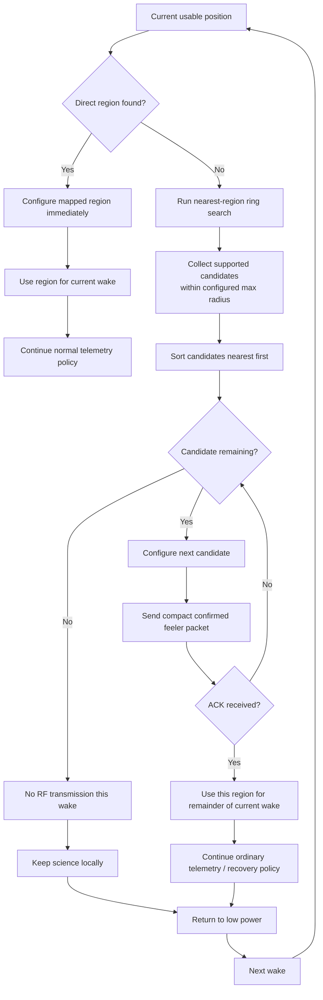

# DDR-0006: LoRaWAN Region Selection and Open-Ocean Probing

**Status:** Draft — product intent substantially elicited; implementation validation pending  
**Intent Interview Date:** 2026-08-09  
**Method:** Intent Interview V2 / Intent-Anchored Development  
**Scope:** Geographic region selection, direct-region authority, open-ocean fallback, nearest-region ring search, confirmed probing, and per-wake RF-region choice  
**Authority:** Product intent is normative. This record is intended to stand alone as part of the regenerable Stratosonde product design.

---

## 1. Intent

Stratosonde must be able to travel across regulatory boundaries and across large areas where no single LoRaWAN regional plan maps directly to the current position.

The firmware therefore needs two clearly separated behaviors:

1. **Deterministic geographic selection** when the current position lies inside a known supported region.
2. **Per-wake discovery** when the current position lies outside every mapped region, such as over international waters.

The core design intent is:

> **When geography is unambiguous, geography determines the LoRaWAN region immediately. When geography is ambiguous, the sonde probes nearby candidate regions in distance order and uses the first one that proves reachable for that wake cycle only.**

This preserves regulatory correctness over land while still giving the sonde a practical chance to communicate over open ocean.

---

## 2. Product-Level Invariants

### INV-REGION-001 — A mapped region is authoritative

If the current valid position lies inside a supported LoRaWAN region, firmware SHALL configure that region immediately.

A previously successful region SHALL NOT override the region dictated by current geography.

### INV-REGION-002 — Region changes happen immediately

When a fresh position indicates that the sonde has crossed into a different supported region, the firmware SHALL switch to that region on that cycle.

No multi-fix hysteresis or persistence requirement is needed for region transition.

### INV-REGION-003 — Open-ocean behavior is explicitly different

If the current position maps to no supported region, the firmware SHALL NOT blindly continue using the previous region as if it were geographically authoritative.

Instead, the firmware SHALL perform a nearest-region search.

### INV-REGION-004 — Candidate regions are tried in geographic proximity order

When no direct region exists, candidate regions SHALL be ranked by distance from the current position.

The nearest supported candidate is tried first.

### INV-REGION-005 — Successful communication selects the region only for that wake

In open-ocean / no-direct-region operation, the first candidate region whose confirmed feeler packet is acknowledged SHALL become the working region for that wake cycle.

That successful region SHALL NOT be cached as authoritative across later wakes.

### INV-REGION-006 — Open-ocean discovery repeats every wake

While the sonde remains outside all mapped regions, each wake cycle SHALL repeat:

- candidate search;
- distance ordering;
- confirmed probe;
- per-wake region selection.

### INV-REGION-007 — No successful candidate means no data transmission

If no candidate region acknowledges the confirmed feeler packet, the sonde SHALL stop RF activity for that wake, retain its science locally, return to low power, and try again on the next cycle.

### INV-REGION-008 — Regulatory geography outranks previous link success

A region that worked on the previous wake SHALL NOT be preferred over the region required by a new direct geographic mapping.

---

## 3. Behavioral Requirements

Confidence legend:

- **CONFIRMED** — explicitly stated or affirmed during the interview.
- **INFERRED** — strongly implied but wording may still deserve review.
- **OPEN** — product behavior is not yet fully decided.

| ID | Requirement | Confidence |
|---|---|---|
| BR-REGION-001 | Firmware SHALL perform a direct geographic region lookup from the current usable position on each wake cycle where RF transmission is being considered. | **CONFIRMED** |
| BR-REGION-002 | If the direct lookup returns a supported region, firmware SHALL configure that region immediately for the current cycle. | **CONFIRMED** |
| BR-REGION-003 | A direct region change SHALL take effect immediately; no consecutive-fix confirmation is required. | **CONFIRMED** |
| BR-REGION-004 | If the direct lookup returns no region, firmware SHALL perform a nearest-region ring search. | **CONFIRMED** |
| BR-REGION-005 | Ring-search distance SHALL be bounded by a configurable maximum radius. | **CONFIRMED** |
| BR-REGION-006 | The ring search SHOULD return multiple supported candidate regions when more than one lies within the configured radius. | **CONFIRMED** |
| BR-REGION-007 | Candidate regions SHALL be ordered nearest-first. | **CONFIRMED** |
| BR-REGION-008 | Firmware SHALL probe open-ocean candidates using the compact confirmed feeler packet or an equivalent low-cost confirmed probe. | **CONFIRMED** |
| BR-REGION-009 | Firmware SHALL try candidate regions in order until one acknowledges or the candidate list is exhausted. | **CONFIRMED** |
| BR-REGION-010 | The first candidate region that acknowledges SHALL be used for the remainder of that wake cycle. | **CONFIRMED** |
| BR-REGION-011 | A successful open-ocean region SHALL NOT be treated as authoritative on the next wake merely because it previously worked. | **CONFIRMED** |
| BR-REGION-012 | While still outside all direct geographic regions, the candidate search and probe process SHALL be repeated from scratch each wake. | **CONFIRMED** |
| BR-REGION-013 | If no open-ocean candidate acknowledges, firmware SHALL stop transmission attempts for that cycle and return to the normal low-power path. | **CONFIRMED** |
| BR-REGION-014 | Science acquisition and local logging SHALL continue even when no legal/useful RF region is found. | **CONFIRMED** |
| BR-REGION-015 | A previous region MAY remain implementation state for session housekeeping, but SHALL NOT override a direct geographic lookup. | **CONFIRMED** |
| BR-REGION-016 | Region-selection logic SHALL remain independent of higher-order trajectory plausibility checks. | **CONFIRMED** |

---

## 4. Direct Geographic Region Selection

When the current usable position lies inside a supported region, the behavior is deterministic.

Example:

```text
current position -> US915 region
```

Then:

```text
configure US915 now
```

If the next wake maps to:

```text
AS923
```

then:

```text
switch to AS923 now
```

The fact that another region worked on the previous wake is irrelevant.

The guiding principle is:

> **Inside a mapped region, geography is authoritative.**

---

## 5. Open-Ocean / No-Direct-Region Behavior

If direct lookup returns no region:

1. run a nearest-region ring search;
2. collect all supported candidate regions within the configured maximum radius;
3. sort them by distance;
4. try the nearest candidate using a confirmed compact probe;
5. if no ACK, try the next candidate;
6. stop when:
   - one ACKs; or
   - the candidate list is exhausted.

If one candidate ACKs:

- configure/use that region for the remainder of the current wake;
- continue the ordinary current-cycle communication policy for that region;
- do not permanently adopt it.

If none ACK:

- retain all science locally;
- stop RF work;
- sleep;
- repeat the whole discovery process next wake.

---

## 6. Region Selection Flow



---

## 7. Why Open-Ocean Selection Is Per-Wake

A region that worked previously over international waters is evidence only that:

> **at that moment, from that location, that region reached a gateway.**

It does not prove that:

- the same region is nearest now;
- the sonde has not moved hundreds of kilometers;
- the same gateway is still reachable;
- another region has become more appropriate;
- the sonde has not entered a directly mapped legal region.

Therefore no open-ocean candidate is sticky across wakes.

The next wake starts fresh.

---

## 8. Why Immediate Switching Is Preferred

Stratosonde can move very large distances between relatively slow float-mode wake intervals.

A five-minute interval can correspond to substantial horizontal travel.

Waiting for multiple consecutive fixes before switching region can therefore leave the radio configured incorrectly for an unnecessary period.

The product intent is simpler:

> **One valid current position is enough to change direct region selection immediately.**

---

## 9. Candidate Radius

The ring search needs a configurable maximum radius.

This exists to prevent the sonde from attempting absurdly distant regions merely because some supported region eventually appears if the search expands far enough.

Conceptually:

```text
if nearest_supported_region_distance <= configured_max_radius:
    candidate is eligible
else:
    candidate is ignored
```

The exact radius is mission configuration.

It may depend on:

- altitude;
- expected gateway reach;
- antenna/radio capability;
- operational policy;
- regulator guidance;
- empirical field testing.

---

## 10. Candidate Ranking

Candidate ordering is geographic.

The nearest supported region should be probed first.

Example:

```text
candidate A: 180 km
candidate B: 320 km
candidate C: 510 km
```

Probe order:

```text
A -> B -> C
```

The firmware does not retain a cross-wake preference based on yesterday's or the previous wake's successful candidate.

---

## 11. Feeler Packet Role

The compact confirmed feeler packet serves several purposes in this DDR:

- proves that a gateway is currently reachable using the candidate region;
- avoids spending the energy of a large full-resolution transmission before basic connectivity is known;
- provides a small useful telemetry payload if received;
- selects one candidate region for the remainder of that wake.

The exact packet name is still a naming decision.

Its architectural role here is:

> **low-cost confirmed connectivity probe**

---

## 12. Failure Semantics

### Direct region exists but communication fails

The region remains geographically authoritative for that wake.

Do not switch to another region merely because a gateway did not acknowledge.

Failure to communicate is a coverage problem, not evidence that the geographic region is wrong.

### No direct region and all candidates fail

No region is selected.

The sonde:

- logs the current science;
- retains it in the circular archive;
- sends nothing further;
- sleeps;
- retries discovery on the next wake.

This is the correct degrade-and-carry-on behavior.

---

## 13. Relationship to Stale Position

This DDR assumes a **usable position input** from the GNSS/provenance policy.

If the position is stale, region selection needs a separate explicit rule because stale geography and RF legality are different concerns.

That behavior should be defined deliberately rather than inferred.

At minimum, the implementation must know whether the position being used for region selection is:

- fresh;
- stale last-known-good;
- unavailable.

The exact stale-position region policy remains a bounded open decision below.

---

## 14. Open Decisions

### OD-REGION-001 — Stale-position region selection

Need to explicitly decide:

- whether stale last-known-good position may continue to select a direct region;
- whether stale data should trigger ring search;
- whether a maximum stale age changes behavior.

### OD-REGION-002 — Maximum ring-search radius

Need a configurable value or policy.

### OD-REGION-003 — Maximum number of candidate probes

Need to decide whether all candidates within radius are always tried or whether energy/time caps the number.

### OD-REGION-004 — Candidate tie breaking

If two regions are effectively equidistant, define deterministic ordering.

Possible rules:

- nearest exact distance;
- fixed region priority;
- stable region enum ordering.

### OD-REGION-005 — Session handling on region change

Need to decide how LoRaWAN session state behaves when switching between:

- direct regions;
- open-ocean candidates;
- consecutive candidate probes.

This is protocol binding, not product intent.

### OD-REGION-006 — Candidate probe energy budget

Open-ocean probing must remain bounded by the wake-cycle energy policy.

Need to define when candidate probing is too expensive for the current energy state.

### OD-REGION-007 — Candidate probing legality

Need implementation/regulatory review to ensure that probing a nearby regional plan from international waters is acceptable under the intended deployment model.

This DDR defines desired product behavior but does not substitute for jurisdiction-specific regulatory validation.

---

## 15. Proof Plan

### P-REGION-001 — Direct region selection

Provide a position unambiguously inside one supported region.

Prove firmware:

- selects that region;
- does not ring-search;
- does not prefer a previously successful region.

### P-REGION-002 — Immediate region transition

Provide two successive valid positions that map to different supported regions.

Prove firmware switches immediately on the second cycle.

### P-REGION-003 — Open-ocean candidate ordering

Provide a no-direct-region position with three supported regions inside the configured search radius at different distances.

Prove candidates are attempted nearest-first.

### P-REGION-004 — First ACK wins for current wake

Return no ACK for candidate 1 and ACK for candidate 2.

Prove:

- candidate 2 becomes working region;
- candidate 3 is not probed;
- subsequent communication that wake uses candidate 2.

### P-REGION-005 — No candidate ACK

Return no ACK for all candidates.

Prove:

- no archive/live RF data is sent afterward;
- current science remains locally archived;
- cycle returns to low power.

### P-REGION-006 — No open-ocean stickiness

Wake 1:

- candidate B ACKs.

Wake 2:

- sonde remains outside direct regions.

Prove the firmware reruns the full ring search and begins from the current nearest-first list rather than automatically choosing B.

### P-REGION-007 — Direct region overrides prior open-ocean success

Wake 1:

- open-ocean candidate B ACKs.

Wake 2:

- current position lies directly inside region C.

Prove region C is selected immediately without probing B.

### P-REGION-008 — Search-radius bound

Provide candidate regions only beyond the configured maximum distance.

Prove no candidate probe occurs.

### P-REGION-009 — Bounded probing under low energy

Provide multiple candidates while energy policy restricts RF work.

Prove probing stops according to the final energy bound and science is still retained locally.

---

## 16. Regeneration Test

A clean-room implementer receiving this DDR should understand that:

- direct geographic mapping is authoritative;
- region changes happen immediately;
- no hysteresis is required for direct region switching;
- no-direct-region locations trigger a nearest-region ring search;
- candidates are bounded by configurable distance;
- candidates are ranked nearest-first;
- each candidate is probed with a low-cost confirmed feeler packet;
- first ACK wins for that wake;
- open-ocean region selection is never sticky across wakes;
- all candidates failing means no further RF transmission that wake;
- science continues to be logged regardless of RF-region availability;
- previous successful regions never override current direct geography.

The implementer should not need the current geographic indexing algorithm, region table structure, LoRaWAN stack internals, packet encoding, or search implementation to recreate the intended behavior.

---

## 17. Next Intent Interview

The next bounded topic should be **stale-position RF legality and region hold**.

Questions to resolve one at a time:

1. If the last valid position was inside a region but GNSS is now stale, may firmware continue using that region indefinitely?
2. Does stale age matter?
3. Should stale position ever trigger the open-ocean ring search?
4. If GNSS disappears near a known border, what is safer: hold last region, probe candidates, or go silent?
5. Is RF legality one of the rare cases where "degrade and carry on" means continue science but stop transmitting?

That decision should be explicit because it sits at the boundary between scientific continuity and regulatory risk.

**Resolved:** this interview was conducted 2026-08-09 and is captured in **DDR-0015 (Stale-Position RF Legality and the Staleness Budget)**. Summary: stale position remains authoritative within a configured maximum staleness age (held region or ring search, full privileges); beyond it, RF silence until the first fresh fix.
