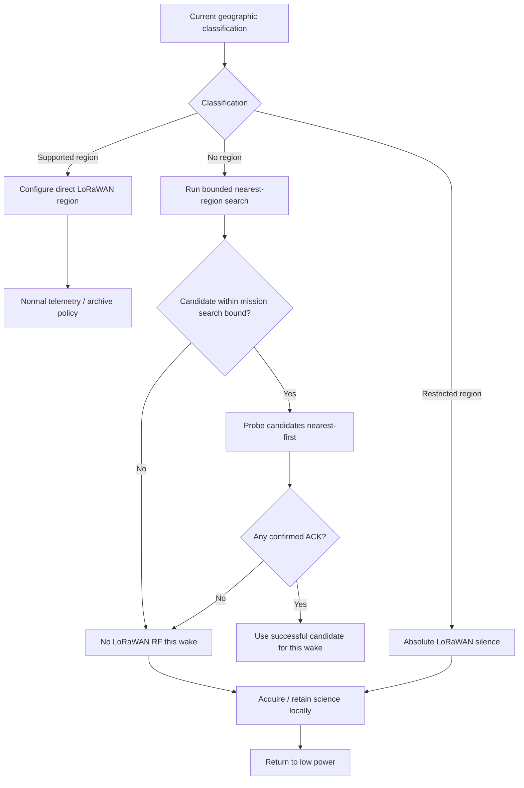
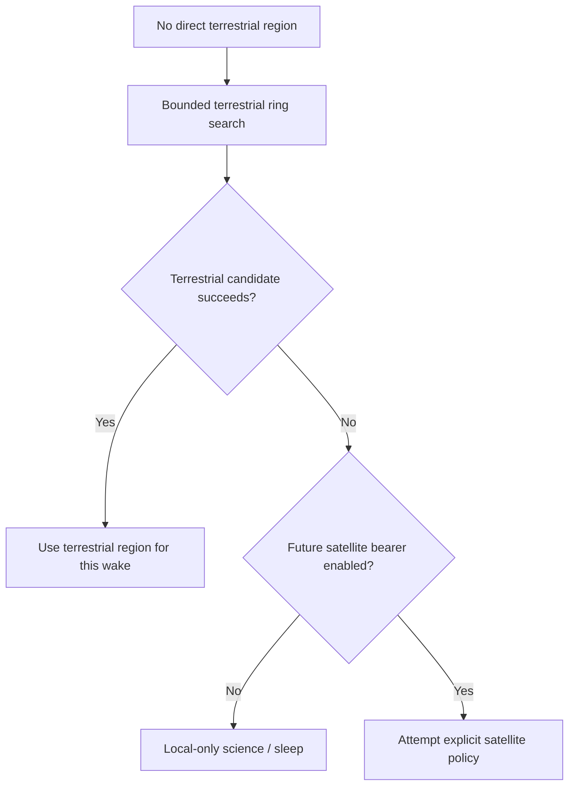

# DDR-0007: RF Transmission Authorization and Restricted-Region Policy

**Status:** Draft — product intent substantially elicited; implementation validation pending  
**Intent Interview Date:** 2026-08-09  
**Method:** Intent Interview V2 / Intent-Anchored Development  
**Scope:** RF authorization outcomes for supported, no-region, and restricted-region geography; bounded no-region probing; mission-profile configuration; and future satellite-path extensibility  
**Authority:** Product intent is normative. This record is intended to stand alone as part of the regenerable Stratosonde product design.

---

## 1. Intent

Stratosonde must separate three very different geographic/RF situations:

1. **Supported region** — a legal LoRaWAN regional plan is directly selected.
2. **No region** — the current position is outside any directly mapped terrestrial region, but nearby supported regions may still be reachable.
3. **Restricted region** — RF transmission is intentionally prohibited.

These cases must not be collapsed into one generic "unknown region" behavior.

The core design intent is:

> **Restricted means absolute RF silence. No-region means bounded discovery may be attempted, but failure to find a usable nearby region results in local-only science and sleep. Supported region means normal LoRaWAN operation according to the selected regional plan.**

---

## 2. Product-Level Invariants

### INV-RF-001 — Restricted region means zero LoRaWAN transmission

If the current position is classified as restricted, the sonde SHALL NOT transmit LoRaWAN RF.

It SHALL continue to:

- acquire GNSS as energy permits;
- acquire sensors;
- maintain time and mission state;
- write the full-resolution science record to local flash;
- continue the mission;
- return to low power.

### INV-RF-002 — Restricted and no-region are different states

A restricted region is a **prohibition**.

A no-region result is an **absence of direct terrestrial regional mapping**.

These SHALL remain separate product states because their future behavior may differ.

### INV-RF-003 — No-region probing is bounded

When the sonde is in a no-region location, the firmware MAY perform nearby-region discovery, but SHALL bound that search by mission-configurable limits.

The search SHALL NOT expand indefinitely.

### INV-RF-004 — No viable candidate means no transmission

If no supported region is found within the configured search bound, or no candidate proves reachable, the sonde SHALL stop RF activity for that wake.

Science collection and logging continue normally.

### INV-RF-005 — Regulatory silence overrides communication opportunity

A restricted-region classification SHALL override gateway reachability, previous link success, prior session state, or nearby-region availability.

### INV-RF-006 — Future non-terrestrial paths must not weaken restricted behavior

A future satellite LoRaWAN or other alternate backhaul path MAY be added for no-region operation.

Restricted-region policy remains an independent authorization decision and SHALL NOT automatically inherit no-region satellite behavior.

---

## 3. Behavioral Requirements

Confidence legend:

- **CONFIRMED** — explicitly stated or affirmed during the interview.
- **INFERRED** — strongly implied but wording may still deserve review.
- **OPEN** — product behavior has not yet been fully decided.

| ID | Requirement | Confidence |
|---|---|---|
| BR-RF-001 | A direct supported region SHALL permit normal LoRaWAN operation according to that region's policy. | **CONFIRMED** |
| BR-RF-002 | A restricted region SHALL prohibit all LoRaWAN transmission for that wake/cycle. | **CONFIRMED** |
| BR-RF-003 | Restricted-region operation SHALL still acquire and locally archive science as energy permits. | **CONFIRMED** |
| BR-RF-004 | Restricted-region operation SHALL still allow GNSS acquisition as energy permits. | **CONFIRMED** |
| BR-RF-005 | No-region operation SHALL remain distinct from restricted-region operation. | **CONFIRMED** |
| BR-RF-006 | In no-region operation, firmware MAY run a nearest-region ring search. | **CONFIRMED** |
| BR-RF-007 | The no-region ring search SHALL be bounded by a configurable maximum distance and/or equivalent ring-count limit. | **CONFIRMED** |
| BR-RF-008 | The ring-search bound SHALL be configurable per mission profile/device configuration. | **CONFIRMED** |
| BR-RF-009 | If no supported candidate is found inside the configured bound, firmware SHALL perform no LoRaWAN transmission that wake. | **CONFIRMED** |
| BR-RF-010 | If candidates are found, candidate probing SHALL follow the nearest-first confirmed-probe behavior defined by region-selection policy. | **CONFIRMED** |
| BR-RF-011 | If every candidate probe fails, firmware SHALL stop RF work, retain the science locally, and return to low power. | **CONFIRMED** |
| BR-RF-012 | Restricted-region silence SHALL not be relaxed merely because a nearby region might be reachable. | **CONFIRMED** |
| BR-RF-013 | Future satellite/LEO LoRaWAN capability MAY be added specifically to no-region behavior. | **CONFIRMED** |
| BR-RF-014 | Future alternate-bearer behavior SHALL require an explicit policy decision for restricted regions rather than inheriting permission automatically. | **CONFIRMED** |

---

## 4. Three RF Authorization Outcomes



---

## 5. Supported Region

A supported region is the ordinary case.

When the current usable position maps directly into a supported region:

- configure that region immediately;
- follow its LoRaWAN regional parameters;
- perform normal compact telemetry;
- perform archive recovery if energy and link policy permit.

The supported-region path does not need ring search.

---

## 6. Restricted Region

Restricted-region behavior is intentionally simple.

The sonde:

1. wakes;
2. checks energy;
3. acquires GNSS if permitted;
4. acquires sensor data;
5. writes the full-resolution record to the local circular archive;
6. performs **no LoRaWAN transmission**;
7. returns to low power.

No feeler packet is sent.

No nearby-region probing is performed.

No previous session is used as justification to transmit.

The mission continues locally.

---

## 7. No-Region Behavior

A no-region result does **not** mean "restricted."

It means:

> **The current position is not inside any directly mapped terrestrial LoRaWAN region.**

Examples may include:

- international waters;
- gaps between defined terrestrial region polygons;
- unsupported geography.

The sonde may still be physically close enough to a terrestrial network to communicate.

Therefore no-region behavior is:

1. run a bounded ring search;
2. collect supported nearby regions;
3. order them by proximity;
4. probe candidates;
5. use the first successful candidate for the current wake;
6. otherwise remain silent and sleep.

---

## 8. Search Bound

The ring search needs a hard bound.

The bound MAY be represented as:

- maximum geographic distance;
- maximum number of spatial-index rings;
- or both.

The current intent is a range on the order of several hundred kilometers, but the exact value is mission configuration rather than an architectural constant.

Conceptually:

```text
if nearest_candidate_distance <= configured_max_search_distance:
    candidate may be probed
else:
    do not probe
```

The reason for the bound is practical:

- beyond some distance, terrestrial gateway reach becomes implausible;
- probing consumes energy and airtime;
- indefinite spatial expansion provides little mission value.

---

## 9. Mission-Profile Configuration

The no-region search policy SHALL be tunable per mission profile or device configuration.

Configuration may include:

- maximum ring count;
- maximum search distance;
- maximum number of candidate regions to probe;
- probe energy budget;
- future alternate-bearer enable/disable.

Different missions may justify different trade-offs because of:

- radio performance;
- antenna configuration;
- expected altitude;
- route;
- battery/solar capacity;
- intended gateway network;
- regulatory review.

The generic behavior does not change.

---

## 10. Future Satellite Backhaul

The no-region state is deliberately preserved as an extensibility point.

A future Stratosonde variant may support:

- Lacuna;
- another LEO LoRaWAN network;
- another non-terrestrial bearer.

Conceptually:



This future path belongs under **no-region** behavior because no-region means terrestrial ambiguity/absence.

It does not redefine restricted-region permission.

---

## 11. Why Restricted Must Remain Separate

Restricted-region semantics are stronger than "couldn't find a network."

Restricted means:

> **Do not transmit.**

That distinction matters because a future sonde could eventually have many bearers:

- terrestrial LoRaWAN;
- satellite LoRaWAN;
- another satellite modem;
- a recovery beacon;
- another RF technology.

A restricted-region rule may apply differently to each bearer.

Therefore the architecture must keep:

```text
NO_REGION
```

and:

```text
RESTRICTED
```

as different policy outcomes.

---

## 12. Failure Philosophy

RF failure or prohibition must not become mission failure.

In both:

- restricted region;
- no-region with no useful candidate;

the sonde still:

- collects science;
- preserves the record locally;
- maintains mission time;
- continues the circular archive;
- returns to low power;
- tries again later if policy permits.

This is an explicit example of Stratosonde's broader principle:

> **Degrade the unavailable subsystem; preserve the mission.**

---

## 13. Open Decisions

### OD-RF-001 — Restricted-region definition source

Need to define how a geographic location becomes classified as restricted:

- polygon table;
- region map attribute;
- backend-generated configuration;
- signed mission profile;
- another source.

### OD-RF-002 — Search distance default

The mission-profile setting is confirmed.

A reasonable default remains to be chosen and validated experimentally.

### OD-RF-003 — Ring count versus kilometers

Need to decide whether configuration exposes:

- physical distance;
- spatial-index ring count;
- both.

Physical distance is easier to interpret operationally, while ring count may map more directly to implementation.

### OD-RF-004 — Candidate-probe cap

Need to decide whether every candidate inside the search distance is probed or whether a maximum count limits energy expenditure.

### OD-RF-005 — Satellite policy

Future work should define:

- when satellite probing is enabled;
- satellite energy budget;
- satellite region/frequency legality;
- whether satellite traffic uses the same archive protocol;
- whether satellite attempts happen every no-region wake or at a slower cadence.

### OD-RF-006 — Restricted alternate bearers

Any future non-LoRaWAN bearer requires an explicit restricted-region authorization decision.

Do not assume that "restricted LoRaWAN" means either:

- all RF prohibited; or
- other RF automatically allowed.

That must be designed consciously.

---

## 14. Proof Plan

### P-RF-001 — Restricted silence

Place the simulated sonde inside a restricted region.

Prove:

- GNSS/sensors may run as energy permits;
- full-resolution local archive write occurs;
- no LoRaWAN transmit API is invoked;
- cycle returns to low power.

### P-RF-002 — Restricted ignores nearby region

Place the sonde in a restricted area near a supported-region boundary.

Prove:

- no ring search is used to bypass restriction;
- no candidate probing occurs;
- no LoRaWAN transmission occurs.

### P-RF-003 — No-region bounded search

Place the sonde in no-region geography with candidates both inside and outside the configured search distance.

Prove only in-bound candidates are considered.

### P-RF-004 — No candidate found

Provide no supported candidate inside the configured bound.

Prove:

- no LoRaWAN RF is emitted;
- science is logged locally;
- cycle sleeps normally.

### P-RF-005 — Candidate found but no ACK

Provide valid candidates but withhold all ACKs.

Prove:

- candidate probing remains bounded;
- no archive/current bulk traffic follows;
- cycle returns to local-only behavior.

### P-RF-006 — Candidate success

Provide candidate A nearest, candidate B second.

A fails; B ACKs.

Prove B is used for the remainder of that wake.

### P-RF-007 — Mission-profile bound changes behavior

Run the same no-region location with two mission profiles using different search bounds.

Prove candidate eligibility follows configuration without changing generic firmware behavior.

### P-RF-008 — Restricted versus no-region state separation

Exercise both classifications at the same geometric distance from a supported region.

Prove:

- no-region may probe;
- restricted never probes.

---

## 15. Regeneration Test

A clean-room implementer receiving this DDR should understand that:

- supported, no-region, and restricted are three distinct RF-authorization outcomes;
- restricted means zero LoRaWAN transmission;
- restricted operation still collects and logs science;
- no-region may perform a bounded nearest-region search;
- the search bound is configurable per mission/device;
- no useful candidate means local-only science and sleep;
- no-region remains an extensibility point for future satellite backhaul;
- restricted behavior must remain separately authorized even if new bearers are introduced;
- regulatory silence overrides connectivity opportunity.

The implementer should not need today's spatial-index implementation, region-table layout, LoRaWAN stack details, packet format, or source-code structure to reproduce the intended behavior.

---

## 16. Next Intent Interview

The next bounded topic should be **stale-position RF legality**.

Questions to resolve:

1. If the last known position was inside a supported region and GNSS becomes stale, should the sonde keep transmitting in that last region?
2. Does stale age ever force silence?
3. If stale position was already no-region, should ring search continue using that stale location?
4. If GNSS disappears near a border, is holding the previous region safer than probing?
5. Should the RF authorization decision itself record whether it was based on fresh or stale position?

Those questions should be explicit because the sonde's science-continuity policy and its RF-authorization policy are not always the same thing.

**Resolved:** this interview was conducted 2026-08-09 and is captured in **DDR-0015 (Stale-Position RF Legality and the Staleness Budget)**. Answers: yes, held-region transmission continues within a configured staleness budget (Q1); yes, stale age forces silence beyond that budget (Q2); yes, ring search may run on a stale no-region position within the same budget (Q3); holding is safer than probing near borders, and no border computation is performed (Q4); no — per-record stale flags suffice, no authorization-basis provenance is added (Q5).
