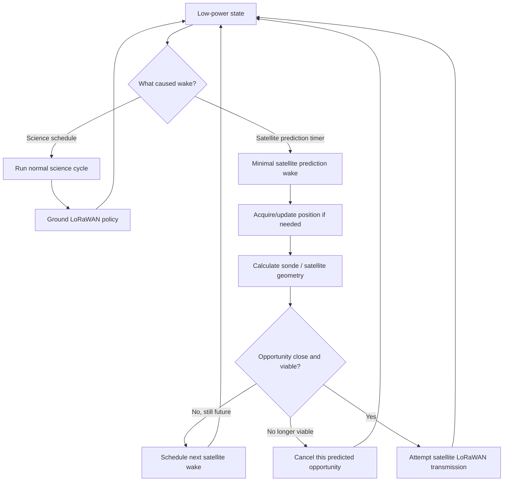
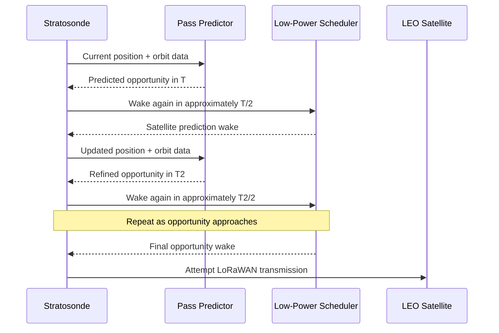
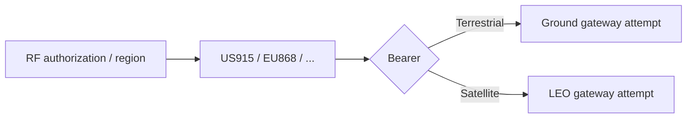
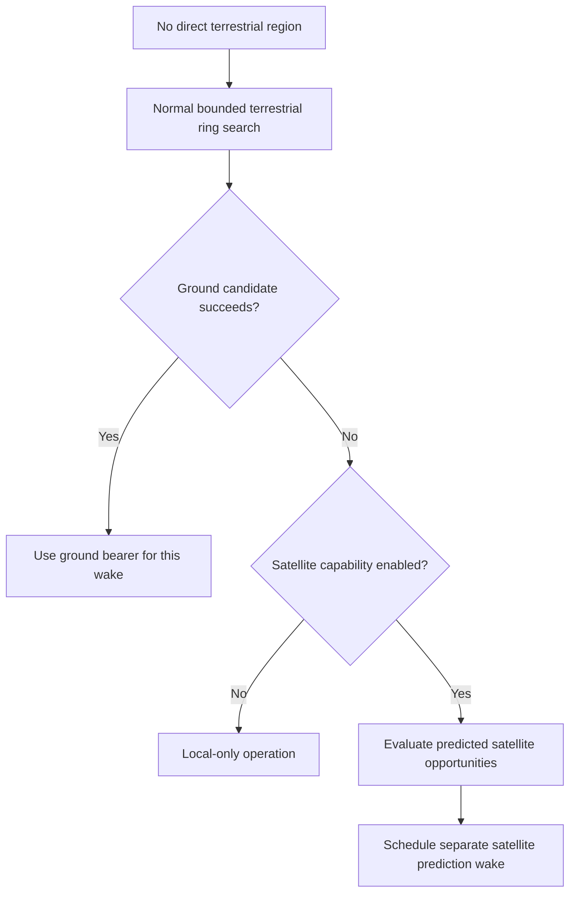

# DDR-0008: Predictive Satellite Opportunity Scheduling

**Status:** Proposed — future capability; not required for first flight  
**Intent Interview Date:** 2026-08-09  
**Method:** Intent Interview V2 / Intent-Anchored Development  
**Scope:** Future Lacuna / LEO LoRaWAN opportunity prediction, satellite-specific wake scheduling, regional RF-plan reuse, and separation from the science wake cycle  
**Authority:** Product intent is normative for the future capability described here. This feature is explicitly out of scope for first flight.

---

## 1. Intent

Stratosonde may spend long periods over regions where no terrestrial LoRaWAN gateway is reachable.

A future capability should allow the sonde to use a low-Earth-orbit LoRaWAN satellite network, such as Lacuna, when a satellite pass is predicted to intersect the sonde's future position.

The sonde already has two things needed to support this:

- a current or estimated position;
- knowledge of the satellite orbit / pass-prediction algorithm.

The satellite opportunity should be treated as a **separate communications schedule**, not as part of the normal science wake cycle.

The core design intent is:

> **Predict future satellite opportunities, wake only to refine that prediction as the pass approaches, and attempt the satellite transmission when the predicted geometry becomes favorable—without disturbing the normal science cadence.**

---

## 2. Product-Level Invariants

### INV-SAT-001 — Satellite opportunity scheduling is independent of the science schedule

The satellite scheduler SHALL NOT redefine the cadence of normal sensor acquisition.

A satellite prediction wake SHALL NOT automatically perform the full science cycle.

### INV-SAT-002 — Prediction wakes are minimal

A satellite prediction wake SHOULD perform only the work required to refine the pass estimate.

At minimum, this may include:

- GNSS acquisition when energy permits;
- current position update;
- satellite-position calculation;
- intercept / link-opportunity calculation;
- scheduling the next satellite-specific wake.

### INV-SAT-003 — The pass estimate is progressively refined

When a future satellite opportunity is predicted, the sonde SHALL wake progressively closer to the predicted pass rather than remaining continuously awake.

The intended policy is approximately:

> sleep for about half the remaining predicted time, wake, recalculate, and repeat.

The exact refinement algorithm is implementation-specific.

### INV-SAT-004 — Ground and satellite opportunities are separate

Normal terrestrial LoRaWAN attempts SHALL remain on their normal science wake cycle.

Satellite attempts SHALL occur on their own predicted opportunity wake schedule.

A failed terrestrial ACK does not by itself convert the current science wake into a satellite wake.

### INV-SAT-005 — Regional RF parameters still apply

The satellite bearer uses the same regional LoRaWAN frequency plan appropriate to the selected operating region.

Examples:

- US915 geography / policy → satellite transmission uses US915 parameters;
- EU868 geography / policy → satellite transmission uses EU868 parameters.

### INV-SAT-006 — Satellite does not weaken restricted-region policy

Future satellite communication SHALL still be subject to the RF authorization rules for restricted regions.

A satellite being physically reachable does not automatically grant permission to transmit.

---

## 3. Behavioral Requirements

Confidence legend:

- **CONFIRMED** — explicitly stated or affirmed in the interview.
- **INFERRED** — strongly implied but wording may still deserve review.
- **OPEN** — product behavior is not yet fully decided.

| ID | Requirement | Confidence |
|---|---|---|
| BR-SAT-001 | Satellite support SHALL be treated as a future capability and SHALL NOT be required for first flight. | **CONFIRMED** |
| BR-SAT-002 | The satellite opportunity scheduler SHALL operate independently of the normal science wake scheduler. | **CONFIRMED** |
| BR-SAT-003 | A satellite prediction wake SHALL NOT automatically acquire environmental sensors or create a new science record. | **CONFIRMED** |
| BR-SAT-004 | A satellite prediction wake MAY acquire GNSS if needed to refine current position and pass geometry. | **CONFIRMED** |
| BR-SAT-005 | The sonde SHALL use an orbital prediction algorithm to estimate whether its future path and the satellite path are likely to create a usable communication opportunity. | **CONFIRMED** |
| BR-SAT-006 | If an opportunity is predicted sufficiently far in the future, firmware SHALL schedule another satellite wake roughly partway to the predicted pass rather than remaining awake continuously. | **CONFIRMED** |
| BR-SAT-007 | At each satellite prediction wake, firmware SHALL recompute the expected sonde position, satellite position, and likely next opportunity time. | **CONFIRMED** |
| BR-SAT-008 | Repeated recalculation SHALL continue until the opportunity becomes close enough to attempt transmission or until the predicted opportunity is no longer viable. | **CONFIRMED** |
| BR-SAT-009 | Ground LoRaWAN attempts SHALL continue independently on the normal ground/science wake cycle. | **CONFIRMED** |
| BR-SAT-010 | Satellite transmission SHALL use the LoRaWAN regional plan appropriate to the current RF authorization context. | **CONFIRMED** |
| BR-SAT-011 | If the current direct region is US915, a satellite opportunity SHALL use US915 RF parameters. | **CONFIRMED** |
| BR-SAT-012 | If the current direct region is EU868, a satellite opportunity SHALL use EU868 RF parameters. | **CONFIRMED** |
| BR-SAT-013 | In no-region / international-water operation, candidate regional plans MAY be considered for satellite use according to future policy. | **CONFIRMED — detailed selection open** |
| BR-SAT-014 | A satellite attempt SHALL remain subject to the same restricted-region authorization policy as any other RF transmission unless a future explicit policy says otherwise. | **CONFIRMED** |
| BR-SAT-015 | Satellite prediction work SHALL remain bounded by the energy policy and SHALL yield to mission survival. | **CONFIRMED** |
| BR-SAT-016 | Satellite opportunity scheduling SHALL not interfere with a science wake that becomes due at the same time. | **CONFIRMED** |

---

## 4. Two Independent Schedulers

The product conceptually has two independent wake sources.

### Science scheduler

Responsible for:

- battery / energy admission;
- temperature and sensors;
- GNSS as the science policy permits;
- full-resolution science logging;
- ground telemetry;
- archive recovery;
- return to low power.

### Satellite opportunity scheduler

Responsible for:

- position update as needed;
- orbital / geometry prediction;
- calculating next satellite opportunity;
- scheduling the next satellite wake;
- attempting satellite communication when the predicted window arrives.



The two schedulers share the same low-power system but have different purposes.

---

## 5. Progressive Pass Refinement

A single pass prediction far in advance may be inaccurate because:

- the balloon continues to drift;
- wind speed/direction changes;
- GNSS position changes;
- orbital prediction error accumulates;
- the usable link geometry may be narrow.

Therefore the sonde should not simply calculate:

> "satellite pass in 4 hours"

and sleep for 4 hours.

Instead it should refine progressively.

Conceptually:

```text
predicted pass in 4 hours
-> wake in ~2 hours

new predicted pass in 2 hours
-> wake in ~1 hour

new predicted pass in 58 minutes
-> wake in ~29 minutes

...

close enough
-> attempt satellite transmission
```



The "halfway" rule is a product heuristic, not a mandatory mathematical algorithm.

A future implementation may use a better convergence policy while preserving the intent:

> **spend very little energy far from the opportunity and progressively increase timing precision as the opportunity approaches.**

---

## 6. Why Satellite Wakes Do Not Create Science Records

A satellite prediction wake exists to improve communication timing.

It is not a new environmental observation cycle.

Therefore it does not need to:

- read the full sensor payload;
- create a new full-resolution archive record;
- transmit a live science packet;
- run ordinary archive-recovery logic;
- otherwise perturb the configured science cadence.

This avoids accidental over-sampling and unnecessary energy consumption.

If a normal science wake and satellite wake coincide, the implementation may combine work efficiently, but the science cadence remains the authoritative observation schedule.

---

## 7. Regional RF Plan and Bearer Selection

Regional plan and bearer are separate concepts.

### Regional plan

Defines the appropriate LoRaWAN RF parameters:

- US915;
- EU868;
- another supported regional plan.

### Bearer / destination

Defines the communication path:

- terrestrial gateway;
- LEO satellite gateway.

Conceptually:

```text
LoRaWAN Region = US915
Bearer = terrestrial
```

and:

```text
LoRaWAN Region = US915
Bearer = satellite
```

may use the same regional RF plan.

This allows bearer selection to evolve without rewriting regional compliance behavior.



---

## 8. Ground Attempts Continue Normally

Satellite opportunity logic does not replace terrestrial communication.

Example:

- science wake occurs;
- sonde tries ground LoRaWAN according to ordinary regional policy;
- no ground gateway acknowledges;
- sonde returns to the normal mission schedule.

Separately:

- a satellite pass predictor has scheduled a wake 37 minutes later;
- that wake occurs;
- firmware refines the satellite geometry;
- no science record is created merely because of that wake.

The two paths are intentionally orthogonal.

---

## 9. No-Region / International-Water Operation

No-region operation is the most likely place where satellite backhaul becomes valuable.

The future policy may behave conceptually as:



The exact regional-plan choice for an international-water satellite attempt remains an open design question.

The interview established that US915 and EU868 may both be relevant candidates depending on location and satellite network support, but the selection rule has not yet been fully specified.

---

## 10. Energy Philosophy

Satellite prediction must remain cheap.

The intended energy pattern is:

- calculate;
- sleep;
- wake later;
- refine;
- sleep again;
- transmit only near a plausible opportunity.

The sonde SHALL NOT remain awake waiting for the satellite.

A predicted satellite pass is optional communication work and is subordinate to:

- battery survival;
- science acquisition;
- local archive integrity;
- RF authorization.

---

## 11. Conflict Between Science and Satellite Wake

If both schedulers become due at nearly the same time:

1. the current science observation SHALL NOT be lost;
2. the implementation MAY combine GNSS acquisition or other shared work;
3. the satellite prediction may be updated using the same fresh position;
4. the science archive behavior remains unchanged;
5. satellite work remains bounded.

The exact scheduler arbitration is implementation-specific.

The product invariant is:

> **Satellite opportunity work must never make the science timeline less reliable.**

---

## 12. Restricted Regions

Satellite support must not create an accidental regulatory bypass.

If a position is classified as restricted under the product's RF authorization policy:

- satellite reachability is irrelevant;
- satellite RF SHALL remain prohibited unless a future explicit decision establishes otherwise.

This is intentionally separate from no-region behavior.

---

## 13. Open Decisions

### OD-SAT-001 — Orbital data source

Need to define how orbital/pass data reaches the sonde:

- compiled orbital parameters;
- commissioning upload;
- backend downlink;
- periodically refreshed ephemeris;
- another mechanism.

### OD-SAT-002 — Prediction algorithm

Need to document/validate the specific Lacuna-provided or equivalent orbit-crossing algorithm.

The implementation should be separately testable from the scheduler.

### OD-SAT-003 — Refinement interval

"Wake halfway to the predicted opportunity" is the current intended heuristic.

Need to decide:

- minimum wake interval;
- maximum wake interval;
- final pre-pass refinement cadence;
- stopping criteria.

### OD-SAT-004 — Final transmit window

Need to define what geometry/link criterion means:

> close enough to attempt satellite transmission.

### OD-SAT-005 — Satellite payload

Need to decide whether the satellite attempt sends:

- compact telemetry;
- newest full-resolution record;
- archive recovery records;
- a satellite-specific packet;
- some combination.

### OD-SAT-006 — Satellite ACK and retry

Need to define:

- confirmed versus unconfirmed;
- number of attempts per pass;
- what ends the pass attempt;
- whether failed satellite packets are later recovered through normal backend gap recovery.

### OD-SAT-007 — International-water regional plan

If no direct terrestrial region exists, need to define how the LoRaWAN plan for the satellite attempt is selected.

Possible inputs include:

- nearest-region candidate;
- satellite-network coverage policy;
- explicit mission configuration;
- multiple regional attempts.

### OD-SAT-008 — Multiple satellites

Need to decide how the scheduler handles:

- overlapping passes;
- multiple candidate satellites;
- selecting the best predicted link;
- keeping more than one future opportunity queued.

### OD-SAT-009 — Scheduler persistence across reset

Future implementation must preserve enough predicted-opportunity state or recompute it safely after MCU reset.

---

## 14. Proof Plan

This DDR is future scope, but its eventual implementation should be proven with deterministic simulation before flight.

### P-SAT-001 — Independent satellite wake

Schedule a satellite prediction wake between two normal science wakes.

Prove:

- no environmental science record is created at the satellite-only wake;
- the normal science cadence remains unchanged.

### P-SAT-002 — Progressive refinement

Start with a satellite opportunity several hours away.

Prove the scheduler repeatedly:

- predicts the opportunity;
- schedules a nearer wake;
- recalculates with updated position;
- converges toward the pass.

### P-SAT-003 — Opportunity disappears

Begin with a plausible future intersection.

Change balloon trajectory so the pass is no longer viable.

Prove:

- prediction is cancelled or rescheduled;
- firmware does not continue waking for a dead opportunity.

### P-SAT-004 — Ground and satellite independence

Cause a normal science wake with no terrestrial ACK.

Prove that:

- the science wake completes normally;
- no immediate satellite attempt is forced;
- a separately scheduled satellite wake remains intact.

### P-SAT-005 — Regional plan reuse

Simulate a valid US915 satellite opportunity.

Prove satellite RF uses the US915 regional configuration.

Repeat for EU868.

### P-SAT-006 — Science wake collision

Make a science wake and a satellite wake due simultaneously.

Prove:

- science acquisition is preserved;
- shared work may be reused;
- satellite handling does not skip the science record.

### P-SAT-007 — Energy suppression

Predict a satellite opportunity while energy policy prohibits optional satellite work.

Prove satellite wake/transmission is suppressed or deferred without affecting normal mission continuity.

### P-SAT-008 — Restricted-region silence

Predict an ideal satellite pass while the sonde is in a restricted region.

Prove no satellite RF transmission occurs.

---

## 15. Regeneration Test

A clean-room implementer receiving this DDR should understand that:

- satellite LoRaWAN is future scope;
- it has its own wake schedule independent of science acquisition;
- far-future passes are refined progressively rather than waited for while awake;
- satellite-only wakes are minimal;
- GNSS may be acquired to refine pass geometry;
- environmental sensors are not read merely because a satellite-prediction wake occurred;
- ground LoRaWAN continues on the normal science cycle;
- satellite and terrestrial bearers share the appropriate regional LoRaWAN plan;
- no-region operation is a natural place to use satellite backhaul;
- restricted-region authorization still applies;
- satellite opportunity work must never interfere with current science or mission survival.

The implementer should not need today's scheduler implementation, orbit library, LoRaWAN stack, satellite vendor API, or wake-timer code to recreate the intended behavior.

---

## 16. Next Intent Interview

The next bounded topic should return to **stale-position RF legality**, because that remains unresolved and affects both terrestrial and future satellite communication.

Questions:

1. If GNSS is stale but the last position was inside a supported region, may the sonde continue transmitting there indefinitely?
2. If stale position was near a border, should the previous region be held or RF stopped?
3. Should stale position ever trigger the no-region ring search?
4. Does RF authorization need to record whether its geography was fresh or stale?
5. Does a future satellite attempt have different stale-position requirements than terrestrial LoRaWAN?

That policy should be explicit before implementation is considered complete.

**Resolved:** this interview was conducted 2026-08-09 and is captured in **DDR-0015 (Stale-Position RF Legality and the Staleness Budget)**. The configured staleness budget applies to terrestrial LoRaWAN now and would apply equally to a future satellite bearer (Q5), since satellite transmission is still RF subject to DDR-0007 authorization.
