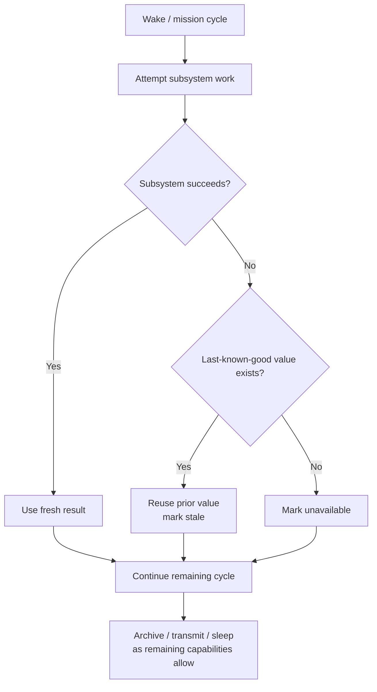
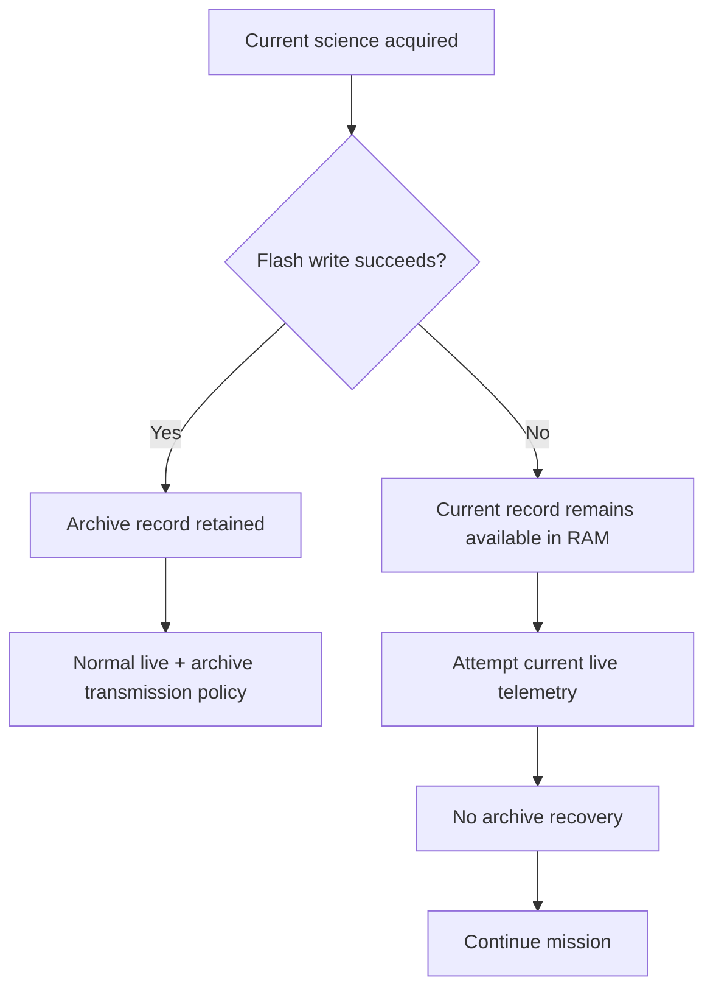
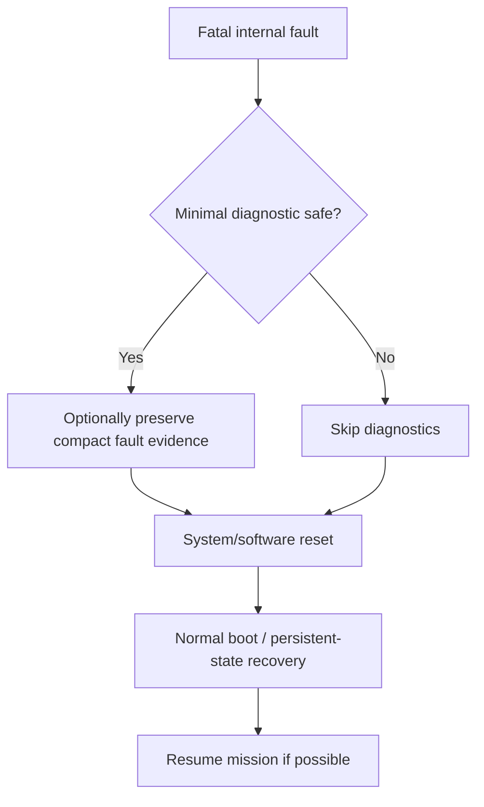

# DDR-0009: Fail-Soft Operation and Deterministic Fault Recovery

**Status:** Draft — product intent substantially elicited; implementation validation pending  
**Intent Interview Date:** 2026-08-09  
**Method:** Intent Interview V2 / Intent-Anchored Development  
**Scope:** Cross-cutting failure philosophy, stale-data substitution, subsystem independence, retry behavior, degraded operation without flash or radio, and deterministic reset on unrecoverable internal faults  
**Authority:** Product intent is normative. This record is intended to stand alone as part of the regenerable Stratosonde product design.

---

## 1. Intent

Stratosonde is a long-duration autonomous scientific instrument that cannot depend on human intervention after launch.

The firmware should therefore assume that individual subsystems will eventually fail, misbehave, timeout, lose connectivity, or return invalid data.

The product should preserve as much mission value as possible despite those failures.

The core design intent is:

> **One failed subsystem should degrade only the capabilities that depend on it. Everything else should keep running, stale data should remain explicitly marked, retries should continue on future cycles, and truly unrecoverable internal faults should return the firmware to a known startup path through reset.**

---

## 2. Product-Level Invariants

### INV-FAIL-001 — Fail soft, not fail cascade

Failure of one subsystem SHALL NOT automatically prevent unrelated subsystems from operating.

Examples:

- GNSS failure shall not stop environmental sensing;
- one sensor failure shall not stop other sensors;
- flash failure shall not stop live telemetry;
- LoRaWAN failure shall not stop science acquisition or local logging;
- missing credentials shall not stop sensing.

### INV-FAIL-002 — Last-known-good data remains usable only with explicit staleness

When a sensor or GNSS source fails to produce a fresh value, firmware MAY reuse the last-known-good value.

That carried-forward value SHALL be explicitly marked stale.

### INV-FAIL-003 — Stale values may persist indefinitely

Firmware SHALL NOT age out a last-known-good value merely because the failure persists for hours or days.

Freshness state, not age-based deletion, is authoritative.

### INV-FAIL-004 — Failed subsystems are retried every ordinary cycle

A persistent sensor or GNSS failure SHALL NOT by itself create a long-lived retry backoff.

If the current energy policy allows the operation, firmware SHALL attempt the subsystem again on the next ordinary wake.

### INV-FAIL-005 — Archive failure must not suppress current data delivery

If external serial flash is unavailable or unwritable, the sonde SHALL continue to:

- acquire current sensor data;
- acquire GNSS as permitted;
- construct current telemetry;
- attempt live radio delivery when allowed.

Loss of the archive reduces historical recovery capability but does not invalidate the current observation.

### INV-FAIL-006 — Communication failure must not suppress science

If LoRaWAN cannot operate because of:

- missing/invalid keys;
- radio failure;
- no gateway;
- no authorized RF region;
- restricted-region policy;

the sonde SHALL continue to acquire and preserve science wherever possible.

### INV-FAIL-007 — Invalid security/session material must not be replaced silently with fake working credentials

If LoRaWAN credentials or equivalent security-critical configuration are invalid, firmware SHALL NOT invent replacement credentials merely to keep transmitting.

The communication subsystem may be declared unavailable while the rest of the mission continues.

### INV-FAIL-008 — Unrecoverable internal faults return to a known path

If firmware reaches a core exception, fatal assertion, or equivalent unrecoverable internal state, the preferred recovery is a deterministic software/system reset.

The product SHALL avoid elaborate ad-hoc behavior inside fatal exception context.

---

## 3. Behavioral Requirements

Confidence legend:

- **CONFIRMED** — explicitly stated or affirmed during the interview.
- **INFERRED** — strongly implied but wording may still deserve review.
- **OPEN** — product behavior is not yet fully decided.

| ID | Requirement | Confidence |
|---|---|---|
| BR-FAIL-001 | Failure of one sensor SHALL NOT prevent unrelated sensors from being read on the same cycle. | **CONFIRMED** |
| BR-FAIL-002 | If a sensor has a previous valid value but no fresh value on the current cycle, firmware SHALL reuse the previous value and mark that sensor stale. | **CONFIRMED** |
| BR-FAIL-003 | The stale/validity representation SHOULD support each meaningful sensor independently when protocol space permits. | **CONFIRMED** |
| BR-FAIL-004 | A stale sensor SHALL still be retried on every ordinary wake for which energy policy allows that sensor. | **CONFIRMED** |
| BR-FAIL-005 | Persistent failure SHALL NOT automatically create failure-history backoff for ordinary sensors or GNSS. | **CONFIRMED** |
| BR-FAIL-006 | If external serial-flash write fails, firmware SHALL continue the remainder of the current live science/telemetry cycle. | **CONFIRMED** |
| BR-FAIL-007 | If serial flash is unavailable, current full-resolution data MAY still be transmitted directly if the communication path permits it. | **CONFIRMED** |
| BR-FAIL-008 | If serial flash is unavailable, archive recovery SHALL naturally be unavailable because no retained archive can be trusted/accessed. | **CONFIRMED** |
| BR-FAIL-009 | If LoRaWAN credentials/session configuration are invalid, firmware SHALL treat LoRaWAN as unavailable and continue science acquisition/local logging. | **CONFIRMED** |
| BR-FAIL-010 | General non-security configuration corruption MAY fall back to known-safe defaults where those defaults are meaningful and conservative. | **INFERRED — needs configuration-specific DDR** |
| BR-FAIL-011 | Security-critical configuration SHALL NOT silently fall back to fabricated/default keys. | **CONFIRMED** |
| BR-FAIL-012 | A fatal MCU/core exception SHALL trigger a deterministic reset rather than attempting complex in-handler recovery. | **CONFIRMED** |
| BR-FAIL-013 | Diagnostic logging in fatal context is optional and SHALL NOT compromise the ability to reset promptly. | **CONFIRMED** |
| BR-FAIL-014 | After reset, firmware SHALL attempt to resume ordinary startup/mission behavior using whatever persistent state remains valid. | **CONFIRMED** |
| BR-FAIL-015 | No recoverable subsystem failure SHALL permanently stop the overall mission unless continuation would violate safety, integrity, energy, or RF authorization constraints. | **CONFIRMED** |

---

## 4. Degradation Model

The firmware should treat subsystem failures independently.



The important rule is that a branch failure rejoins the main mission path whenever practical.

---

## 5. Per-Sensor Stale Semantics

The default product behavior is:

```text
fresh sample available
-> use fresh value
-> stale = false
```

```text
fresh sample unavailable
+ previous valid sample exists
-> use previous value
-> stale = true
```

```text
fresh sample unavailable
+ no previous valid sample exists
-> value unavailable/invalid
```

This model should apply consistently to:

- GNSS position;
- temperature;
- humidity;
- pressure;
- other environmental sensors;
- future quick-connect/Qwiic sensors where appropriate.

The exact status-bit layout is an implementation/protocol decision.

---

## 6. Retry Philosophy

Persistent failure does not mean permanent disablement.

The reason is simple:

- environmental conditions change;
- connectors recover;
- buses may recover after reset;
- GNSS visibility changes;
- spoofing/interference may disappear;
- a sensor may respond correctly on a later cycle.

Therefore:

> **If the energy policy still permits the task, try again next cycle.**

This avoids complex failure-history state machines unless a future subsystem proves that backoff is materially beneficial.

---

## 7. Serial-Flash Failure

Serial flash is important because it preserves full-resolution history.

But it is not allowed to become a single point of failure for current science delivery.

If the flash archive fails:

1. acquire current sensors normally;
2. acquire GNSS normally as energy permits;
3. construct current compact/full-resolution data in RAM;
4. attempt ordinary live communication when permitted;
5. skip historical archive recovery because retained flash data is unavailable/untrusted;
6. continue the mission.



This preserves immediate mission value even after permanent archive failure.

---

## 8. Communication Failure

LoRaWAN is a delivery subsystem, not the mission itself.

If LoRaWAN fails:

- science collection continues;
- GNSS continues as allowed;
- local archive continues if flash is healthy;
- firmware continues waking;
- later cycles retry communication according to normal policy.

If security/session material is invalid, the radio path may remain unavailable until proper credentials exist.

The firmware shall not invent credentials merely to avoid declaring a communications failure.

---

## 9. Configuration Failure Philosophy

Configuration corruption must be classified by consequence.

### Non-security operating configuration

Examples may include:

- preferred wake interval;
- fast/slow cadence targets;
- some mission-tunable thresholds.

Where a known conservative default exists, firmware MAY use that default rather than abandoning the mission.

### Security- or authorization-critical configuration

Examples:

- LoRaWAN keys;
- credentials;
- signed authorization data;
- region authorization data if integrity cannot be established.

If such data is invalid, firmware should disable the affected capability rather than fabricate a substitute.

This area deserves a separate configuration-integrity DDR before implementation is considered complete.

---

## 10. Fatal Internal Faults

Some failures are qualitatively different from ordinary peripheral faults.

Examples:

- HardFault;
- MemManage fault;
- BusFault;
- UsageFault;
- impossible internal invariant violation;
- fatal exception-handler entry.

In those cases, the product should prefer:

> **reset into a known startup path**

rather than:

> **attempt complicated recovery while execution context is already untrustworthy**

Conceptually:



Diagnostic capture is subordinate to guaranteed reset.

---

## 11. Why Reset Is Different From Peripheral Degradation

Peripheral failure says:

> "One capability is unavailable."

Fatal internal exception says:

> "The trustworthiness of current execution is unknown."

Therefore the preferred policies differ:

- **peripheral fault** → continue around it;
- **fatal internal fault** → restart from a known execution state.

This distinction keeps the recovery model simple and deterministic.

---

## 12. Mission Continuity After Reset

A reset should not be interpreted as mission completion.

After reboot, firmware should reconstruct whatever persistent mission state is required, such as:

- commissioning versus flight status;
- mission start time/epoch;
- next archive record ID;
- archive ring position;
- relevant configuration;
- region/session state where safe and valid.

If some persistent state is unavailable, the product should degrade conservatively rather than stop by default.

The exact reset-persistence model deserves its own DDR.

---

## 13. What This DDR Does Not Specify

This record intentionally does not define:

- individual sensor driver retry counts;
- I2C/SPI bus-recovery sequences;
- exact stale-bit packing;
- flash bad-sector handling;
- configuration storage format;
- CRC algorithm;
- MCU exception-handler code;
- crash-record format;
- watchdog timing;
- reset-cause persistence;
- LoRaWAN credential storage.

Those should be implementation bindings or narrower DDRs.

---

## 14. Open Decisions

### OD-FAIL-001 — Status-bit capacity

Need to define how many independent stale/validity states fit in:

- compact telemetry;
- full-resolution archive records.

If space is limited, need a priority scheme.

### OD-FAIL-002 — Flash-failure diagnosis

Need to define when flash is considered:

- one-write failure;
- temporarily unavailable;
- permanently failed.

The mission behavior remains fail-soft regardless.

### OD-FAIL-003 — Configuration classes

Need a formal classification of configuration into:

- safe-to-default;
- must-disable-feature;
- must-reject-as-unsafe.

### OD-FAIL-004 — Fatal-fault diagnostic record

Need to decide whether fatal handlers attempt to store:

- reset cause;
- fault registers;
- program counter;
- compact crash code;
- nothing.

Reset reliability takes priority.

### OD-FAIL-005 — Watchdog relationship

Need a separate decision on:

- hardware watchdog;
- independent watchdog timing;
- whether watchdog reset is treated the same as software fatal reset;
- persistent reset-loop detection.

### OD-FAIL-006 — Reset-loop protection

Need to decide whether repeated immediate resets should trigger a reduced recovery path or continue rebooting normally.

This should be designed carefully so reset-loop protection does not accidentally create a permanent mission stop.

---

## 15. Proof Plan

### P-FAIL-001 — Single sensor failure isolation

Force one environmental sensor to fail.

Prove:

- other sensors still run;
- GNSS still runs as allowed;
- current record is produced;
- failed sensor is stale/unavailable;
- mission continues.

### P-FAIL-002 — Last-known-good reuse

Establish a valid sensor reading, then fail that sensor.

Prove subsequent records reuse the prior value with stale status asserted.

### P-FAIL-003 — Long-term stale retry

Fail a sensor for many consecutive cycles.

Prove:

- stale data remains clearly marked;
- firmware still attempts the sensor every eligible wake;
- no permanent failure backoff occurs.

### P-FAIL-004 — Flash failure preserves live telemetry

Force archive write failure.

Prove:

- current science acquisition completes;
- compact telemetry can still transmit;
- current full-resolution data can still be transmitted when policy allows;
- archive recovery is skipped;
- mission continues.

### P-FAIL-005 — LoRaWAN credential failure

Invalidate LoRaWAN security material.

Prove:

- no fabricated/default credentials are used;
- LoRaWAN remains unavailable;
- science acquisition continues;
- local archive continues if healthy.

### P-FAIL-006 — Conservative non-security defaults

Corrupt a non-security mission configuration field for which a safe default is defined.

Prove firmware uses the approved default and continues the mission.

### P-FAIL-007 — Fatal exception reset

Inject a simulated fatal MCU exception.

Prove firmware:

- performs no complex normal mission work inside the fault handler;
- resets deterministically;
- re-enters startup;
- resumes mission behavior if persistent state permits.

### P-FAIL-008 — Fault logging cannot prevent reset

Force the optional fatal-diagnostic write path itself to fail.

Prove the reset still occurs.

### P-FAIL-009 — Post-reset mission continuity

Create established flight/archive state, reset the MCU, and reboot.

Prove required persistent mission state is reconstructed according to the future reset-persistence DDR.

---

## 16. Regeneration Test

A clean-room implementer receiving this DDR should understand that:

- Stratosonde is designed to fail soft;
- one subsystem failure should not cascade into unrelated mission loss;
- last-known-good sensor values may be reused indefinitely with explicit stale flags;
- failed sensors and GNSS are retried every ordinary eligible wake;
- flash failure removes historical retention but not live science or live telemetry;
- LoRaWAN failure removes delivery but not sensing;
- invalid credentials must not be silently replaced;
- conservative defaults may be acceptable for some non-security configuration;
- fatal internal exceptions should reset to a known execution path;
- diagnostic activity during fatal faults is optional and subordinate to reliable reset;
- resets do not end the mission.

The implementer should not need today's driver structure, exception-handler implementation, packet bit layout, RTOS strategy, or flash driver to recreate the intended behavior.

---

## 17. Next Intent Interview

The next high-value bounded topic should be **persistent state and reset recovery**.

Questions should include:

1. Which mission state must survive MCU reset?
2. How is commissioning-to-flight state persisted?
3. How is mission elapsed time reconstructed?
4. How is the next archive record ID recovered?
5. How is the circular-buffer write position recovered?
6. Which LoRaWAN session state may safely persist?
7. What happens after repeated reset loops?
8. Does reset cause become part of the next science record or telemetry?

That topic naturally follows this failure philosophy because deterministic reset is only useful if the mission can reconstruct enough state to continue correctly.
