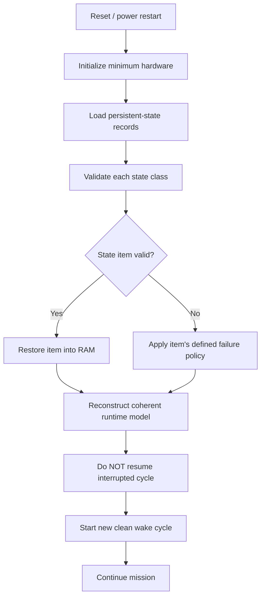
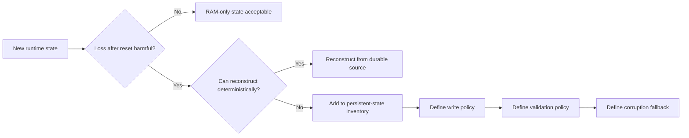
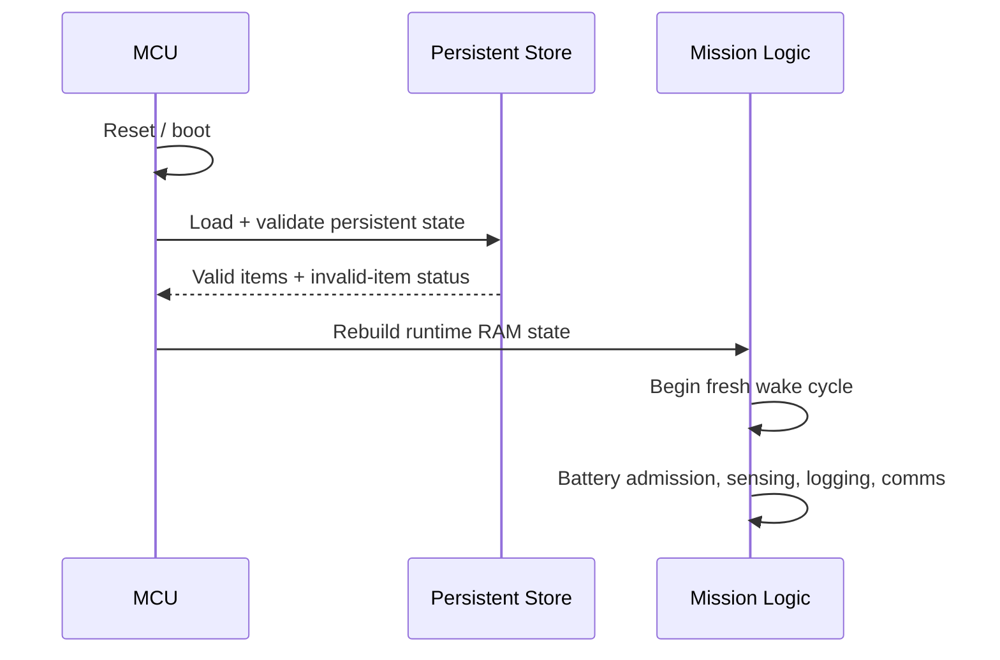

# DDR-0010: Persistent Mission State and Clean Reset Recovery

**Status:** Draft — architectural intent established; persistent-state inventory remains intentionally extensible  
**Intent Interview Date:** 2026-08-09  
**Method:** Intent Interview V2 / Intent-Anchored Development  
**Scope:** What reset recovery must accomplish, what classes of state require non-volatile persistence, clean reboot behavior, persistence policy per item, and initial examples such as LoRaWAN frame counters, archive cursors, and recovery watermarks  
**Authority:** Product intent is normative. This record is intended to stand alone as part of the regenerable Stratosonde product design.

---

## 1. Intent

Stratosonde is expected to operate unattended for long periods and must recover from:

- software resets;
- watchdog resets;
- core exceptions;
- transient brownouts or total supply interruption;
- other MCU restart conditions.

A reset must not be treated as mission completion.

At the same time, firmware should not attempt to resume an interrupted instruction sequence or reconstruct the exact middle of a wake cycle.

The product should instead recover the durable state required for mission continuity and begin a **new clean wake cycle**.

The core design intent is:

> **Persist every piece of state required to continue the mission correctly after reset, restore that state at startup, rebuild the runtime RAM model, and begin a fresh wake cycle rather than attempting to resume the interrupted cycle.**

The exact list of persistent variables is expected to grow as the product matures.

---

## 2. Product-Level Invariants

### INV-PERSIST-001 — Reset starts a new clean wake cycle

After reset, firmware SHALL NOT attempt to resume midway through the interrupted wake cycle.

Startup SHALL:

1. initialize hardware;
2. validate and restore persistent state;
3. rebuild runtime state in RAM;
4. begin a clean mission wake cycle.

### INV-PERSIST-002 — Mission continuity state must survive reset

Any state whose loss could cause incorrect mission behavior after reset SHALL have a defined persistence/recovery strategy.

The list is not permanently closed.

As new features are added, their required persistent state SHALL be added to the inventory.

### INV-PERSIST-003 — Persistence is based on correctness need, not convenience

A value SHALL be persisted because losing it would create an unacceptable consequence, such as:

- protocol rejection;
- duplicate record identity;
- incorrect archive traversal;
- loss of mission configuration;
- loss of recovery progress;
- privacy-policy regression;
- incorrect mission-time reconstruction.

### INV-PERSIST-004 — Different state may have different durability policies

Not every persistent item must be written on every change.

Each item SHALL have an explicit policy balancing:

- maximum acceptable rollback after unexpected reset;
- protocol correctness;
- mission consequence;
- flash endurance;
- write energy;
- update frequency.

### INV-PERSIST-005 — Critical protocol state must recover safely

State required for communication-protocol correctness, especially monotonic counters or session state, SHALL recover in a way that does not silently reuse invalid old values.

### INV-PERSIST-006 — Persistent corruption degrades the affected capability

If one persistent-state class cannot be validated, the product SHALL degrade the capability that depends on it rather than assuming unverified data is correct.

Other independent mission capabilities should continue where possible.

### INV-PERSIST-007 — The persistence format is implementation, the recovered behavior is product intent

This DDR does not mandate:

- one flash technology;
- one page layout;
- one CRC;
- one wear-leveling algorithm;
- one journaling format.

Those are implementation decisions provided that the product-level recovery behavior is satisfied.

### INV-PERSIST-008 — Durability effort scales with mission consequence

Each persistent item SHALL be assigned to a consequence class, and SHALL define its maximum acceptable rollback/loss. Small loss is acceptable only where explicitly bounded. (Added 2026-08-12.)

**Mission-threatening/protocol-critical:**
- permanent identity (DDR-0024);
- LoRaWAN credentials/session material whose loss cannot be repaired in flight;
- frame counters where rollback violates protocol/security;
- commissioning/flight one-way state.

**Mission-continuity critical:**
- mission configuration;
- archive identity/frontier or reconstructible equivalent;
- archive-delivery watermark;
- navigation/time anchors where required;
- adapted cadence state where loss would materially change reboot behavior.

**Recoverable limited loss:**
- a small number of newest science records;
- transient diagnostics;
- interrupted current wake execution.

Reset still begins a fresh wake rather than resuming mid-cycle execution (INV-PERSIST-001).

### INV-PERSIST-009 — Persistent mission state makes wake behavior independent of RAM history

Mission behavior after power removal/reset SHALL be determined by persistent state and current inputs, not by unpersisted RAM history that only happened to survive a particular low-power path. (Added 2026-08-12.)

This supports the product mental model:

> An ordinary sleep/wake cycle should be as close as practical to a clean power-cycle/restart from a mission-state perspective.

At minimum, strong persistence/recovery guarantees apply to per-region LoRaWAN session/credential state, frame counters and other anti-replay/protocol-continuity state, commissioned configuration, flight/mission latch or equivalent lifecycle state, and archive metadata or a reconstructible equivalent.

Archive writes SHOULD be atomic/self-validating (see DDR-0011). A brownout/fault may tolerate losing a small bounded number of the newest records if older committed records remain intact, the archive remains reconstructible, the loss is bounded, and failure does not cascade into whole-archive loss.

---

## 3. Reset Recovery Model



The reset path should be deterministic and understandable.

---

## 4. Initial Persistent-State Inventory

This inventory is a **starting list**, not a final closed schema.

### 4.1 LoRaWAN identity, credentials, and session state

Likely persistent items include, as applicable to the chosen activation/session model:

- provisioned LoRaWAN keys / credentials;
- device identity;
- active session material;
- selected/active regional context where safe to restore;
- uplink frame counter;
- downlink frame counter(s);
- other stack counters whose rollback could invalidate communication.

For a multi-region Stratosonde, the implementation may need distinct persisted session/counter state for each supported region.

Conceptual example:

```text
US915:
    session_state
    frame_counter_up
    frame_counter_down

EU868:
    session_state
    frame_counter_up
    frame_counter_down

AS923:
    session_state
    frame_counter_up
    frame_counter_down
```

The exact LoRaWAN state depends on stack/version and is implementation binding.

The product requirement is:

> **A reset must not cause protocol state to roll backward in a way that makes otherwise valid communication unusable or unsafe.**

---

### 4.2 Full-resolution archive state

Likely persistent archive state includes:

- next logical record ID;
- circular-buffer write position or information sufficient to reconstruct it;
- oldest retained record;
- newest retained record;
- archive generation/wrap information if needed;
- metadata required to distinguish valid committed records from incomplete writes.

The archive itself is already non-volatile science data.

The startup problem is to recover enough indexing state to continue writing and retrieving records correctly.

---

### 4.3 Archive-delivery recovery state

Likely persistent items include:

- normal archive-recovery watermark;
- next record to visit in the normal newest-to-older recovery walk;
- any future backend-request recovery state that must survive reset.

The exact representation is open.

The product requirement is that reset should not cause arbitrary re-sending, skipping, or loss of recovery position beyond the item's defined rollback tolerance.

---

### 4.4 Mission configuration

Persistent mission configuration may include:

- requested fast cadence;
- requested slow cadence;
- power-policy thresholds;
- launch/stability thresholds;
- no-region ring-search limits;
- region support configuration;
- sensor payload configuration;
- future satellite capability configuration;
- mission-specific energy parameters.

Configuration changes relatively infrequently and may use a different persistence mechanism from high-frequency counters.

---

### 4.5 Mission lifecycle state

The persistence inventory should include whatever is required to prevent reset from incorrectly returning a flying sonde to commissioning/privacy behavior.

Possible persistent state includes:

- whether the mission has transitioned from commissioning into flight;
- mission epoch / flight-start absolute time;
- information required to reconstruct mission elapsed time.

The exact encoding remains to be defined.

---

### 4.6 Time continuity

Potential persistent items include:

- mission-start epoch;
- last trustworthy absolute-time relationship;
- information required to reconstruct monotonic mission elapsed time after reset.

The STM32 RTC may provide part of this continuity, but the product should not depend on assumptions that have not been tested across all reset/power-loss cases.

---

### 4.7 Reset / diagnostic context

Optional persistent state may include:

- reset cause;
- compact fatal-fault code;
- watchdog/reset count;
- repeated-reset indicator.

This information is useful only if storing it does not compromise reliable recovery.

---

## 5. Persistent-State Inventory Is Extensible

There is intentionally no claim that §4 is exhaustive.

The design process for every new stateful feature should ask:

> **If the MCU reset right now and this value disappeared or rolled backward, could the mission behave incorrectly?**

If yes, that state needs one of:

- durable persistence;
- deterministic reconstruction from other durable data;
- a conservative fallback that safely disables/degrades the dependent feature.



---

## 6. Runtime RAM Copy and Durable Copy

For state that changes during operation, the likely model is:

- a **RAM working copy** used by normal firmware;
- a **non-volatile durable representation** used for reset recovery.

The two do not necessarily need a physical flash write after every RAM mutation.

Instead, each state item receives an explicit synchronization policy.

Conceptually:

```text
runtime value changes
-> RAM copy changes immediately
-> persistence policy decides when durable copy must advance
```

For some items:

```text
every change -> durable commit
```

For others:

```text
checkpoint periodically
```

For others:

```text
derive again from authoritative flash archive on boot
```

---

## 7. Item-Specific Write Policy

The product does not impose one universal persistence frequency.

Each parameter should document:

1. **What goes wrong if this value rolls back?**
2. **How much rollback is acceptable?**
3. **How often does the value change?**
4. **How expensive is a durable write?**
5. **Can a dual-page/journal/wear-level scheme absorb the write rate?**
6. **Can startup reconstruct the exact value instead?**

### Example: LoRaWAN frame counter

A frame counter may be correctness-critical because rollback can cause the network to reject subsequent frames or otherwise violate session expectations.

Possible policy:

- persist every increment; or
- safely reserve/checkpoint a future range; or
- checkpoint periodically only if the resulting rollback behavior is proven acceptable.

This DDR does **not** choose the mechanism.

It requires the choice to be explicit and proven.

### Example: archive recovery watermark

Losing a small amount of progress may merely cause some archive data to be visited again or skipped depending on representation.

Its durability policy may therefore differ from a protocol-security counter.

### Example: mission configuration

Configuration changes rarely.

It can reasonably require an atomic durable commit whenever configuration is changed.

---

## 8. Persistence Policy Matrix

The implementation should maintain a table similar to:

| State item | Why persistent | Maximum acceptable rollback | Candidate write policy | Corruption fallback |
|---|---|---:|---|---|
| LoRaWAN uplink frame counter per session/region | Protocol correctness | **To be defined; likely very small/zero** | Every change, reserved range, or proven checkpoint scheme | Disable/re-establish affected session |
| LoRaWAN downlink/session counters | Protocol correctness | To be defined | Stack-specific durable policy | Disable/re-establish affected session |
| LoRaWAN keys/credentials | Communication identity/security | None | Write only during provisioning/configuration | RF capability unavailable |
| Next science record ID | Unique archive identity | No duplicate IDs | Persist or reconstruct from archive | Reconstruct newest committed record |
| Archive write cursor | Continue circular archive | Must not overwrite wrong records | Persist or reconstruct | Scan/reconstruct archive |
| Archive recovery watermark | Continue delivery progress | Some rollback may be tolerable | Periodic or event-based | Conservative restart of recovery walk |
| Mission start/flight state | Privacy + lifecycle correctness | Must not revert to commissioning in flight | Durable transition commit | Conservative flight behavior |
| Mission epoch | Time continuity | Defined by time model | Durable at flight start | Reconstruct from RTC/archive if possible |
| Mission configuration | Product behavior | Last committed config | Atomic commit on change | Per-field safe defaults or feature disable |
| Reset/fault diagnostics | Observability only | Loss acceptable | Best effort | Ignore |

This table should evolve as the firmware evolves.

---

## 9. Clean Wake After Reset

The firmware should not attempt to answer:

> "Which exact instruction/task was running when power disappeared?"

Instead it asks:

> "What durable mission state survived, and what should a normal wake do now?"

Example:



The interrupted cycle may have been only partly completed.

That is acceptable if each subsystem's own atomicity/proof rules prevent corrupted durable state.

---

## 10. Default Recovery Phase

The interview preference is to keep reset recovery simple and avoid trying to resume a detailed transient flight phase.

If durable mission state confirms that flight has already begun, startup should resume normal flight behavior with a **clean ordinary wake**.

A simple stable/float-like policy may be an appropriate conservative starting condition until current pressure measurements re-establish whether the atmosphere is changing rapidly.

Exact post-reset cadence-state initialization remains an implementation/open decision.

The important invariant is:

> **Never accidentally revert a launched mission to commissioning/privacy state merely because the MCU reset.**

---

## 11. State Validation

Persistent state must not be trusted merely because bytes exist.

Each persistent state class should have a validation method appropriate to its consequence.

Possible mechanisms include:

- CRC;
- version field;
- generation number;
- commit marker;
- duplicated records;
- journal sequencing;
- semantic range checks.

Exact mechanism belongs in the subsequent persistence-implementation DDR.

Product behavior is:

```text
valid state
-> restore

invalid state
-> invoke that state class's defined conservative fallback
```

---

## 12. Corruption Is Per-State, Not Necessarily Global

A corrupted archive watermark should not automatically invalidate:

- LoRaWAN keys;
- mission configuration;
- science archive;
- mission epoch.

Likewise, invalid LoRaWAN session state should not automatically erase the science archive.

Persistent state should be partitioned so independent failures can degrade independently where practical.

This mirrors the broader Stratosonde fail-soft philosophy.

---

## 13. What This DDR Does Not Specify

This record intentionally does not choose:

- internal MCU flash versus external flash for each item;
- EEPROM emulation;
- FRAM;
- dual-page layout;
- journal format;
- copy-on-write format;
- CRC polynomial;
- generation-counter width;
- exact wear-leveling algorithm;
- atomic commit markers;
- flash erase granularity;
- exact LoRaWAN stack persistence API.

Those belong to the next implementation-oriented design decision.

---

## 14. Open Decisions

### OD-PERSIST-001 — Complete state inventory

The initial list in §4 is not exhaustive.

The inventory should be maintained as a living design artifact during feature development.

### OD-PERSIST-002 — LoRaWAN persistence granularity

Need stack-specific decisions for each region/session concerning:

- keys;
- session tokens;
- uplink counters;
- downlink counters;
- join state;
- other anti-replay/security state.

### OD-PERSIST-003 — Frame-counter durability

Need to determine whether each relevant frame counter is:

- written every increment;
- advanced using reserved blocks;
- checkpointed periodically;
- reconstructed/rejoined after rollback.

Correctness must be proven against the actual LoRaWAN stack/network behavior.

### OD-PERSIST-004 — Record ID recovery

Need to choose whether next record ID is:

- explicitly persisted;
- reconstructed from the newest valid archive record;
- both.

### OD-PERSIST-005 — Archive cursor recovery

Need to choose whether circular-buffer pointers are:

- explicitly persisted;
- derived by scanning committed records;
- restored from redundant metadata.

### OD-PERSIST-006 — Recovery-watermark rollback tolerance

Need to define what happens if the last-sent/recovery watermark rolls backward after reset.

### OD-PERSIST-007 — Mission elapsed-time restoration

Need a robust method for reconstructing mission elapsed time across:

- software reset;
- watchdog reset;
- RTC-preserving reset;
- full supply loss.

### OD-PERSIST-008 — Post-reset dynamic/float cadence state

Current preference is a simple clean wake with conservative stable/float-like behavior followed by normal pressure-based reclassification.

This should be confirmed with implementation tests.

---

## 15. Proof Plan

### P-PERSIST-001 — Reset never resumes mid-cycle

Inject reset at multiple points in a wake cycle:

- during sensing;
- after sensing;
- during archive work;
- during radio work.

Prove reboot always begins through the standard startup/restoration path and then starts a new clean wake cycle.

### P-PERSIST-002 — Flight state survives reset

Enter flight, reset the MCU, and reboot.

Prove startup does not return to commissioning privacy behavior.

### P-PERSIST-003 — Record identity survives reset

Write several records, reset, then write another.

Prove no logical record ID collision occurs.

### P-PERSIST-004 — Archive cursor survives/reconstructs

Reset at multiple circular-buffer positions, including near wrap.

Prove the next committed record is written to the correct logical location.

### P-PERSIST-005 — Recovery watermark restoration

Advance archive delivery progress, reset, and reboot.

Prove recovery resumes according to the documented rollback tolerance.

### P-PERSIST-006 — LoRaWAN counter continuity

Advance each relevant LoRaWAN frame/session counter, reset unexpectedly at worst-case persistence timing, then attempt communication.

Prove behavior conforms to the chosen durability policy and does not silently use prohibited rollback state.

### P-PERSIST-007 — Independent corruption

Corrupt one persistent-state class while leaving others valid.

Prove only the dependent capability degrades where safe.

### P-PERSIST-008 — Configuration restoration

Change mission configuration, commit it, reset, and reboot.

Prove the last valid committed configuration is restored.

### P-PERSIST-009 — Interrupted persistence update

Remove power/reset during every critical phase of the future persistent-store commit sequence.

Prove startup chooses either:

- the previous complete state; or
- the new complete state;

never a partially committed state represented as valid.

---

## 16. Regeneration Test

A clean-room implementer receiving this DDR should understand that:

- reset begins a new clean wake cycle;
- firmware never tries to resume midway through an interrupted cycle;
- all state required for correct mission continuity must either persist or be deterministically reconstructible;
- the persistent-state inventory is intentionally extensible;
- LoRaWAN session/counter state is an important initial example, potentially per region;
- record IDs, archive cursors, recovery watermarks, mission configuration, flight state, and time continuity are other expected state classes;
- runtime RAM values may have durable counterparts;
- each item gets its own write-frequency/durability policy;
- flash wear is balanced against the consequence of rollback;
- corrupted state degrades the affected capability instead of necessarily invalidating the whole mission;
- a launched sonde must not revert to commissioning after reset.

The implementer should not need the current flash layout, MCU family, RTOS, LoRaWAN stack API, or storage driver to reproduce the intended recovery behavior.

---

## 17. Next Intent Interview

The natural next topic is the **persistent-store implementation contract**:

- atomic commit behavior;
- dual-page or journal strategy;
- generation/version numbering;
- CRC/integrity validation;
- erase-before-write behavior;
- power-loss interruption;
- wear leveling;
- how to choose the newest valid copy;
- how critical counters avoid unacceptable rollback.

That DDR can then provide the concrete storage mechanism that satisfies the architectural persistence policy defined here.
