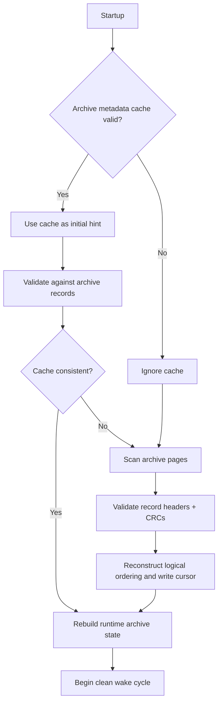
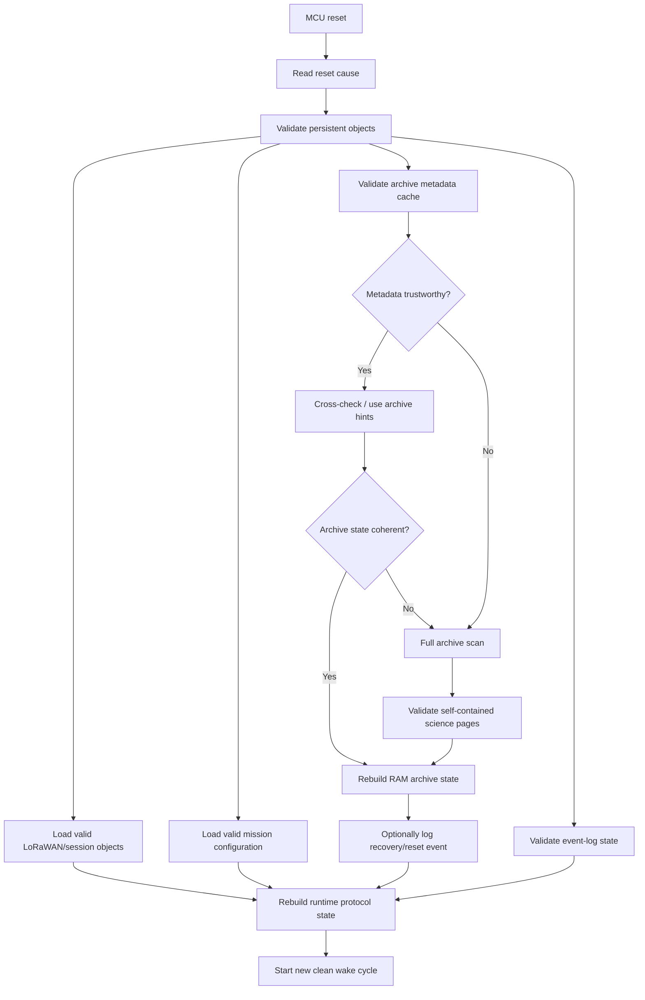

# DDR-0011: Persistent Storage Integrity and Recovery Mechanics

**Status:** Draft — implementation architecture substantially elicited; exact memory layout and device-specific flash mechanics pending  
**Intent Interview Date:** 2026-08-09  
**Method:** Intent Interview V2 / Intent-Anchored Development  
**Scope:** Persistent-storage organization, atomic update expectations, self-validating science records, startup reconstruction, metadata authority, LoRaWAN regional state, CRC/integrity checks, and a compact persistent system-event log  
**Authority:** Product intent is normative. Concrete page addresses, flash technologies, CRC choices, and driver APIs are implementation bindings.

---

## 1. Intent

Stratosonde must survive unexpected resets and interrupted writes without requiring fragile global metadata to reconstruct mission state.

Persistent storage should be simple, partitioned by purpose, independently recoverable, and biased toward data structures that can prove their own validity.

The design should avoid a single giant configuration transaction or centralized state blob when independent persistent objects are sufficient.

The core design intent is:

> **Persistent objects are independently validatable and independently updateable. Full-resolution science records are self-validating. Derived archive indexes are caches, not authorities. After reset, firmware may spend several seconds scanning persistent storage to reconstruct correct state rather than trusting questionable metadata.**

---

## 2. Product-Level Invariants

### INV-STORE-001 — Interrupted writes must not produce apparently valid partial state

For every persistent object, a reset or power interruption during update SHALL leave startup able to identify either:

- the previous valid state;
- the new valid state;
- or the object as invalid.

Partially written data SHALL NOT be accepted as valid state.

### INV-STORE-002 — Persistent objects are independent by default

LoRaWAN regional state, mission configuration, archive records, archive metadata, and diagnostic events SHOULD be stored as logically independent objects.

A global multi-object transaction SHALL only be introduced when correctness requires atomic coupling.

### INV-STORE-003 — Science records validate themselves

Each full-resolution science record in serial flash SHALL contain enough structure to establish:

- that a record is present;
- which logical record it is;
- whether the record was completely written;
- whether its stored contents pass an integrity check.

### INV-STORE-004 — Reconstructible metadata is not authoritative

If archive write position, oldest/newest pointers, or similar indexing state can be reconstructed from the self-validating archive records, that derived metadata SHALL NOT be the sole authority.

A metadata cache MAY speed startup, but invalid metadata SHALL be recoverable by scanning the archive.

### INV-STORE-005 — Correct recovery is more important than fast boot

A full scan taking several seconds is acceptable when required to reconstruct correct persistent state.

### INV-STORE-006 — Science storage and diagnostic-event storage are separate

A system-event log SHALL have its own bounded storage and SHALL NOT consume or overwrite the scientific circular archive.

### INV-STORE-007 — Events are for system-level occurrences, not redundant science status

Conditions already represented in every science record, such as an ordinary stale sensor reading, SHOULD NOT generate repetitive event-log records.

The event log is for rare system-level events and transitions.

### INV-STORE-008 — Reset causes are useful persistent diagnostics

Reset cause history SHOULD be preserved in the system-event log when practical.

### INV-STORE-009 — Reconstructible metadata is not more authoritative than valid science

If archive metadata is damaged but valid self-checking science records remain recoverable, firmware SHOULD reconstruct state rather than abandon/format the archive solely because header/index metadata is missing. (Added 2026-08-12; strengthens INV-STORE-004.)

### INV-STORE-010 — Prefer last-update loss over whole-object loss

Storage mechanisms SHOULD prefer losing one incomplete update, conservatively advancing a counter, or reconstructing a cursor over destroying the entire credential bank, archive, or configuration object. (Added 2026-08-12.)

Verification consequence: power-cut proof is required around credential, counter, archive-record, and archive-metadata updates (see DDR-0026 fault-injection levels and the Flight-1 readiness checklist §6/§7).

---

## 3. Persistent Storage Organization

The conceptual persistent memory map is organized by purpose rather than by one monolithic object.

A future implementation might resemble:

```text
Persistent Store
├── LoRaWAN region/session object: US915
├── LoRaWAN region/session object: EU868
├── LoRaWAN region/session object: AS923
├── ...
├── Mission configuration object
├── Mission lifecycle/time object
├── Archive-recovery state
├── Compact system-event log
└── Full-resolution science archive
    ├── Record page N
    ├── Record page N+1
    ├── Record page N+2
    └── ...
```

Exact page numbers are not architectural requirements.

The important principle is **ownership and independence**.

---

## 4. Independent Persistent Objects

Each logical object owns the durable state required for its function.

Examples:

### LoRaWAN regional/session state

For each supported region, persistent state may include:

- keys / credentials;
- session tokens;
- uplink frame counter;
- downlink frame counter;
- other stack-specific session information.

Conceptually:

```text
US915 persistent object:
    credentials
    session state
    FCntUp
    FCntDown

EU868 persistent object:
    credentials
    session state
    FCntUp
    FCntDown
```

When a US915 packet is transmitted, only state belonging to the affected US915 object needs to change unless the protocol requires otherwise.

### Mission configuration

Mission parameters form another independently committed object.

### Archive recovery state

Recovery watermarks/cursors form another logical object.

### Science archive

Science pages are independently committed records, not fields inside a mutable global configuration structure.

---

## 5. Atomicity Model

Atomicity is required **per correctness boundary**.

The desired result of an interrupted commit is:

```text
old valid object
OR
new valid object
OR
detectably invalid object
```

Never:

```text
part-old + part-new but accepted as valid
```

Possible implementation mechanisms include:

- dual-page A/B copies;
- generation counters;
- commit markers;
- copy-on-write records;
- append journals;
- CRC-protected versioned objects.

This DDR does not choose one mechanism globally.

Different object classes may justify different implementations.

---

## 6. Science Record Format

The intended serial-flash science archive uses self-validating records.

The interview expectation is that a full-resolution record may naturally occupy one flash page.

A conceptual page format is:

```text
+-------------------------------+
| Magic / record type           |
| Format version                |
| Logical record ID             |
| Payload length                |
| Mission elapsed time          |
| Record payload                |
| ...                           |
| CRC / integrity code          |
| Commit indicator if required  |
+-------------------------------+
```

Not every field must be transmitted over LoRaWAN.

Some fields exist specifically for local recovery and validation.

---

## 7. Archive Recovery by Scan

The authoritative archive recovery mechanism is the science pages themselves.

After reset:

1. inspect archive pages;
2. validate page structure and CRC;
3. read logical record IDs;
4. determine the valid retained sequence;
5. reconstruct:
   - newest record;
   - oldest retained record;
   - next logical record ID;
   - next physical write location;
   - circular wrap/generation context if required.



The archive scan is the **gold-standard recovery path**.

Metadata exists only to optimize startup.

---

## 8. Incomplete Science Writes

If reset or power loss occurs while writing one science page, startup must identify that page as incomplete or invalid.

Firmware SHALL NOT infer that the presence of a partial header means the record exists.

The recovery scan should stop, skip, or otherwise process the invalid page according to the chosen circular-buffer format while preserving all previously committed valid records.

The proof requirement is more important than the exact flash encoding:

> **An interrupted record write cannot masquerade as a successfully committed science record.**

---

## 9. Metadata Cache

Archive metadata MAY persist items such as:

- cached write cursor;
- cached oldest record;
- cached newest record;
- cached generation;
- cached next record ID.

However:

> **Metadata is an acceleration structure, not the scientific source of truth.**

If metadata fails CRC or contradicts the archive:

- ignore it;
- rebuild by scanning records;
- regenerate fresh metadata afterward.

A corrupt cache must never make an otherwise healthy archive inaccessible.

---

## 10. Boot-Time Scan Cost

Spending several seconds reconstructing the archive after an abnormal reset is acceptable.

The mission is long-duration.

The occasional cost of a scan is preferable to:

- complex write amplification;
- fragile index synchronization;
- losing otherwise valid science;
- trusting stale metadata.

Normal low-power wakes need not perform the scan.

It is primarily a reset/recovery behavior.

---

## 11. LoRaWAN Counter Persistence

LoRaWAN counters and session state are a different class from the reconstructible science archive.

They may not be recoverable merely by scanning science records.

Each regional/session object therefore requires an explicit durable update strategy.

The current architectural direction is:

- maintain a current RAM copy;
- maintain a durable persistent representation;
- update the relevant regional object independently;
- choose write frequency per parameter based on correctness and flash-wear consequences.

For example:

```text
EU868 packet transmitted
-> increment EU868 RAM frame counter
-> persist EU868 counter according to its policy
```

US915 state is not rewritten merely because EU868 changed.

---

## 12. Write Frequency Is Parameter-Specific

This DDR does not require every counter to be physically written every increment.

For each item, the implementation must answer:

- Can rollback make the protocol invalid?
- Can the protocol automatically recover?
- Would rollback merely lose a few packets?
- How frequently does this value change?
- Can dual-page or journal storage tolerate every-change commits?
- Is block reservation safer than repeated exact commits?

Example candidate strategies:

### Strategy A — every change

Useful when rollback is unacceptable and flash endurance is sufficient.

### Strategy B — checkpoint periodically

Useful only if bounded rollback is proven safe.

### Strategy C — reserve a future range

Persist a counter reservation boundary, then consume values in RAM without another write until the reserved range is nearly exhausted.

### Strategy D — reconstruct

Best for values that can be derived reliably from self-validating durable data.

The strategy is chosen **per state item**.

---

## 13. Compact Persistent System-Event Log

Stratosonde should have a small persistent diagnostic-event log separate from the science archive.

Its purpose is field diagnosis of rare system events.

Candidate entries include:

- reset cause;
- watchdog reset;
- fatal exception reset;
- persistent metadata CRC failure;
- archive reconstruction performed;
- configuration recovery/fallback;
- persistent-store corruption;
- major subsystem initialization failure;
- other rare system-level transitions.

The event log is not intended to record routine science conditions.

---

## 14. What Is Not an Event

Do not create an event every cycle for conditions already represented in the scientific record.

For example:

```text
GNSS stale
temperature stale
humidity stale
pressure stale
```

already belong in science-record validity/status fields.

Repeatedly duplicating those states into a diagnostic log:

- wastes flash;
- adds little information;
- obscures meaningful faults.

A transition that is genuinely system-significant MAY become an event, but ordinary per-record stale state is science provenance, not a system fault event.

---

## 15. Event Record Model

A compact event may contain:

```text
event_id
event_code
absolute_time if available
mission_elapsed_time if available
reset/fault cause or parameter
optional small argument
CRC
```

A severity field MAY be useful, for example:

```text
INFO
WARNING
ERROR
CRITICAL
```

but exact encoding is open.

Events should remain compact.

---

## 16. Event Log Retention

The event log is a small dedicated bounded store.

It SHALL NOT overwrite the science archive.

Its own retention behavior remains an implementation decision.

Possible choices include:

- small circular event log;
- retain newest events;
- retain critical events preferentially;
- fixed number of pages with explicit overflow indication.

The interview did not yet choose exact overflow behavior.

---

## 17. Reset Cause History

At startup, firmware SHOULD inspect hardware reset-cause information and preserve a compact event when useful.

Examples might distinguish:

- power-on reset;
- software reset;
- watchdog reset;
- brownout reset;
- core/fault-induced reset;
- other MCU-supported reset sources.

The value of this information is diagnostic.

It helps explain field behavior without affecting the ordinary science path.

---

## 18. Event Delivery

The short compact telemetry packet should remain lean.

Event history does not need to appear in every compact packet.

Future delivery options include:

- include limited recent event information in a full-resolution/extended packet;
- allow backend request of event records;
- piggyback events during favorable archive-recovery opportunities.

The event-log transport protocol remains open.

---

## 19. Persistent Store Recovery Flow



---

## 20. Persistent Memory Map Principle

The implementation should document a persistent memory map by **purpose**.

Example only:

| Persistent class | Logical contents | Update character |
|---|---|---|
| Regional LoRaWAN object A | keys, session state, frame counters | potentially frequent |
| Regional LoRaWAN object B | keys, session state, frame counters | potentially frequent |
| Mission configuration | mission parameters | rare |
| Mission lifecycle/time | flight-state/epoch continuity | rare/event based |
| Archive-recovery cursor | recovery watermark | periodic/event based |
| Event log | rare diagnostic events | rare |
| Science archive | immutable full-resolution records | every science sample |

Exact physical addresses remain implementation-specific.

---

## 21. Open Decisions

### OD-STORE-001 — Atomic object mechanism

Choose the mechanism for mutable persistent objects:

- dual-page A/B;
- append journal;
- generation records;
- another proven atomic format.

Different classes may use different mechanisms.

### OD-STORE-002 — CRC/integrity algorithm

Choose CRC/checksum width and algorithm for:

- science pages;
- configuration objects;
- regional session objects;
- event records.

### OD-STORE-003 — Science-page commit encoding

Choose how a page proves complete commit:

- CRC only where erased/incomplete state cannot validate;
- explicit commit marker;
- generation/header semantics;
- another approach.

### OD-STORE-004 — Archive scan algorithm

Define exact handling of:

- circular wrap;
- blank pages;
- torn writes;
- corrupted isolated pages;
- sequence-number wrap;
- multiple valid runs after unusual corruption.

### OD-STORE-005 — LoRaWAN counter strategy

Define per-counter persistence behavior, potentially per region/session.

### OD-STORE-006 — Event-log overflow

Choose whether the small event log:

- wraps oldest-first;
- preserves critical events;
- freezes and reports overflow;
- uses another bounded policy.

### OD-STORE-007 — Event transport

Define how the backend retrieves event records.

### OD-STORE-008 — Metadata-cache update frequency

If a fast-boot archive cache is implemented, decide how often it is updated.

It must remain optional for correctness.

### OD-STORE-009 — Physical storage allocation

Choose actual internal/external flash regions after device endurance, erase geometry, and capacity are known.

---

## 22. Proof Plan

### P-STORE-001 — Torn mutable-object update

For every phase of a mutable persistent-object commit, inject reset/power loss.

Prove startup selects:

- old valid state; or
- new valid state;

never a partial state accepted as valid.

### P-STORE-002 — Science-page interrupted write

Interrupt power at multiple byte/word positions while writing a science page.

Prove the incomplete page is never accepted as a committed record.

### P-STORE-003 — Archive reconstruction without metadata

Erase/corrupt archive index metadata while leaving science pages intact.

Prove startup reconstructs:

- logical record ordering;
- oldest/newest record;
- next record ID;
- write cursor.

### P-STORE-004 — Metadata contradiction

Provide valid-looking metadata that disagrees with the self-validating science pages.

Prove the archive records win and runtime state is rebuilt from them.

### P-STORE-005 — Long scan accepted

Populate thousands of archive pages.

Force metadata loss.

Prove complete correct recovery even if startup requires several seconds.

### P-STORE-006 — Regional persistence independence

Modify EU868 frame/session state.

Prove unrelated US915 persistent state remains unchanged.

Repeat across supported regions.

### P-STORE-007 — Counter rollback worst case

Reset at worst-case timing for each chosen LoRaWAN counter persistence strategy.

Prove communication behavior is acceptable and matches the explicit counter policy.

### P-STORE-008 — Event log separate from science

Fill the event-log storage.

Prove no science archive page is overwritten or reduced because of event-log activity.

### P-STORE-009 — Reset cause event

Trigger each supported reset type.

Prove reset cause is captured accurately when the platform can identify it.

### P-STORE-010 — Routine stale data does not spam event log

Simulate long GNSS/sensor stale periods.

Prove stale state is recorded in science data without creating one diagnostic event per wake.

---

## 23. Regeneration Test

A clean-room implementer receiving this DDR should understand that:

- persistent storage is partitioned into independent logical objects;
- updates are atomic at each correctness boundary;
- multi-object atomic transactions are not required unless a real invariant demands them;
- each full-resolution science record is self-validating;
- science pages are the authority for archive reconstruction;
- archive index/pointer metadata is merely a cache;
- slow full scanning after abnormal reset is acceptable;
- LoRaWAN region/session objects maintain their own persistent counters and state;
- each mutable parameter gets its own durability/write-frequency policy;
- a small persistent system-event log is separate from the science archive;
- reset causes belong in that event log;
- ordinary stale sensor states do not;
- diagnostic events may be transferred later in higher-bandwidth telemetry rather than bloating the compact packet.

The implementer should not need today's flash chip, exact page addresses, CRC implementation, LoRaWAN stack API, or STM32 storage driver to reproduce this design.

---

## 24. Next Intent Interview

The next bounded topic should be **boot sequence and startup recovery behavior**.

Questions should resolve:

1. What is the minimum hardware brought up before persistent-state validation?
2. What happens if one LoRaWAN region object's storage is corrupt but others are valid?
3. When is the RTC trusted at startup?
4. When should GNSS be acquired during recovery?
5. How does startup determine commissioning versus already-in-flight?
6. Should a recovered in-flight sonde initially assume stable/float cadence until pressure trend is rebuilt?
7. When should reset/fault events be transmitted?
8. What startup failures are allowed to trigger another reset versus degrade and carry on?

That will bind DDR-0009 through DDR-0011 into one deterministic reset-to-mission startup path.

---

## 25. Amendment 2026-08-13 (intent interview, passes 1 and final)

**Disposition:** amend; no new record required.

### Decision delta 1 — isolated corruption creates a gap, not a truncated archive

A torn or corrupted science record is acceptable as an isolated data gap.

It is **not** acceptable for one bad record to make:

- all prior committed records inaccessible;
- all later/future records inaccessible;
- the archive appear to end permanently at the bad record;
- normal mission logging stop.

#### INV-STORE-011 — Record corruption is locally contained

Validity SHALL be independently decidable at a granularity that allows an isolated
damaged record or page to be skipped without invalidating unrelated earlier or later
records.

#### New behavioral requirements

| ID | Requirement | Confidence |
|---|---|---|
| BR-STORE-001 | When archive traversal encounters an isolated invalid/torn science record, recovery/delivery SHALL skip that record, preserve the resulting gap, and continue searching for later valid records. | **CONFIRMED** |
| BR-STORE-002 | Archive index/metadata reconstruction SHALL NOT be an unconditional precondition for completing boot or for ordinary mission progress. | **CONFIRMED** |
| BR-STORE-003 | A successful science record write SHALL NOT require a mandatory read-back verification pass in flight; validity is decided on read (lazy validation). | **CONFIRMED** |

A gap in science data is acceptable. A premature logical end-of-archive caused
solely by one corrupt record is not.

### Decision delta 2 — recovery need not block boot

§7 and §10 already allow a full archive scan when metadata is invalid. The interview
refines this:

> Correct recovery is required, but an expensive whole-flash sanity scan SHALL NOT
> become an unconditional startup prerequisite.

Repeated brownout/reset conditions are precisely when heavy flash reads are most
counterproductive.

Archive recovery MAY therefore be bounded at boot, lazy, incremental, deferred until
archive traversal actually needs the missing index, or resumed across wakes.

The architecture must still **eventually** reconstruct correct archive state.

#### Revised metadata rule

If archive metadata is corrupt or contradictory:

1. do not trust it;
2. preserve ordinary mission boot progress;
3. enter a known "archive index requires reconstruction" condition;
4. perform bounded/incremental reconstruction when energy and mission scheduling
   permit;
5. skip isolated bad science records during traversal;
6. regenerate metadata from surviving valid records.

A full scan remains an allowed implementation *technique*; it is not mandatory
boot-time behavior.

### Decision delta 3 — torn write behavior

If power disappears during a record write:

- the partial record MUST fail validation;
- previously committed records remain valid;
- the next future record can still be written;
- archive traversal can step past the damaged slot/page;
- no repair-in-place is required merely to continue the mission.

### Decision delta 4 — erase policy

- **Commissioning** should initialize/erase the archive, so a flight begins from a
  known state.
- **In flight**, erase just in time, at the smallest practical hardware erase unit,
  immediately before the space is needed. Large speculative pre-erase campaigns are
  not required and waste scarce energy.
- Elaborate bad-block management is explicitly **not** required for first flight
  (`../SYSTEM-INVARIANTS.md` SI-020). Exact erase geometry and bad-area bookkeeping
  remain implementation bindings.

### Rationale

The archive's purpose is long-duration science survivability. The most realistic
single-record corruption mechanism is power loss during write. The product should
tolerate that event without spending scarce energy on eager repair, and without
turning one missing observation into catastrophic log loss.

A brownout loop is exactly the condition in which large startup reads are least
affordable — so recovery work must be schedulable, not a boot gate.

### Proof additions

#### P-STORE-011 — Torn middle record

Create valid records A and B, tear the write of C, then successfully write D and E.
Prove:

- A and B remain readable;
- C is rejected;
- D and E remain discoverable/readable;
- archive iteration reports one gap rather than stopping at C.

#### P-STORE-012 — Brownout-loop-safe boot

Invalidate archive metadata and repeatedly reset the MCU under constrained energy.
Prove boot can still restore critical mission state and return to safe operation
without requiring an unbounded whole-archive scan before normal mission progress.

#### P-STORE-013 — Deferred reconstruction

Boot with invalid archive index metadata but healthy science pages. Prove archive
reconstruction can be performed later in bounded pieces and eventually reconstructs
traversal state correctly.

#### P-STORE-014 — No routine scan on a valid-cursor boot

Boot with valid retained cursor/metadata. Prove no whole-archive scan is performed
as ordinary startup work.

### Cross-references

- DDR-0012 §22 — boot ordering and the deferred-reconstruction condition.
- DDR-0010 §18 — record identity and delivery watermark durability.
- DDR-0004 — circular archive semantics and record immutability.
- `../SYSTEM-INVARIANTS.md` SI-009, SI-010.

