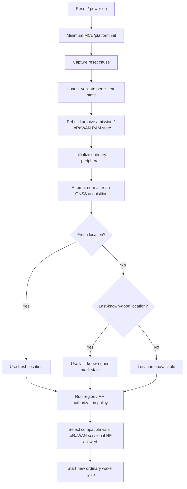
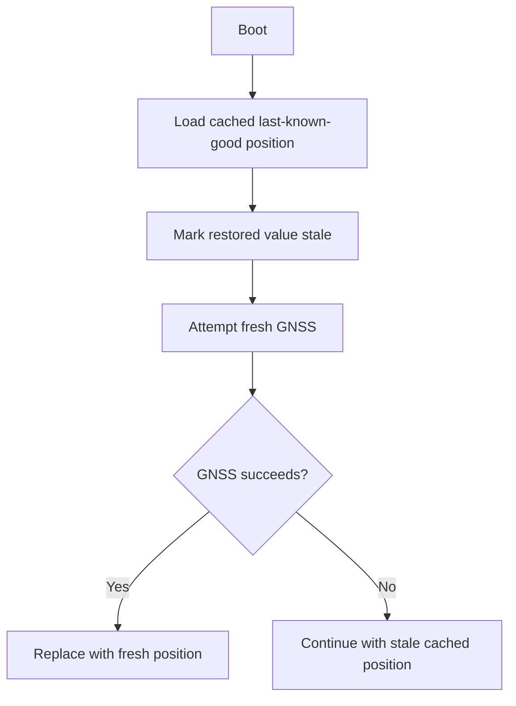
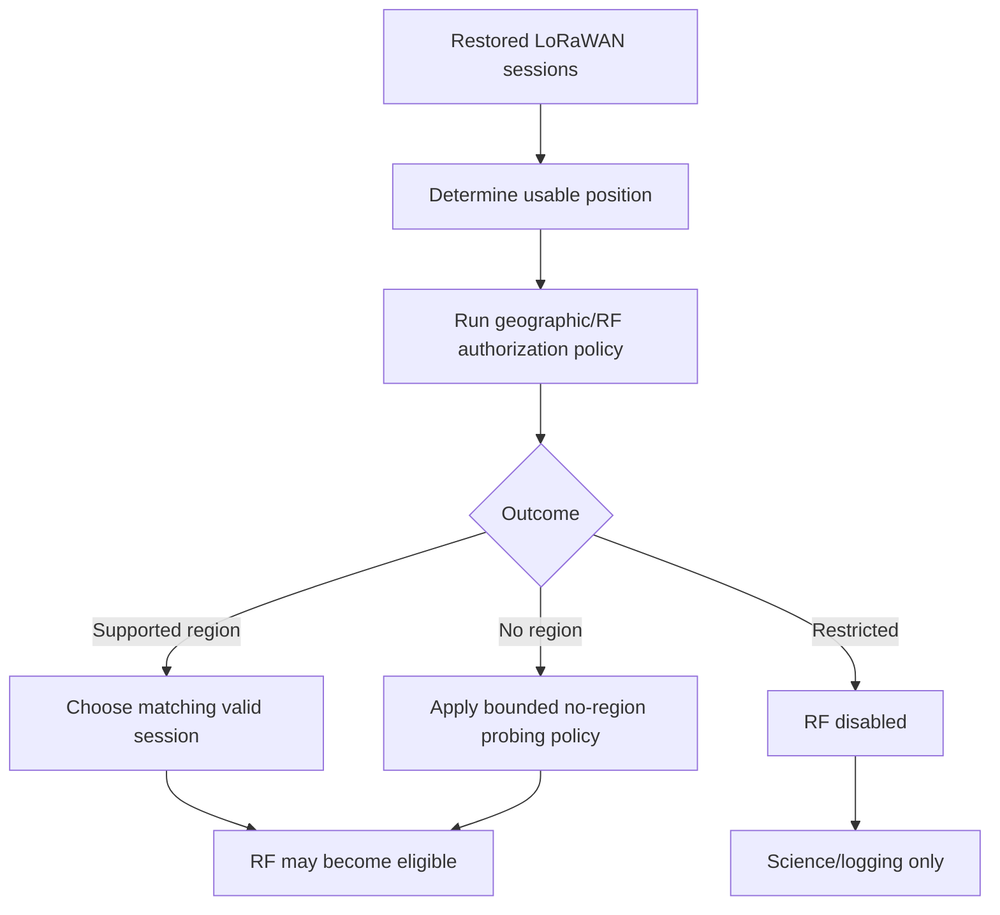

# DDR-0012: Boot Sequence and Startup Recovery

**Status:** Draft — product intent substantially elicited; implementation validation pending  
**Intent Interview Date:** 2026-08-09  
**Method:** Intent Interview V2 / Intent-Anchored Development  
**Scope:** MCU boot, persistent-state restoration, LoRaWAN session recovery, location/region recovery, peripheral initialization, RF enablement, and entry into the ordinary wake cycle after reset  
**Authority:** Product intent is normative. Exact startup function order, driver calls, STM32 initialization code, and LoRaWAN stack APIs are implementation bindings.

---

## 1. Intent

Stratosonde should treat boot and reset recovery as a simple way back into normal mission operation.

Boot is not a special mission mode.

The product should:

1. initialize enough hardware to restore durable state;
2. validate and rebuild runtime state;
3. recover the full LoRaWAN session state needed for correct communication;
4. determine a usable location and RF authorization context;
5. initialize ordinary peripherals;
6. degrade around anything that fails;
7. start a **fresh ordinary wake cycle**.

The firmware SHALL NOT attempt to resume midway through the cycle that was interrupted by reset.

The core design intent is:

> **Boot restores enough trustworthy state to safely re-enter the normal mission loop. It does not invent a special recovery behavior, and it does not let one failed peripheral prevent the rest of the sonde from carrying on.**

---

## 2. Product-Level Invariants

### INV-BOOT-001 — Boot never resumes an interrupted wake cycle

After any MCU reset, firmware SHALL begin from the normal startup path and then start a fresh wake cycle.

It SHALL NOT attempt to resume:

- an interrupted sensor acquisition;
- an interrupted archive write;
- an interrupted archive-recovery burst;
- an interrupted LoRaWAN transmission;
- any other mid-cycle execution point.

### INV-BOOT-002 — RF remains disabled until authorization context is established

Firmware SHALL NOT transmit merely because a LoRaWAN session was restored from non-volatile storage.

Before RF transmission becomes eligible, startup/current-cycle logic must establish:

- usable position provenance;
- geographic/regulatory region outcome;
- restricted/no-region policy;
- a compatible valid LoRaWAN session/credential state.

### INV-BOOT-003 — Restored session state does not override geography

A restored US915, EU868, AS923, or other session SHALL NOT force the sonde to keep using that region if the current geographic policy requires another region.

Current region authorization outranks previous-session convenience.

### INV-BOOT-004 — Fresh GNSS is preferred but not required for boot progress

If fresh GNSS is unavailable after boot, firmware SHALL use the last-known-good location when available, mark it stale, and continue according to the stale-position policy.

GNSS acquisition failure SHALL NOT wedge startup.

### INV-BOOT-005 — Peripheral startup failures are ordinary subsystem failures

A humidity sensor, pressure sensor, GNSS receiver, radio, serial flash device, or other peripheral failing initialization SHALL be handled using the same fail-soft policy as a runtime failure.

Boot SHALL NOT create a special "fatal peripheral init" rule unless a future explicit safety requirement demands it.

### INV-BOOT-006 — Reset does not end the mission

If persistent state shows that the mission had already entered flight, reboot SHALL NOT return the sonde to commissioning/privacy behavior.

### INV-BOOT-007 — Startup converges into the ordinary mission loop

After restoration and initialization, firmware SHALL use the same ordinary wake/sense/log/transmit/sleep behavior as normal operation.

### INV-BOOT-008 — Startup establishes a known state, then rejoins the normal mission cycle

Startup SHALL proceed in this order (added 2026-08-12):

1. establish safe/low-power hardware defaults (DDR-0001 INV-WAKE-008);
2. restore/validate required persistent mission state;
3. establish current energy/power admissibility (DDR-0001 INV-WAKE-009);
4. initialize only capabilities required for admitted mission work;
5. enter ordinary wake-cycle orchestration.

After reset, firmware SHALL NOT attempt instruction-level or task-level resumption of the interrupted wake (restates INV-BOOT-001); it starts a fresh ordinary cycle from restored persistent state.

### INV-BOOT-009 — Reset cause is observable but not normally policy-driving

Reset cause MAY be logged and surfaced diagnostically (BR-BOOT-015). The normal first-flight product SHALL NOT maintain separate long-term behavior based solely on historical reset cause. (Added 2026-08-12; see DDR-0009 INV-FAIL-013/014.)

### Servicing versus reset recovery

Normal reset recovery (this DDR) is distinct from intentional firmware servicing: changing the application image requires physical access and follows DDR-0025. An ordinary reflash preserves provisioned identity/credentials; boot recovery after servicing is the same ordinary path defined here. (Cross-reference added 2026-08-12.)

The boot path should disappear into the regular mission path as soon as practical.

---

## 3. Startup Phases

The conceptual boot flow is divided into two broad phases.

### Phase A — Safe restoration

Purpose:

- initialize the MCU and minimum platform services;
- capture reset cause;
- load and validate persistent state;
- reconstruct archive/runtime state;
- restore mission lifecycle/time state;
- restore LoRaWAN regional/session state into RAM;
- keep RF transmission disabled.

### Phase B — Ordinary mission entry

Purpose:

- initialize the ordinary peripherals;
- obtain fresh GNSS if allowed;
- otherwise use last-known-good location as stale;
- determine RF region/authorization;
- determine which restored session state is legal/useful;
- execute a fresh normal wake cycle.



---

## 4. Persistent State Restored at Boot

Boot should load whatever durable state is required by the persistence contract.

Initial examples include:

### Mission state

- commissioning versus flight state;
- mission epoch;
- mission-time reconstruction state;
- mission configuration.

### Archive state

- science archive itself;
- reconstructed or cached write cursor;
- next logical record ID;
- recovery watermark / archive-delivery cursor.

### Last-known-good state

Potentially:

- last-known-good position;
- last-known-good region context;
- last-known-good sensor values where useful.

### LoRaWAN state

Potentially per supported region:

- credentials / keys;
- session material;
- uplink/downlink frame counters;
- region-specific session state required by the stack.

### Diagnostic state

- reset cause/history;
- compact event-log metadata.

This list remains extensible.

---

## 5. Last-Known-Good Location at Startup

The sonde needs a usable location context early because region authorization depends on geography.

The preferred startup behavior is:

1. restore cached last-known-good location from persistent mission state if available;
2. treat restored position as stale;
3. attempt ordinary GNSS acquisition;
4. replace stale position with fresh position if GNSS succeeds;
5. if GNSS fails, continue with stale position.

A dedicated last-known-good mission-state record/page may make this easier than requiring a full archive search on every normal boot.

However, the science archive may remain a reconstruction fallback if the dedicated state is corrupt or unavailable.



---

## 6. LoRaWAN Session Restoration

Boot should reconstruct the complete LoRaWAN session state required for correct communication.

A conceptual per-region state might include:

```text
Region X:
    credentials
    session tokens
    uplink frame counter
    downlink frame counter
    stack-specific session state
```

Startup may restore several region objects into RAM.

However, **restoration is not authorization to transmit**.

The chosen current geographic region must still be determined.

Example:

```text
Persisted valid sessions:
    US915
    EU868

Fresh geographic lookup:
    EU868

Result:
    EU868 session may be used
    US915 session remains persisted but inactive
```

---

## 7. Region Verification Before RF

The startup sequence must not accidentally emit RF from a restored but geographically wrong region.

Conceptually:



If the current region has no valid session/keys, the radio capability degrades while science continues.

---

## 8. Peripheral Initialization

The intended startup philosophy is simple:

> **Initialize normal peripherals and then let the ordinary fail-soft policy handle failures.**

There is no requirement for an elaborate staged peripheral boot solely to create special boot semantics.

Possible peripherals include:

- pressure sensor;
- temperature/humidity sensors;
- GNSS receiver;
- serial flash;
- LoRa radio;
- quick-connect/I2C payload devices;
- other mission payloads.

If one fails:

- mark/reuse stale data where applicable;
- continue other sensor work;
- retry on future ordinary wakes;
- do not block the mission.

---

## 9. Sensor Init Failure

Example:

Humidity sensor does not initialize/respond.

Desired behavior:

```text
last good humidity exists
-> use last good value
-> stale = true
-> continue all other work
```

or:

```text
no prior valid humidity exists
-> mark unavailable
-> continue all other work
```

The sensor is tried again on later eligible cycles.

Boot failure is not treated differently from a runtime read failure.

---

## 10. Radio Init Failure

If the radio cannot initialize:

- acquire science normally;
- archive locally if flash is healthy;
- no live RF delivery occurs;
- sleep normally;
- try the radio again on the next ordinary wake.

The radio is not mission-critical to the point of stopping science acquisition.

---

## 11. Serial Flash Init Failure

If serial flash cannot initialize:

- acquire current science;
- retain the current data in RAM during the active cycle;
- construct the compact/current telemetry;
- attempt the normal feeler packet when RF is authorized;
- if the link succeeds, send the current high-resolution packet directly if policy permits;
- skip archive recovery because the archive is unavailable;
- return to low power.

This is the same fail-soft behavior used for a runtime flash failure.

---

## 12. Reset Cause

Boot SHOULD read the MCU reset cause early enough that it is not lost by initialization.

Potential causes may include:

- power-on;
- software reset;
- watchdog;
- brownout;
- core/fault reset;
- other platform-specific sources.

The cause may be appended to the persistent system-event log.

Failure to log that diagnostic SHALL NOT prevent boot progress.

---

## 13. Archive Reconstruction

Boot may use valid archive metadata as an optimization.

If metadata is invalid or inconsistent:

- scan self-validating science pages;
- reconstruct archive pointers/state;
- continue boot.

Several seconds of reconstruction time is acceptable after abnormal reset.

Archive reconstruction is not a reason to abandon the mission.

---

## 14. Flight-State Recovery

If persistent state says the sonde had already entered flight:

- boot restores flight state;
- commissioning privacy suppression is not re-enabled;
- mission elapsed time is reconstructed;
- the next wake is treated as an ordinary flight wake.

The post-reset flight-dynamics controller may initially have little recent pressure history.

A simple conservative approach is to begin from a stable/float-like cadence assumption and let new pressure samples rebuild the running average and reclassify the appropriate fast/slow cadence.

Exact initialization of that filter remains implementation/open design.

---

## 15. Boot Is Not Commissioning

There is an important distinction:

```text
first-ever device commissioning
```

is not the same thing as:

```text
ordinary MCU boot during a launched mission
```

A reset must not accidentally re-run privacy or provisioning behavior that belongs only to pre-flight commissioning.

Persistent mission state determines which lifecycle context the device is in.

---

## 16. Boot Failure Philosophy

Boot follows the same product rule as runtime:

> **Degrade the unavailable capability and carry on.**

Examples:

| Failure | Boot behavior |
|---|---|
| GNSS unavailable | use stale last-known-good location if available |
| one sensor unavailable | stale/unavailable sensor; others continue |
| serial flash unavailable | no archive; live telemetry may continue |
| radio unavailable | science/archive continue; retry later |
| one LoRaWAN regional session corrupt | disable/degrade that session; other valid regions remain available |
| archive metadata corrupt | reconstruct by archive scan |
| event log corrupt | diagnostics degrade; mission continues |
| mission configuration field corrupt | apply that field/class's defined fallback |

Only an unrecoverable internal MCU/software execution fault should normally return to reset again.

---

## 17. Behavioral Requirements

Confidence legend:

- **CONFIRMED** — explicitly stated or affirmed in the interview.
- **INFERRED** — strongly implied but wording may still deserve review.
- **OPEN** — product behavior has not yet been fully decided.

| ID | Requirement | Confidence |
|---|---|---|
| BR-BOOT-001 | After reset, firmware SHALL start a new clean wake cycle rather than resume the interrupted cycle. | **CONFIRMED** |
| BR-BOOT-002 | Boot SHALL load and validate persistent mission state before ordinary RF transmission is allowed. | **CONFIRMED** |
| BR-BOOT-003 | Boot SHALL restore the complete usable LoRaWAN session state required by the stack. | **CONFIRMED** |
| BR-BOOT-004 | LoRaWAN session state MAY be maintained independently per supported region. | **CONFIRMED** |
| BR-BOOT-005 | A restored session SHALL NOT override current geographic region authorization. | **CONFIRMED** |
| BR-BOOT-006 | Boot SHALL attempt ordinary GNSS acquisition when energy permits. | **CONFIRMED** |
| BR-BOOT-007 | If GNSS is unavailable, boot SHALL continue using last-known-good location marked stale when available. | **CONFIRMED** |
| BR-BOOT-008 | Last-known-good location SHOULD be available through a compact persistent mission-state representation rather than requiring a normal full archive scan. | **INFERRED — exact storage binding open** |
| BR-BOOT-009 | Archive scanning MAY be used as fallback reconstruction if cached mission/archive state is unavailable or corrupt. | **CONFIRMED** |
| BR-BOOT-010 | Boot SHALL initialize ordinary peripherals without making individual peripheral success a global mission gate. | **CONFIRMED** |
| BR-BOOT-011 | Peripheral startup failure SHALL be handled with the same stale/degraded retry policy used at runtime. | **CONFIRMED** |
| BR-BOOT-012 | Radio initialization failure SHALL NOT stop sensing or local logging. | **CONFIRMED** |
| BR-BOOT-013 | Serial-flash initialization failure SHALL NOT stop current science acquisition or current live telemetry. | **CONFIRMED** |
| BR-BOOT-014 | If the mission was already in flight before reset, boot SHALL NOT return the device to commissioning mode. | **CONFIRMED** |
| BR-BOOT-015 | Reset cause SHOULD be captured and stored in the persistent event log when practical. | **CONFIRMED** |
| BR-BOOT-016 | Boot SHALL eventually converge into the same ordinary wake-cycle logic used during normal operation. | **CONFIRMED** |

---

## 18. Open Decisions

### OD-BOOT-001 — Last-known-good state record

Need to decide whether the dedicated persistent mission-state record includes:

- X/Y;
- pressure altitude;
- GNSS altitude;
- region;
- absolute timestamp;
- freshness/source;
- selected sensor last-known-good values.

### OD-BOOT-002 — Stale-position RF legality

The exact region rule for stale position remains a separate unresolved product decision.

Boot can restore the stale position, but RF authorization must obey that future policy.

### OD-BOOT-003 — Startup ordering details

Need implementation decisions for the exact order of:

- clocks;
- watchdog;
- CRC/integrity engine;
- internal flash;
- external serial flash;
- RTC;
- GNSS;
- sensors;
- radio.

The product does not currently require elaborate staging beyond safety and dependency needs.

### OD-BOOT-004 — Missing session for current region

Need to define whether firmware:

- attempts rejoin/activation automatically;
- declares LoRaWAN unavailable;
- uses another provisioned session mechanism.

### OD-BOOT-005 — Post-reset cadence initialization — **NARROWED 2026-08-13**

Need to decide the exact initial pressure-history/filter state after reboot in
flight.

Current direction: begin simple and let new measurements rapidly re-establish the
detector state.

**2026-08-13 narrowing:** the *reversible* dynamic-versus-stable cadence question is
gone (DDR-0002 `INV-LIFE-011`). Cadence after reset is determined by the **restored
latched flight phase**, not by rebuilt pressure history. Pressure history now only
needs to be good enough to (a) detect launch if still pre-flight, or (b) qualify
float if in ascent and not yet latched. A float-latched unit does not need its
pressure history rebuilt to choose cadence at all.

### OD-BOOT-006 — Reset-loop behavior — **RESOLVED 2026-08-13**

Original: repeated resets unresolved; any mitigation must not create a permanent
mission-stop state.

**Resolved by DDR-0020 + DDR-0009 `OD-FAIL-006` + the 2026-08-13 interview:** there
is **no** reset-count adaptation, no reduced recovery mode, no permanent feature
disable, and no give-up state. Every boot re-enters the same ordinary recovery path
indefinitely.

The residual question — whether extreme immediate reset loops warrant additional
hardware/boot-level brownout protection — is an engineering matter tracked in
`open-intent-questions.md` item 6, not a product-policy decision.

### OD-BOOT-007 — RTC validity at boot

Need explicit time-management rules for determining whether the restored RTC can be trusted before a fresh GNSS UTC update.

---

## 19. Proof Plan

### P-BOOT-001 — Reset during each wake phase

Inject reset during:

- sensor acquisition;
- GNSS acquisition;
- archive write;
- compact TX;
- archive recovery;
- sleep transition.

Prove startup always follows the standard clean boot path and begins a new ordinary wake.

### P-BOOT-002 — Restore flight lifecycle

Launch/enter flight, reset, reboot.

Prove:

- flight state persists;
- commissioning privacy behavior does not return;
- mission continues.

### P-BOOT-003 — Fresh GNSS unavailable

Boot with a valid cached last-known-good position but no GNSS fix.

Prove:

- cached position is used;
- stale status is asserted;
- startup continues;
- no GNSS-related boot deadlock occurs.

### P-BOOT-004 — Fresh GNSS supersedes stale

Boot with cached stale position, then obtain a valid fresh GNSS fix.

Prove the fresh position replaces the cached position for the current cycle.

### P-BOOT-005 — Region mismatch after reset

Persist a valid US915 session.

Boot at a position mapping directly to EU868.

Prove firmware does not transmit using US915 merely because that session was restored.

### P-BOOT-006 — Sensor initialization failure

Force one sensor to fail during boot.

Prove other sensors, GNSS, logging, and communication continue according to normal policy.

### P-BOOT-007 — Radio initialization failure

Force the LoRa radio to fail initialization.

Prove science and archive operations continue and the radio is retried on the next ordinary wake.

### P-BOOT-008 — Flash initialization failure

Force serial flash unavailable at boot.

Prove:

- current science still occurs;
- compact packet may still transmit;
- current high-resolution packet may transmit directly after link success;
- archive recovery is skipped.

### P-BOOT-009 — Archive metadata corruption

Corrupt cached archive metadata.

Prove startup reconstructs archive state from self-validating science pages and eventually enters the normal wake path.

### P-BOOT-010 — One regional session corrupt

Corrupt one region's persistent session object while leaving another valid.

Prove only the corrupt regional capability degrades.

### P-BOOT-011 — Reset cause capture

Trigger supported reset causes and prove they are preserved in the event log without preventing startup.

---

## 20. Regeneration Test

A clean-room implementer receiving this DDR should understand that:

- reset starts a clean new wake cycle;
- boot restores/validates persistent state first;
- full LoRaWAN session state is recoverable, potentially per region;
- restored radio state does not grant permission to transmit until geography/RF policy is resolved;
- fresh GNSS is preferred but stale last-known-good position is acceptable for continuity;
- peripheral startup failures are handled exactly like ordinary runtime failures;
- no single sensor, radio, or serial-flash init failure should stop the mission;
- a launched mission must remain launched across reset;
- archive metadata can be rebuilt from self-validating archive records;
- reset cause is diagnostic, not a mission gate;
- after initialization, boot converges into the ordinary wake-cycle state machine.

The implementer should not need today's startup function names, STM32 HAL order, LoRaWAN stack API, peripheral driver layout, or RTOS structure to recreate the intended behavior.

---

## 21. Next Intent Interview

The next bounded topic should be **time management and time authority**.

Questions should include:

1. When is the STM32 RTC first considered trustworthy?
2. Does GNSS UTC initialize the RTC only during commissioning or discipline it during flight?
3. If GNSS UTC jumps backward, should RTC ever step backward?
4. How is monotonic mission elapsed time reconstructed across reset?
5. What timestamp is used when GNSS time is unavailable but RTC is valid?
6. How should absolute-time source/provenance be stored in the science record?
7. What happens after full power loss if RTC backup power was also lost?

That DDR will complete the time-related decisions first surfaced in the GNSS interview.

---

## 22. Amendment 2026-08-13 (intent interview, pass 1)

**Disposition:** amend; no new record required. Resolves `OD-BOOT-006` and narrows
`OD-BOOT-005` (§18).

### Refined boot principle

Boot is the path back to an ordinary mission wake — **not a maintenance window**.

The startup sequence SHALL prioritize restoring the minimum trustworthy state
required for:

- lifecycle correctness;
- wake scheduling;
- time continuity;
- RF legality/session correctness;
- current science acquisition;
- a safe return to low power.

Bulk archive reconstruction SHALL NOT be an unconditional prerequisite to any of
those goals.

### INV-BOOT-010 — Boot completes without bulk archive reconstruction

Startup SHALL reach ordinary mission operation without requiring a full archive or
whole-flash scan.

If archive metadata is unavailable or contradictory, startup SHALL:

- mark archive traversal as needing reconstruction;
- **not** fabricate an index;
- **not** treat a full archive scan as a hard precondition for boot completion;
- continue ordinary mission operation where safe;
- reconstruct in bounded/lazy work per DDR-0011 (`BR-STORE-002`).

### Flight-state recovery replaces flight-dynamics recovery

Any text in §14 suggesting that a recovered sonde should rebuild a reversible
pressure-dynamics classifier — and could therefore return from float to fast cadence
— is **superseded** by DDR-0002's terminal float latch (`INV-LIFE-011`).

Post-reset behavior follows the restored persistent lifecycle state:

| Restored state | Behavior |
|---|---|
| Commissioning-ready | Remain commissioning-ready unless a real launch transition occurs |
| Flight/ascent, not yet float-latched | Resume the ascent target cadence, subject to DDR-0016; float qualification may still occur |
| Float-latched | Remain float-latched; select the float/slow target cadence; never re-enter ascent cadence |

### Wake-schedule recovery

Startup SHALL restore enough scheduler state to avoid either:

- an unintended rapid reset/wake loop that consumes the battery; or
- an unintended very long delay caused by timer rollover or default initialization.

Exact timer-register restoration is **not** required; semantic preservation of the
intended next wake is (DDR-0010 `INV-PERSIST-010`). Losing at most one shifted
observation is acceptable; the device then re-establishes fixed start-to-start
cadence.

### Rationale

A brownout loop is exactly the condition in which large startup reads are least
desirable: energy is scarce, and every retry pays the cost again. Startup should be
small, deterministic, and oriented toward mission survival.

Making archive repair a boot gate would convert a storage inconvenience into a
mission-ending livelock — the opposite of DDR-0009's fail-soft intent.

### Proof additions

#### P-BOOT-012 — Float latch survives reset

Reset with the float latch set. Prove float remains latched and the float cadence
target is selected on the first ordinary post-reset scheduling decision.

#### P-BOOT-013 — Long-sleep reset does not collapse the schedule

Reset during long sleep. Prove the schedule does not collapse into rapid waking and
does not extend into an unintended multi-day delay.

#### P-BOOT-014 — Corrupt archive metadata still boots

Reset with corrupt archive metadata. Prove the science mission boots and continues,
and that archive reconstruction is deferred/bounded rather than blocking.

#### P-BOOT-015 — Single invalid history item degrades only itself

Reset with one invalid sensor-history item. Prove only that capability degrades and
the rest of the cycle proceeds.

### Cross-references

- DDR-0002 §19 — the terminal float latch this boot path must honor.
- DDR-0010 §18 — what must be restored and what may be lost.
- DDR-0011 §25 — bounded/lazy archive reconstruction and skip-and-continue.
- DDR-0009 §18 — bounded recovery, no reset-count escalation.
- `../SYSTEM-INVARIANTS.md` SI-004, SI-005, SI-010.

