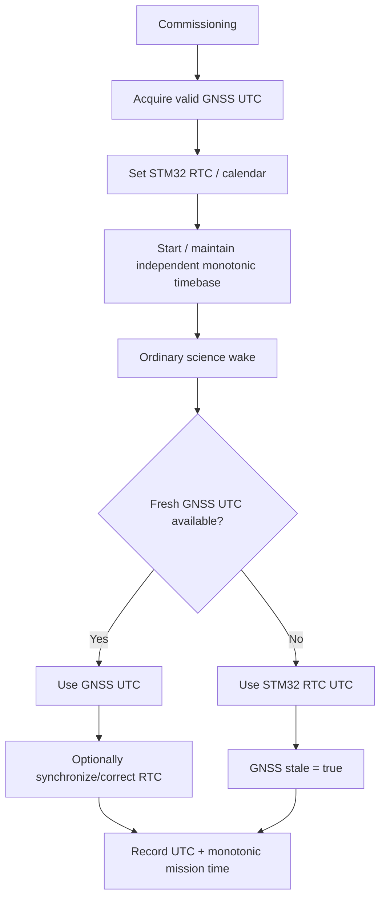

# DDR-0013: Time Authority, RTC Continuity, and Monotonic Mission Time

**Status:** Draft — product intent substantially elicited; implementation validation pending  
**Intent Interview Date:** 2026-08-09  
**Method:** Intent Interview V2 / Intent-Anchored Development  
**Scope:** GNSS UTC authority, STM32 RTC synchronization, UTC fallback during GNSS loss, monotonic mission time, scheduling-time separation, reset continuity, and record time provenance  
**Authority:** Product intent is normative. Exact RTC peripheral configuration, low-speed clock source, tick implementation, register usage, and timestamp field widths are implementation bindings.

---

## 1. Intent

Stratosonde needs to preserve two fundamentally different concepts of time:

1. **Absolute UTC time** — what time it is in the outside world.
2. **Monotonic mission time** — how much mission time has elapsed and how firmware schedules future work.

Those concepts should not be conflated.

GNSS provides the authoritative absolute time whenever a valid GNSS solution is available.

During commissioning, GNSS UTC initializes the STM32 real-time clock/calendar.

After that, the STM32 RTC provides a local UTC working copy so the sonde can continue timestamping science during GNSS outages.

Separately, firmware maintains a monotonic timebase for:

- elapsed mission time;
- wake scheduling;
- timeout measurement;
- other duration calculations.

The monotonic timebase must remain independent of UTC correction.

The core design intent is:

> **GNSS defines absolute UTC. The STM32 RTC carries UTC forward when GNSS is unavailable. Monotonic time is a separate clock that never moves backward and is never altered merely because UTC is corrected.**

---

## 2. Product-Level Invariants

### INV-TIME-001 — GNSS UTC is the authoritative absolute time source

When valid GNSS UTC is available, it SHALL be treated as the authoritative external time reference.

The STM32 RTC is a local working copy, not a competing authority.

### INV-TIME-002 — RTC is seeded from GNSS during commissioning

During commissioning, once valid GNSS UTC is available, firmware SHALL initialize/synchronize the STM32 real-time clock/calendar from GNSS.

### INV-TIME-003 — RTC carries absolute time through GNSS outages

If GNSS later becomes unavailable, firmware SHALL continue using the STM32 RTC/calendar as the absolute UTC timestamp source.

The associated GNSS freshness state SHALL make clear that the current absolute time is no longer directly refreshed by GNSS.

### INV-TIME-004 — Monotonic time is independent of UTC

The monotonic timebase SHALL NOT be derived from the mutable UTC calendar in a way that allows UTC correction to move mission elapsed time backward or distort scheduling.

### INV-TIME-005 — UTC correction must not rewrite history

If a later GNSS fix reveals RTC drift, firmware MAY correct the RTC for future timestamps.

Already archived records SHALL NOT be rewritten merely because the UTC estimate was later improved.

### INV-TIME-006 — Wake scheduling uses monotonic/duration time

Wake intervals, timeouts, and elapsed-time decisions SHOULD be based on the monotonic clock rather than UTC calendar arithmetic.

### INV-TIME-007 — Mission elapsed time never goes backward

Mission-relative elapsed time SHALL remain monotonic regardless of:

- GNSS loss;
- GNSS UTC discontinuity;
- RTC correction;
- time-zone/calendar representation;
- ordinary clock synchronization.

### INV-TIME-008 — Science records preserve enough context to interpret time

Science records SHALL preserve:

- absolute UTC;
- monotonic mission-relative time;
- GNSS stale/fresh provenance sufficient to tell whether absolute time was directly GNSS-backed or carried forward by RTC.

---

## 3. The Three Time Concepts

Stratosonde conceptually uses three different time values.

### 3.1 GNSS UTC

This is the external absolute time authority.

Examples:

```text
2026-08-09 20:43:12 UTC
```

GNSS UTC is used to:

- establish the real-world timestamp;
- initialize/synchronize the STM32 RTC;
- validate later RTC drift;
- provide absolute science-record timestamps when fresh.

---

### 3.2 STM32 RTC / Calendar UTC

This is the sonde's local working copy of UTC.

It is initialized from GNSS and continues running when GNSS is unavailable.

Conceptually:

```text
GNSS available:
    GNSS UTC -> RTC sync

GNSS unavailable:
    RTC continues UTC estimate
```

If GNSS later returns, the RTC may be corrected to the new authoritative UTC.

---

### 3.3 Monotonic Mission Time

This is not wall-clock time.

It represents elapsed mission time or another always-forward-running duration timebase.

It is used for:

- scheduling;
- sleep intervals;
- timeouts;
- mission elapsed time;
- relative ordering;
- measuring duration.

Conceptually:

```text
mission_elapsed = monotonic_now - mission_start_monotonic
```

The exact implementation may use:

- a low-speed hardware counter;
- an RTC sub-counter;
- an LPTIM;
- another always-forward clock source.

The product requirement is independence from UTC correction, not a specific peripheral.

---

## 4. Behavioral Requirements

Confidence legend:

- **CONFIRMED** — explicitly stated or affirmed in the interview.
- **INFERRED** — strongly implied but wording may still deserve review.
- **OPEN** — product behavior has not yet been fully decided.

| ID | Requirement | Confidence |
|---|---|---|
| BR-TIME-001 | GNSS UTC SHALL be the authoritative absolute time source when valid GNSS time is available. | **CONFIRMED** |
| BR-TIME-002 | During commissioning, valid GNSS UTC SHALL initialize/synchronize the STM32 RTC/calendar. | **CONFIRMED** |
| BR-TIME-003 | If GNSS later becomes unavailable, firmware SHALL continue timestamping with STM32 RTC UTC. | **CONFIRMED** |
| BR-TIME-004 | GNSS stale/fresh state SHALL provide the record-level indication needed to interpret whether UTC is directly GNSS-backed or carried forward locally. | **CONFIRMED** |
| BR-TIME-005 | Monotonic mission time SHALL be maintained independently of absolute UTC. | **CONFIRMED** |
| BR-TIME-006 | Monotonic mission time SHALL NOT move backward if RTC/GNSS UTC is corrected. | **CONFIRMED** |
| BR-TIME-007 | Wake scheduling and interval timing SHOULD use monotonic time rather than UTC calendar comparisons. | **CONFIRMED** |
| BR-TIME-008 | When GNSS returns after an outage, firmware MAY update/correct the RTC for future records. | **CONFIRMED** |
| BR-TIME-009 | Correcting RTC SHALL NOT rewrite previously archived science timestamps. | **CONFIRMED** |
| BR-TIME-010 | Science records SHALL carry both absolute UTC and monotonic mission-relative time. | **CONFIRMED** |
| BR-TIME-011 | The record-ID sequence SHALL remain independent of both UTC and mission elapsed time. | **CONFIRMED** |
| BR-TIME-012 | Time provenance does not require a separate large time-validity state if GNSS freshness plus UTC plus monotonic time provides unambiguous interpretation. | **CONFIRMED** |
| BR-TIME-013 | Mission elapsed time SHALL be recoverable across ordinary resets according to the persistent-state/reset-recovery policy. | **CONFIRMED — exact mechanism open** |
| BR-TIME-014 | If RTC state is invalid or lost, firmware SHALL continue the mission using monotonic/record ordering and mark absolute-time confidence appropriately until GNSS restores UTC. | **INFERRED — exact encoding open** |

---

## 5. Normal Time Flow



---

## 6. Why Monotonic Time Must Be Separate

UTC can legitimately change due to:

- correcting RTC drift;
- a GNSS receiver regaining authoritative time;
- future leap-second handling;
- firmware discovering that the RTC estimate was wrong.

Scheduling should not be vulnerable to those changes.

Bad example:

```text
next_wake_utc = current_utc + 5 minutes
```

followed by:

```text
RTC corrected backward by 12 seconds
```

This can distort interval logic.

Preferred conceptual model:

```text
next_wake_monotonic = monotonic_now + interval
```

UTC is attached to the science record for external interpretation.

Monotonic time controls relative behavior.

---

## 7. RTC Correction

If GNSS returns after an outage and shows that RTC drifted:

```text
RTC says: 12:00:10
GNSS says: 12:00:00
```

firmware may correct the RTC to the GNSS value.

Because monotonic mission time is separate:

- wake timing remains coherent;
- mission elapsed time remains coherent;
- record ordering remains coherent.

Already written records retain the UTC values that were known at the time.

The backend can later compare:

- prior RTC-derived UTC;
- later GNSS UTC;
- monotonic mission time;

to detect or estimate drift.

---

## 8. Record Time Model

A full-resolution science record conceptually contains:

```text
record_id
absolute_utc
mission_elapsed_time
GNSS freshness / stale status
...
```

Interpretation:

### Fresh GNSS

```text
absolute_utc = GNSS UTC
GNSS stale = false
```

### GNSS unavailable

```text
absolute_utc = STM32 RTC UTC
GNSS stale = true
mission_elapsed_time continues normally
```

The product does not currently require another large time-source enum solely to distinguish these two cases.

---

## 9. Mission-Time Epoch

Mission elapsed time begins at the commissioning-to-flight transition.

That transition may occur through:

- operator initiation; or
- automatic launch detection.

Conceptually:

```text
mission_elapsed = 0
```

at mission start.

After that:

```text
mission_elapsed = monotonic_now - mission_start_reference
```

The exact method for preserving/reconstructing this reference across reset remains an implementation decision.

---

## 10. Reset Recovery

After an MCU reset:

1. restore persistent mission-start state;
2. restore/validate RTC if the platform retained it;
3. reconstruct the monotonic mission-time reference;
4. begin a fresh wake cycle;
5. attempt GNSS normally;
6. if GNSS succeeds, use authoritative GNSS UTC;
7. otherwise continue with RTC UTC if valid.

The mission should not restart its elapsed-time epoch merely because the MCU restarted.

---

## 11. Full Power Loss

A complete power loss may create a different case than a software reset.

Possible outcomes depend on hardware:

- RTC backup domain survives;
- RTC backup domain does not survive;
- monotonic hardware counter resets;
- persistent mission epoch remains available.

The product requirement is:

> **Do not fabricate absolute UTC after the local clock has genuinely lost authority.**

If RTC is invalid after full power loss:

- mission record IDs still preserve order;
- archived data remains intact;
- a fresh GNSS fix can restore absolute UTC;
- time confidence/freshness must remain honest until then.

Exact representation is an open implementation detail.

---

## 12. Time and GNSS Staleness

The interview intentionally reuses GNSS freshness to help explain time provenance.

When GNSS is fresh:

- position is fresh;
- GNSS UTC is fresh.

When GNSS is unavailable:

- last-known position may be stale;
- RTC continues absolute time;
- GNSS stale indicates the absolute time is no longer being directly refreshed from GNSS.

A future protocol may choose to split position freshness and time-source freshness if operational evidence shows that GNSS can provide one valid dimension without the other.

That is not currently required by this product intent.

---

## 13. Time Does Not Control Scientific Truth Retroactively

If the system later learns that UTC had drifted:

- do not rewrite archived records;
- do not renumber record IDs;
- do not alter mission elapsed time;
- do not "fix" historic science silently.

The backend has enough information to perform post-processing using:

- record order;
- mission elapsed time;
- fresh/stale GNSS periods;
- known RTC correction points.

---

## 14. Open Decisions

### OD-TIME-001 — Exact monotonic hardware source

Need to choose the specific always-forward timebase:

- low-speed timer;
- RTC subsecond counter;
- LPTIM;
- another STM32 clock source.

### OD-TIME-002 — RTC correction threshold

Need to decide whether every fresh GNSS UTC update corrects RTC, or only corrections above some threshold.

Possible policies:

- always synchronize;
- correct only when drift exceeds N seconds;
- discipline gradually;
- step immediately.

The monotonic timebase must remain unaffected either way.

### OD-TIME-003 — Large UTC jump diagnostic

Need to decide whether an unexpectedly large RTC-vs-GNSS correction generates a system event.

### OD-TIME-004 — Timestamp precision

Seconds versus sub-second precision remains an implementation choice.

The interview did not require millisecond precision.

### OD-TIME-005 — Full-power-loss reconstruction

Need to define how startup behaves if:

- RTC is invalid;
- persistent mission state survives;
- GNSS is temporarily unavailable.

### OD-TIME-006 — Time provenance split

The current intent uses GNSS stale/fresh plus UTC plus mission time.

If future GNSS hardware exposes separate position-valid/time-valid semantics, the record format may need independent provenance bits.

---

## 15. Proof Plan

### P-TIME-001 — Commissioning RTC initialization

Provide valid GNSS UTC during commissioning.

Prove STM32 RTC/calendar is synchronized to it.

### P-TIME-002 — GNSS outage

After RTC synchronization, remove GNSS.

Prove:

- absolute UTC continues from RTC;
- GNSS stale is asserted;
- mission elapsed time continues monotonically.

### P-TIME-003 — UTC correction does not affect monotonic scheduling

Introduce known RTC drift.

Restore GNSS and correct UTC.

Prove:

- monotonic time does not jump;
- pending wake intervals remain correct;
- mission elapsed time remains monotonic.

### P-TIME-004 — Backward UTC correction

Make RTC several seconds ahead of GNSS.

Apply the final correction policy.

Prove no archived record is rewritten and monotonic mission time never decreases.

### P-TIME-005 — Forward UTC correction

Make RTC behind GNSS.

Correct RTC.

Prove monotonic scheduling remains unaffected.

### P-TIME-006 — Reset continuity

Establish mission elapsed time, reset the MCU, and reboot.

Prove mission elapsed time resumes according to the persistent-state design rather than restarting from zero.

### P-TIME-007 — Record provenance

Generate:

- one fresh-GNSS record;
- one RTC-fallback record.

Prove the backend can distinguish the circumstances using the record's UTC, monotonic mission time, and GNSS freshness.

### P-TIME-008 — Complete loss of RTC authority

Simulate full power loss that invalidates RTC while preserving persistent archive/configuration.

Prove firmware does not silently claim trustworthy UTC before a valid source is re-established.

---

## 16. Regeneration Test

A clean-room implementer receiving this DDR should understand that:

- GNSS UTC is the authoritative external time;
- commissioning seeds the STM32 RTC from GNSS;
- RTC carries UTC forward through GNSS outages;
- GNSS stale/fresh state explains whether absolute time is directly GNSS-backed;
- monotonic mission time is a separate concept;
- monotonic time never moves backward;
- wake scheduling uses monotonic duration, not mutable UTC;
- RTC may be corrected when GNSS returns;
- corrections affect future UTC only, not archived history;
- science records preserve absolute UTC plus mission-relative monotonic time;
- mission elapsed time survives ordinary resets;
- full loss of RTC authority must be represented honestly rather than hidden.

The implementer should not need today's RTC driver, clock-tree configuration, timer peripheral, timestamp struct, or scheduler code to reproduce the intended behavior.

---

## 17. Next Intent Interview

The next bounded topic should be **configuration management and validation**.

Questions should include:

1. Which configuration classes may safely fall back to defaults?
2. Which configuration classes must disable a feature if validation fails?
3. How are mission parameters versioned?
4. How are LoRaWAN credentials separated from ordinary configuration?
5. Can configuration be changed in flight?
6. Which settings may be changed remotely?
7. How is a partially written configuration rejected?
8. What configuration belongs per device versus per mission?

That DDR will connect persistence mechanics with mission-specific tunability.

---

## 18. Amendment 2026-08-13 (intent interview, passes 1 and 2)

**Disposition:** amend; no new record required.

### Confirmed time hierarchy

1. Valid GNSS UTC is the authoritative absolute time source.
2. On a valid GNSS sync, firmware sets/corrects the STM32 RTC according to the
   existing monotonic-time safety rules (§7).
3. Whenever fresh GNSS time is unavailable, **the STM32 RTC remains the working
   absolute clock** — it is not discarded, and its output is not treated as invalid.
4. Mission monotonic time remains independent and SHALL NOT move backward because of
   RTC or GNSS correction (`INV-GNSS-006`, §6).

### INV-TIME-009 — RTC age alone does not stop the mission or RF

Loss of fresh GNSS time SHALL NOT, by itself:

- stop science collection;
- invalidate all timestamps;
- force RF silence.

RF silence caused by prolonged GNSS outage is governed by **position/region
uncertainty** under DDR-0015 (`BR-STALE-018`), not by an independent "the RTC has been
unsynchronized too long" timer.

While RF is permitted by the position/region policy, RTC-derived absolute UTC remains
acceptable for packet and science timestamps, with GNSS freshness/provenance marked
accordingly.

### New behavioral requirement

| ID | Requirement | Confidence |
|---|---|---|
| BR-TIME-015 | Absence of fresh GNSS time SHALL NOT by itself stop science, invalidate stored timestamps, or silence RF. | **CONFIRMED** |
| BR-TIME-016 | No second, time-specific RF cutoff SHALL be introduced; the DDR-0015 position-staleness budget is the only RF-silence timer. | **CONFIRMED** |
| BR-TIME-017 | RTC-derived timestamps used during a GNSS outage SHALL be marked with honest freshness/provenance and SHALL NOT be presented as fresh GNSS time. | **CONFIRMED** |

### Rationale

GNSS is expected to supply both position and authoritative UTC, but the STM32 RTC is
accurate enough to preserve useful time continuity across the same outage window in
which the system is already willing to operate on stale geographic information.

The scientifically dangerous failure is **pretending RTC-derived time is fresh GNSS
time**, not using the RTC at all. Honest provenance solves that; discarding the clock
would not.

### Open numeric policy — deliberately not chosen

The interview considered examples such as six, twelve, or twenty-four hours for
prolonged GNSS outage but did **not** select an independent time number.

Do not add a second time-specific cutoff. The configured stale-**position** legality
budget from DDR-0015 (24 h for first flight, `BR-STALE-017`) is the only relevant
bound.

### Proof additions

#### P-TIME-009 — RTC carries the mission through a GNSS outage

Run without GNSS time sync for an extended period. Prove science continues, records
carry RTC-derived UTC with honest provenance, and monotonic mission time never steps
backward.

#### P-TIME-010 — No independent time-based RF veto

With RF otherwise authorized by fresh-enough position, let RTC sync age grow. Prove no
RF silence is triggered by time age alone.

### Cross-references

- DDR-0015 §11 — the single RF-silence budget (position-based).
- DDR-0003 §17 — position provenance and honest placeholders.
- DDR-0010 §18 — RTC validity/mission-epoch durability across reset.
- `../SYSTEM-INVARIANTS.md` SI-014.

