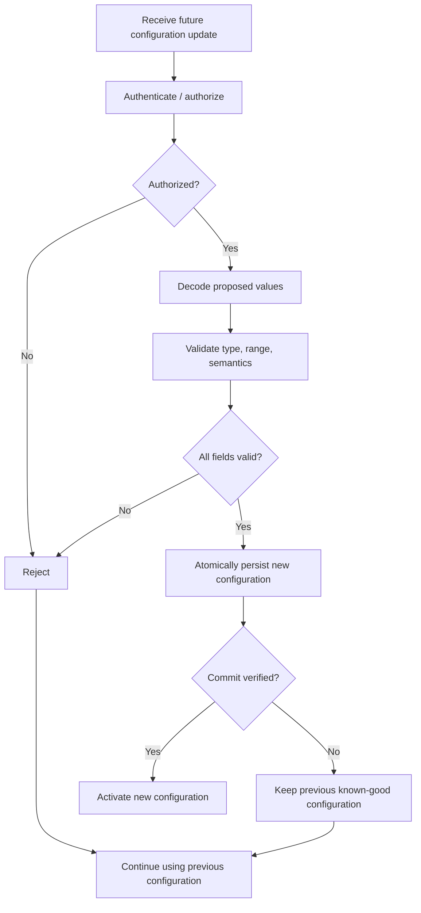
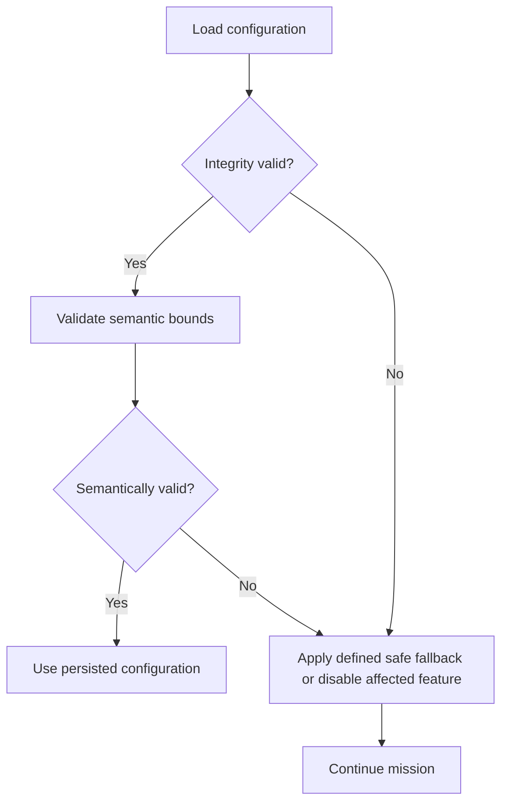

# DDR-0014: Configuration Management and Future Remote Commands

**Status:** Proposed / Future-Oriented — architecture captured; remote configuration and command handling are not first-flight requirements  
**Intent Interview Date:** 2026-08-09  
**Method:** Intent Interview V2 / Intent-Anchored Development  
**Scope:** Mission configuration, persistent validation, separation from protocol state, future downlink updates, transactional change semantics, and distinction between persistent configuration and one-shot commands  
**Authority:** Product intent is normative. Exact configuration storage, command protocol, authentication scheme, packet encoding, and downlink implementation are future bindings.

---

## 1. Intent

Stratosonde currently relies primarily on compile-time configuration.

Future versions may benefit from limited remote configuration and command capability, but that capability is **not required for first flight**.

The architecture should therefore preserve simplicity now while avoiding choices that make safe future control difficult.

The core design intent is:

> **First flight does not depend on remote configuration. Future versions may accept a small, carefully validated set of mission-configuration updates and one-shot commands, while security-critical protocol state remains separate and invalid updates never replace a known-good configuration.**

---

## 2. Product-Level Invariants

### INV-CONFIG-001 — Remote configuration is not a first-flight dependency

The first-flight product SHALL remain fully operable without remote configuration or general-purpose command support.

### INV-CONFIG-002 — Configuration and protocol state are separate

Mission configuration SHALL remain conceptually separate from security/protocol state such as:

- LoRaWAN keys;
- session credentials;
- frame counters;
- activation/session state.

Invalid mission configuration SHALL NOT cause protocol credentials to be regenerated or replaced.

### INV-CONFIG-003 — Invalid updates never replace valid configuration

A proposed configuration update SHALL be validated before becoming active.

If validation fails:

- reject the update;
- retain the previous valid configuration;
- continue normal mission behavior.

### INV-CONFIG-004 — Configuration changes are transactional

A configuration change SHALL become visible as one complete valid update or not at all.

Partially written or partially validated configuration SHALL NOT become active.

### INV-CONFIG-005 — Safe defaults are allowed only where explicitly defined

Some ordinary mission parameters MAY fall back to conservative defaults if configuration is unavailable or corrupt.

Security-critical or authorization-critical state SHALL NOT silently fall back to fabricated defaults.

### INV-CONFIG-006 — One-shot commands are not persistent configuration

Future actions such as:

- release a mechanism;
- take an immediate measurement;
- initiate a diagnostic action;
- request a record;

SHOULD be modeled as commands/events, not silently stored as persistent mission configuration unless persistence is explicitly intended.

### INV-CONFIG-007 — Every mutable configuration field has bounds

A remotely writable parameter SHALL have explicit:

- type;
- minimum/maximum;
- allowed values;
- semantic validation;
- default/fallback policy;
- persistence behavior.

---

## 3. Configuration Classes

The product should distinguish at least three broad classes.

### 3.1 Firmware / build-time configuration

Examples:

- compiled feature support;
- hardware-driver selection;
- board-specific constants;
- immutable protocol capabilities.

This is not ordinary mission configuration.

---

### 3.2 Mission configuration

Examples:

- requested fast cadence;
- requested slow cadence;
- pressure/altitude change thresholds;
- no-region search distance;
- satellite feature enablement in future;
- payload-specific energy limits;
- archive-recovery budgets.

These settings may eventually be remotely adjustable.

---

### 3.3 Protocol / security state

Examples:

- LoRaWAN keys;
- session state;
- frame counters;
- device identity;
- authorization material.

These belong to protocol persistence, not ordinary mission configuration.

---

## 4. First-Flight Scope

For first flight, configuration may remain:

- compile-time;
- provisioned before launch;
- fixed in persistent storage;
- not remotely editable.

That is acceptable.

The product should not introduce a general command/configuration engine solely to satisfy architectural completeness.

The future extension point is sufficient.

---

## 5. Future Remote Configuration

A future downlink may propose a configuration transaction.

Conceptually:

```text
receive proposed configuration update
-> authenticate / authorize
-> decode
-> validate every affected field
-> reject entire update if invalid
-> persist atomically
-> activate only after successful commit
```



---

## 6. Example Mission Parameters

Potential future remotely configurable fields include:

| Parameter | Example | Validation idea |
|---|---:|---|
| Slow target interval | 300 s | within mission-defined min/max |
| Fast target interval | 10 s | within energy/regulatory bounds |
| Pressure-change threshold | mission-specific | physically plausible range |
| No-region search radius | e.g. hundreds of km | bounded maximum |
| Maximum candidate probes | small integer | energy-bounded |
| Archive recovery budget | records/time | bounded |
| Satellite support enable | on/off | only if feature provisioned |
| Payload energy profile | mission-defined | versioned/validated |

Exact fields remain future work.

---

## 7. Example Validation

Suppose a downlink proposes:

```text
slow_target_interval = 300 s
fast_target_interval = 2 s
```

If 2 seconds is outside the allowed mission bounds:

```text
validation fails
-> reject the transaction
-> keep the previous configuration
```

Do not apply the valid field while rejecting only the invalid one unless the protocol explicitly supports independent partial updates.

The default preference is whole-transaction consistency.

---

## 8. Persistent Object Format

A persistent mission-configuration object should contain enough metadata to prove what it is and whether it is valid.

Conceptually:

```text
magic
format_version
payload_length
configuration_generation
configuration_payload
CRC / integrity value
commit indicator if needed
```

Exact storage mechanics are governed by the persistent-storage integrity design.

---

## 9. Versioning

Mission configuration SHALL be versioned.

A future firmware version must be able to determine whether persisted configuration is:

- directly compatible;
- migratable;
- unsupported;
- corrupt.

The device SHALL NOT blindly reinterpret an old binary configuration layout as a new layout.

---

## 10. Defaults

Defaults are useful for ordinary mission behavior.

Possible examples:

- conservative wake interval;
- conservative change threshold;
- archive recovery disabled or limited;
- bounded no-region search.

Defaults should be:

- known at build time;
- intentionally safe;
- documented;
- testable.

Defaults are **not** appropriate replacements for:

- LoRaWAN credentials;
- cryptographic keys;
- authorization state.

---

## 11. Configuration Failure Behavior



The failure of one configuration class should not necessarily invalidate unrelated configuration.

---

## 12. One-Shot Commands

Future downlinks may request immediate actions that should not become configuration.

Examples:

- request archive record N;
- perform a diagnostic read;
- trigger a mechanism;
- request immediate sensor acquisition;
- request an event-log entry;
- future release/cutdown action.

These SHOULD be modeled as **commands**.

Conceptually:

```text
configuration:
    "what should the device normally do?"

command:
    "do this action once"
```

This distinction prevents temporary actions from accidentally becoming persistent behavior.

---

## 13. Command Execution Principles

Future command processing should satisfy:

- authorization before execution;
- explicit command identity;
- bounded arguments;
- idempotency strategy where relevant;
- failure reporting where practical;
- no permanent configuration change unless explicitly requested.

Safety-critical actuator commands may require their own DDR.

---

## 14. Configuration Change Audit

Successful or rejected configuration changes SHOULD be eligible for the compact persistent event log.

Useful event examples:

```text
CONFIG_UPDATE_ACCEPTED
CONFIG_UPDATE_REJECTED
CONFIG_CRC_INVALID
CONFIG_DEFAULT_USED
CONFIG_VERSION_UNSUPPORTED
```

The short telemetry packet does not need to carry configuration history continuously.

Events may be recovered later when bandwidth permits.

---

## 15. Behavioral Requirements

Confidence legend:

- **CONFIRMED** — explicitly stated or affirmed in the interview.
- **INFERRED** — strongly implied but wording may still deserve review.
- **OPEN** — product behavior has not yet been fully decided.

| ID | Requirement | Confidence |
|---|---|---|
| BR-CONFIG-001 | Remote configuration SHALL NOT be required for first flight. | **CONFIRMED** |
| BR-CONFIG-002 | The architecture SHALL leave room for future downlink-driven configuration updates. | **CONFIRMED** |
| BR-CONFIG-003 | Mission configuration SHALL remain separate from LoRaWAN credentials/session state. | **CONFIRMED** |
| BR-CONFIG-004 | Persisted configuration SHALL include an integrity check such as CRC. | **CONFIRMED** |
| BR-CONFIG-005 | Configuration fields SHALL undergo semantic/range validation in addition to integrity validation. | **CONFIRMED** |
| BR-CONFIG-006 | Invalid proposed configuration SHALL be rejected while the previous valid configuration remains active. | **CONFIRMED** |
| BR-CONFIG-007 | Future persistent configuration changes SHALL be committed atomically. | **CONFIRMED** |
| BR-CONFIG-008 | Ordinary mission parameters MAY use defined safe defaults when configuration is invalid. | **CONFIRMED** |
| BR-CONFIG-009 | Security/protocol state SHALL NOT silently use fabricated defaults. | **CONFIRMED** |
| BR-CONFIG-010 | Future one-shot actions SHOULD be modeled separately from persistent configuration. | **CONFIRMED** |
| BR-CONFIG-011 | Configuration changes SHOULD generate persistent diagnostic events when practical. | **INFERRED** |
| BR-CONFIG-012 | Mission configuration SHALL be versioned. | **INFERRED — strongly recommended architectural requirement** |

---

## 16. Open Decisions

### OD-CONFIG-001 — First mutable fields

Need to choose the first subset of parameters that can actually be changed in flight.

### OD-CONFIG-002 — Downlink authentication

Need a separate security decision for proving that a configuration/command downlink is authorized.

### OD-CONFIG-003 — Configuration transport format

Possible future approaches include:

- fixed binary commands;
- TLV;
- versioned compact schema;
- another small protocol.

### OD-CONFIG-004 — Activation timing

Need to decide whether an accepted configuration update becomes active:

- immediately;
- on next wake;
- after reboot;
- per-field.

### OD-CONFIG-005 — Factory reset

Need to define what "factory reset" means for:

- mission config;
- credentials;
- archive;
- event log;
- lifecycle state.

### OD-CONFIG-006 — Actuator commands

Any command capable of physical action, such as a release/cutdown mechanism, deserves a dedicated safety/security design.

### OD-CONFIG-007 — Calibration data

Need to determine whether sensor calibration is:

- immutable manufacturing data;
- field-service data;
- mission configuration;
- separately protected persistent state.

---

## 17. Proof Plan

### P-CONFIG-001 — Valid configuration load

Persist a valid configuration object.

Prove boot loads and applies it.

### P-CONFIG-002 — CRC failure

Corrupt configuration storage.

Prove:

- corrupted data is rejected;
- safe fallback is used only where defined;
- mission continues.

### P-CONFIG-003 — Semantic validation

Provide a CRC-valid but out-of-range parameter.

Prove semantic validation rejects it.

### P-CONFIG-004 — Failed update preserves previous configuration

Start from known-good configuration.

Attempt an invalid future update.

Prove the original configuration remains active and durable.

### P-CONFIG-005 — Interrupted update

Reset/power-loss during configuration commit.

Prove startup sees either:

- previous valid config; or
- new valid config;

never a half-written active configuration.

### P-CONFIG-006 — Protocol state isolation

Corrupt ordinary mission configuration.

Prove valid LoRaWAN credentials/session persistence remains unaffected.

### P-CONFIG-007 — Unsupported version

Present configuration from an unsupported format version.

Prove firmware rejects or migrates it according to explicit policy rather than misinterpreting bytes.

### P-CONFIG-008 — Command is not configuration

Execute a one-shot future command.

Prove it does not silently modify persistent mission configuration unless the command explicitly requests such a change.

---

## 18. Regeneration Test

A clean-room implementer receiving this DDR should understand that:

- remote configuration is future scope, not first-flight scope;
- mission configuration, firmware/build constants, and protocol/security state are separate concepts;
- persisted configuration carries integrity and version information;
- configuration values also require semantic validation;
- failed updates leave previous valid configuration intact;
- persistent changes are transactional;
- safe defaults are allowed only for explicitly approved ordinary mission parameters;
- credentials are never invented as defaults;
- one-shot commands are distinct from persistent configuration;
- the design should remain simple until a real operational need justifies more remote-control machinery.

The implementer should not need today's configuration structs, flash addresses, command packet format, or source-code layout to recreate the intended behavior.

---

## 19. Next Intent Interview

The next high-value topic should be **power-management policy**, specifically the adaptation algorithm that decides when to:

- honor requested cadence;
- slow cadence;
- skip GNSS;
- skip bulk archive recovery;
- reduce RF work;
- recover toward the requested cadence after charging improves.

That is one of the few remaining areas where the product intent is clear at a high level but the statefulness and decision logic still need a precise contract.

**Resolved:** this interview was conducted 2026-08-09 and is captured in **DDR-0016 (Power-Management and Energy-Adaptation Policy)**. Summary: a tiered energy-state model (voltage + trend + temperature) scales cadence first; expensive operations pass temperature-normalized droop admission tests; recovery is trend-driven; CRITICAL is refusal-based survival. Concrete thresholds await battery/load profiling (OD-PWR-001).
